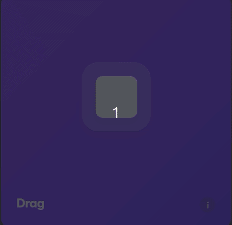
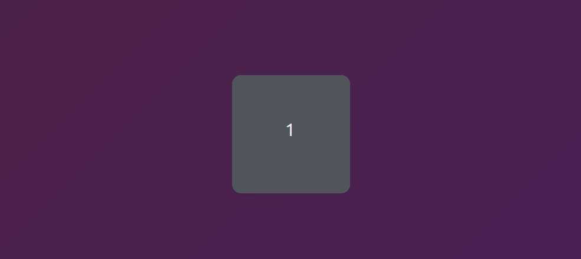
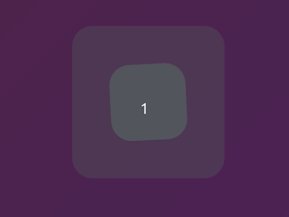

# Animations

이번 파트에서는 **Framer Motion**을 사용하여 React JS로 손쉽게 **Animation**을 구현하는 법을 배워볼 것이다.

## 1. Framer Motion이란?

**Framer Motion**은 **React를 위한** 웹 애니메이션, 제스처 오픈 소스 라이브러리이다. Pose라고 불리는 라이브러리부터 시작이 되었다. 아래와 같은 기능을 제공하고 있다.

- 다양한 애니메이션
- 단순한 키프레입 문법 제공
- 제스쳐(darg/tap/hover)
- 레이아웃 애니메이션
- SVG paths
- Exit 애니메이션
- 컴포넌트 간의 애니메이션 오케스트레이팅
- CSS 변수
- ...그외 훨씬 더 많은 것들

해당 페이지에서 Documentation을 참고할 수 있으니 확인해보자.

[Production-Ready Animation Library for React | Framer Motion](https://www.framer.com/motion/)

해당 파트는 Animation을 다루는 것인 만큼 **코드**와 **GIF**를 위주로 살펴볼 것이다.

먼저 가장 기초 코드를 살펴보고 넘어가자.

```tsx
// index.tsx

import React from "react";
import ReactDOM from "react-dom";
import { RecoilRoot } from "recoil";
import { ThemeProvider } from "styled-components";
import App from "./App";
import { darkTheme } from "./theme";

import { createGlobalStyle } from "styled-components";

const GlobalStyle = createGlobalStyle`
@import url('https://fonts.googleapis.com/css2?family=Source+Sans+Pro:wght@300;400&display=swap');
html, body, div, span, applet, object, iframe,
h1, h2, h3, h4, h5, h6, p, blockquote, pre,
a, abbr, acronym, address, big, cite, code,
del, dfn, em, img, ins, kbd, q, s, samp,
small, strike, strong, sub, sup, tt, var,
b, u, i, center,
dl, dt, dd, menu, ol, ul, li,
fieldset, form, label, legend,
table, caption, tbody, tfoot, thead, tr, th, td,
article, aside, canvas, details, embed,
figure, figcaption, footer, header, hgroup,
main, menu, nav, output, ruby, section, summary,
time, mark, audio, video {
  margin: 0;
  padding: 0;
  border: 0;
  font-size: 100%;
  font: inherit;
  vertical-align: baseline;
}
/* HTML5 display-role reset for older browsers */
article, aside, details, figcaption, figure,
footer, header, hgroup, main, menu, nav, section {
  display: block;
}
/* HTML5 hidden-attribute fix for newer browsers */
*[hidden] {
    display: none;
}
body {
  line-height: 1;
}
menu, ol, ul {
  list-style: none;
}
blockquote, q {
  quotes: none;
}
blockquote:before, blockquote:after,
q:before, q:after {
  content: '';
  content: none;
}
table {
  border-collapse: collapse;
  border-spacing: 0;
}
* {
  box-sizing: border-box;
}
body {
  font-weight: 300;
  font-family: 'Source Sans Pro', sans-serif;
  color:black;
  line-height: 1.2;
  background:linear-gradient(135deg,#e09,#d0e);
}
a {
  text-decoration:none;
  color:inherit;
}
`;

ReactDOM.render(
  <React.StrictMode>
    <RecoilRoot>
      <ThemeProvider theme={darkTheme}>
        <GlobalStyle />
        <App />
      </ThemeProvider>
    </RecoilRoot>
  </React.StrictMode>,
  document.getElementById("root")
);
```

기본 **CSS Reset**코드에 몇가지 필요한 것만 추가로 적용한 상태이고, 이 코드에 변동 사항은 없을 것이다.

```tsx
// styled.d.ts

import "styled-components";

declare module "styled-components" {
  export interface DefaultTheme {}
}

// theme.ts

import { DefaultTheme } from "styled-components";

export const darkTheme: DefaultTheme = {};
```

해당 코드 또한 변동 사항이 없을 것이며, 사실 theme의 경우 이 파트에선 다룰 예정은 없다. **App.tsx**만으로 진행할 예정이다.

```tsx
// App.tsx

import styled from "styled-components";

const Wrapper = styled.div`
  height: 100vh;
  width: 100vw;
  display: flex;
  justify-content: center;
  align-items: center;
`;

const Box = styled.div`
  width: 200px;
  height: 200px;
  background-color: white;
  border-radius: 10px;
  box-shadow: 0 2px 3px rgba(0, 0, 0, 0.1), 0 10px 20px rgba(0, 0, 0, 0.06);
`;

function App() {
  return (
    <Wrapper>
      <Box />
    </Wrapper>
  );

export default App;
```

## 2. Installation

먼저, Motion을 Install할 것이고, 이후 Motion을 이용하여 애니메이션을 만들어 볼 것이다.

설치는 다음과 같다.

    npm install framer-motion

이렇게 하고 import를 해주자.

```tsx
// App.tsx

import { motion } from "framer-motion";

...
```

기본적으로 Framer Motion은 일반적인 태그로는 사용이 불가능하다.

살짝의 변형이 들어가줘야 하는데, 자세한 것은 아래에서 배우기로 하고 설치를 하고 사용하려고 할 때 오류가 나는 경우가 있다.

이렇게 하고 본인이 오류가 난다면, 아래를 읽어보자.

```tsx
function App() {
  return (
    <Wrapper>
      <Box />
      <motion.div></motion.div>
    </Wrapper>
  );
}
```

`Failed to compile.`


이 오류는 **Create-React-App ver.4**를 사용하면 나오는 **Error**이다.

현재 **motion의 경우 version.5**로 업데이트가 되어 있는 상태이다.

본인이 **Create-React-App ver.5**를 사용하여 이 오류가 안나온다면 해당 챕터는 넘기고, 오류가 나온다면 계속해서 읽어보자.

오류를 해결하기 위해서 **create-react-app**을 수정해 줄 필요가 있다.

정확히 말해서, 이 **오류의 원인**은 **motion이 ECMAScript module**로 변경되었기 때문이다.

여기서, **Module과 ESM**을 알아보고 넘가자.

### 2.1 ESM

먼저 Module에 대해서 알아보자.

**모듈(Module)**

**모듈**이란 애플리케이션을 구성하는 개별적 요소로서 **재사용 가능한 코드** 조각을 말한다.

일반적으로 **모듈**은 파일 단위로 분리되어 있으며, 애플리케이션은 필요에 따라서 모듈을 로드하고 재사용한다.

**ECMAScript(ES) module**

**ES Module**은 **ES6**에 도입된 모듈 시스템으로, import, export를 사용해 분리된 자바스크립트 파일끼리 서로 접근할 수 있다.

**<h3>왜 사용하는가?</h3>**

- 초기 자바스크립트는 독립적인 작업을 수행하며 큰 스크립트가 필요하지 않았다. jQuery가 생겨나고 애플리케이션의 규모가 커지면서 script파일을 나누기 시작했고, **파일간의 변수, 함수 등을 전달하고 받는 방법이 필요**했다.

- **ESM** 이전에는 **각각의 Script 파일을 전역 스코프처럼 사용**했다. HTML 파일에서 보다 위에 있는 Script 파일은 전역 스코프처럼 하위의 Script 태그에서 접근, 변경이 가능했다.

  - 이 때문에 jQuery script를 최상단에 두고, **순서를 올바르게 구성**하는게 중요했다.

  - 이 구조는 파일 순서가 뒤틀리면 에러가 발생한다.
  - 하위 script가 상위 script의 값을 쉽게 변경시키는 **전역 오염**이 발생하기 쉽다.
  - 해당 script가 어떤 script에 의존성을 갖고 있는지 파악하기 힘들다.
  - 즉, 유지 보수가 힘들다.

**<h3>해결책 - 모듈화</h3>**

- 이러한 문제속에서 모듈화에 대한 필요성이 높아져 ES Module이 등장하게 되었다.

- **모듈**은 함수와 변수를 **모듈 스코프**에 넣고, 각 함수는 **함수 스코프**를 가진다.

- 다만 export로 해당 변수, 함수를 **다른 모듈에서 import를 통해 의존할 수 있도록** 지정할 수 있다.

- 이러한 모듈화는 다음과 같은 **장점**을 가진다.

  - **import - export의 명시적 관계**로, 하나의 모듈이 제거되면 어떤 모듈이 손상되었는지 알 수 있다. 즉, **의존성 파악에 용이**하다. (A가 import B를 하고 있을 때, B가 사라지거나 오류가 생기면 no found B 에러가 뜨는 등)

  - 코드를 각각 **독립적**으로 **작동할 수 있는 단위로 나누기** 수월하다. 이는 모듈을 **재사용**함으로써 다양한 종류의 애플리케이션을 만들 수 있다.

  - **import - export**로 관계되지 않은 모듈간의 오염은 일어나지 않는다.

참고: [[ JavaScript ] ES Modules 정리하기](https://velog.io/@jjunyjjuny/ES-Modules-%EC%A0%95%EB%A6%AC%ED%95%98%EA%B8%B0)

### 2.2 Error Correction

이제 위에서 봤던 에러를 고쳐보자.

우리는 CRACO라는 작업을 할 것이다.

**C** Create, R **React**, **A** App, **C** Configuration,**O** Override

그래서 **CRACO**를 설치하고, **craco-config.js**파일을 생성해주자.

    npm install @craco/craco --save

```js
// craco-config.js

module.exports = {
  webpack: {
    configure: {
      module: {
        rules: [
          {
            type: "javascript/auto",
            test: /\.mjs$/,
            include: /node_modules/,
          },
        ],
      },
    },
  },
};
```

**Custom 설정 사항**을 적용해준 것이다.

이후, package.json을 수정해주면 된다.

```js
//  package.json

  "scripts": {
    "start": "react-scripts start",
    "build": "react-scripts build",
    "test": "react-scripts test",

                ↓

  "scripts": {
    "start": "craco start",
    "build": "craco build",
    "test": "craco test",

```

이렇게 하면 오류는 해결 될 것이다.

## 3. How to ues?

**Framer Motion**에서 제공해주는 기능은 매우 많다.

모든 것을 다루기에는 힘들 것이다. 그래서 우리는 기본적으로 자주 쓰이는 것들만 다뤄볼 것이다.





이렇게 진행하면서 6개를 어떻게 구현하는지 알아볼 것이다.

그리고 최종적으로는 이것을 구현할 것이다.


이제 진행해 보자.

먼저 우리는 **Motion**을 사용하기 위해서 **일반적인 태그로 사용하는 것이 아니라**, **motion.tagName**이러한 식으로 사용해야 한다고 잠깐 봤다.

```tsx
<motion.div></motion.div>
```

그러면 Styled Component에는 어떻게 해주면 될까?

```tsx
const Box = styled(motion.div)``;
```

이와 같은 식으로 해주면 된다.

이렇게 기본적인 Set Up 작업은 보았고, 이제 실제로 확인해보자.

### 3.1 Animate

Motion은 **Prop을 건네주면서 기능을 활성화** 시키는데, **animate** prop을 넣어보자.

```tsx
function App() {
  return (
    <Wrapper>
      <Box animate={{ borderRadius: "100px" }} />
    </Wrapper>
  );
}
```

현재 Box styled component에는 border-radius가 15px로 되어있는데, 그것을 100px로 바꾸는 것이다.


현재 **duration**을 주지 않아서 순식간에 바뀌지만, 새로고침할 때마다 바뀌는 것을 확인할 수 있다.

duration을 주기 위해선, **trasition prop**을 사용하면 된다.

```tsx
<Box transition={{ delay: 3 }} animate={{ borderRadius: "100px" }} />
```

애니메이션을 다룰 때에는 3가지 요소를 중요하게 생각해야 한다.

1.  Animation 시작 전에는 어디서, 어떤 모습을 나타낼까? **the initial state**(마운트 될 때)
2.  Animation이 끝났을 때는 어떤 모습일까? **the target state**
3.  Animation은 어떻게 진행될까? **the transition state**

motion에서도 이 3개에 animate를 주기 위해서 각각 **prop**이 존재한다.

먼저 **시작은 initial**, **중간은 animate**, **끝은 exit**로 사용된다.

Box에 transition을 더 주면서 알아보자.

transition에는 **type**이 존재하는데, **default값으론 "spring"**으로 되어 있다.

**spring**은 마지막에 말 그대로 **스프링처럼 튕기는 것**이다.

선형적으로 진행하고 싶다면 **"tween"**을 사용하면 된다.

```tsx
transition={{ type: "tween" }}
```

**stiffness**라는 것도 있는데, 이것은 **stiff(뻣뻣)**한 정도라고 생각하면 된다.


**damping**은 무엇일까?

이것은 **반동력**이다.

```tsx
transition={{ type: "spring", damping: 1 }}
```


위에서 봤던 Animate를 구현하고 싶다면 이와 같은 식으로 해주면 될 것 같다.

```tsx
<Box
  transition={{ type: "spring" }}
  initial={{ scale: 0 }}
  animate={{ scale: 1, rotateZ: 360 }}
/>
```



### 3.2 Variants

이번엔 Variants에 대해서 알아보자.

Framer motion을 사용하다 보면, 각종 Props때문에 코드가 지저분해 질 수 있다. 따라서 **variants**를 이용해 애니메이션 상태를 정의해 주는 것이다.

현재 코드는 다음과 같다.

```tsx
// App.tsx

const Box = styled(motion.div)`
  width: 200px;
  height: 200px;
  display: grid;
  grid-template-columns: repeat(2, 1fr);
  background-color: rgba(255, 255, 255, 0.2);
  border-radius: 40px;
  box-shadow: 0 2px 3px rgba(0, 0, 0, 0.1), 0 10px 20px rgba(0, 0, 0, 0.06);
`;

const Circle = styled(motion.div)`
  background-color: white;
  height: 70px;
  width: 70px;
  border-radius: 35px;
  place-self: center;
  box-shadow: 0 2px 3px rgba(0, 0, 0, 0.1), 0 10px 20px rgba(0, 0, 0, 0.06);
`;

function App() {
  return (
    <Wrapper>
      <Box>
        <Circle />
        <Circle />
        <Circle />
        <Circle />
      </Box>
    </Wrapper>
  );
}
```

[위에서 봤던](#3-how-to-ues) variants 구현하기 위해서, Box안에 4개의 Circle을 넣어주었다.

애니메이션을 보면 Box가 먼저 나타나고, 그 다음 자식들이 따라오게 된다.

Variants를 만들어서 연습을 해보자.

```tsx
const boxVariants = {
  start: {
    opacity: 0,
    scale: 0.5,
  },
  end: {
    scale: 1,
    opacity: 1,
    transition: {
      type: "spring",
      duration: 0.5,
      bounce: 0.5,
    },
  },
};

function App() {
  return (
    <Wrapper>
      <Box variants={boxVariants} initial="start" animate="end">
        <Circle />
        <Circle />
        <Circle />
        <Circle />
      </Box>
    </Wrapper>
  );
}
```

코드를 보며 차근차근 알아보자.

먼저 **variants**를 만들어 주었다.

그 후, 애니메이션의 **시작점, 끝에서의 style을 정의**해 줬다.

그 후 **Box의 animation**이기 때문에 Box 컴포넌트에 variants prop을 주고 initial과 animate prop에 variants안에 만들언 놓았던 style을 건네 준 것이다.

**initial**은 **element의 animate의 시작 style**, **animate**는 **element의 animation의 끝 style**으로 보면 된다.

이번엔 **CircleVariants**도 만들어 보자.

```tsx
const circleVariants = {
  start: {
    scale: 0,
  },
  end: {
    scale: 2,
    transition: {
      type: "spring",
      bounce: 0.8,
      duration: 5,
    },
  },
};

function App() {
  return (
    <Wrapper>
      <Box variants={boxVariants} initial="start" animate="end">
        <Circle variants={circleVariants} />
        <Circle variants={circleVariants} />
        <Circle variants={circleVariants} />
        <Circle variants={circleVariants} />
      </Box>
    </Wrapper>
  );
}
```

여기서 Circle 컴포넌트에는 initial과 animate prop을 건네주지 않았다.

적용하지 않은 것인가라는 생각이 들 수 있지만, 아니다.

Motion은 **자식 컴포넌트**에서 initial과 animate를 적어주지 않았을 때 **부모 컴포넌트에 있는 것을 복사해서 자신의 컴포넌트에 붙여넣기** 해서 적용한다.


이제 위에서 봤던 것을 구현해보자.

Box가 애니메이션을 마칠 때 까지 0.5초가 걸릴 것을 알고 있으니깐,

Circle에 delay를 적용하자.

```tsx
const boxVariants = {
  start: {
    opacity: 0,
    scale: 0.5,
  },
  end: {
    scale: 1,
    opacity: 1,
    transition: {
      type: "spring",
      duration: 0.5,
      bounce: 0.5,
    },
  },
};

const circleVariants = {
  start: {
    opacity: 0,
  },
  end: {
    opacity: 1,
    transition: {
      delay: 0.5,
    },
  },
};
```

이렇게 모든 Circle에 dealy를 0.5초를 주었다.

하지만, 우리가 할 것은 **Circle마다 delay를 다르게 주는 것**이다.

근데 문제는, 이러한 식으로 한다면 첫번째 Circle에 0.5초를 주고, 두번째 Circle에 1초를 주고, ... 이러한 식으로 반복 될 것이다.

그래서 이걸 위한 **유틸리티**가 있다.

Document에 보면, **Orchestration**이 있다.

**Orchestration**에는 **delayChildren**이 있다.

부모 variants안에 있다면, 모든 자식들에 delay를 줄 수 있다.

```tsx
const boxVariants = {
  start: {
    opacity: 0,
    scale: 0.5,
  },
  end: {
    scale: 1,
    opacity: 1,
    transition: {
      type: "spring",
      duration: 0.5,
      bounce: 0.5,
      delayChildren: 0.5,
    },
  },
};

const circleVariants = {
  start: {
    opacity: 0,
  },
  end: {
    opacity: 1,
  },
};
```

이것은 위의 코드와 동일한 효과를 낼 것이다.

우리가 하고 싶은 것을 하려면 **staggerChildren**을 사용하면 될 것이다.

```tsx
const boxVariants = {
  start: {
    opacity: 0,
    scale: 0.5,
  },
  end: {
    scale: 1,
    opacity: 1,
    transition: {
      type: "spring",
      duration: 0.5,
      bounce: 0.5,
      delayChildren: 0.5,
      staggerChildern: 0.5,
    },
  },
};

const circleVariants = {
  start: {
    opacity: 0,
    y: 10,
  },
  end: {
    opacity: 1,
    y: 0,
  },
};
```


이렇게 하면서 Circle이 아래에서 위로 나오는 것까지 구현이 되었다.

### 3.3 Gesture

이번엔 **Gesture**를 다뤄보는 파트이다.

Gesture은 Hover이나, MouseLeaving, MouseEnter, Drag 등등 .. 여러가지 있을 것이다. 이러한 것들을 다뤄볼 것이다.

먼저 기본 코드부터 다시 보자.

```tsx
// App.tsx

import styled from "styled-components";
import { motion } from "framer-motion";

const Wrapper = styled.div`
  height: 100vh;
  width: 100vw;
  display: flex;
  justify-content: center;
  align-items: center;
`;

const Box = styled(motion.div)`
  width: 200px;
  height: 200px;
  background-color: rgba(255, 255, 255, 1);
  border-radius: 40px;
  box-shadow: 0 2px 3px rgba(0, 0, 0, 0.1), 0 10px 20px rgba(0, 0, 0, 0.06);
`;

const bosVariants = {};

function App() {
  return (
    <Wrapper>
      <Box />
    </Wrapper>
  );
}

export default App;
```

**Gesture prop**인 **"while"** 이란 것을 사용하게 될 것이다.

**while**에는 **whileDrag**, **whileFocus**, **whileHover**, **whileInview**, **whileTap**이 있다.

간단하게 사용법만 보자면, 이러하다.

```tsx
function App() {
  return (
    <Wrapper>
      <Box whileHover={{ scale: 2 }} whileTap={{ borderRadius: "100px" }} />
    </Wrapper>
  );
}
```


그러면 **위에서 봤던 Gestures**를 만들려면 어떻게 하면 될까?

굉장히 간단한 거였다.

```tsx
<Box
  whileHover={{ scale: 1.5, rotateZ: 90 }}
  whileTap={{ scale: 1, borderRadius: "100px" }}
/>
```

이것에 Variants를 사용해보자.

두 Variants를 만들어 볼 것인데 하나는 Hover, 하나는 Tap이다.

```tsx
const boxVariants = {
  hover: { scale: 1.5, rotateZ: 90 },
  click: { scale: 1, borderRadius: "100px" },
};
```

이것을 적용하는 방법은 위에서 봤던 것과 동일하다.

```tsx
<Box variants={boxVariants} whileHover="hover" whileTap="click" />
```

variants는 유용하게 쓰일 수 있는데, 예를 들어 조건문을 활용하고 싶다면, 다음과 같이 해주면 된다.

```tsx
{
  condition ? "hover" : "other";
}
```

### 3.4 Drag

위에서 Hover과 Click Animation을 구현했다.

이제 Drag Animation에 대해서 알아보자.

간단하다. drag라는 prop을 주면 된다.

```tsx
const boxVariants = {
  hover: { scale: 1.5, rotateZ: 90 },
  click: { scale: 1, borderRadius: "100px" },
};

function App() {
  return (
    <Wrapper>
      <Box drag variants={boxVariants} whileHover="hover" whileTap="click" />
    </Wrapper>
  );
}
```

darg에는 **constraint(제약)** 을 걸어줄 수 있는데 x축으로만 움직이게 한다든가, y축으로만 움직이게 하는 것이 가능하다.

```tsx
<Box drag="x" variants={boxVariants} whileHover="hover" whileTap="click" />
```

또한 영역에서 제한을 걸 수 있는데, 그때 필요한 것은 **dargConstraints**이다.

**dargConstraints**에는 기본적으로 Box에 만들 수 있다.

드래깅이 허용될 수 있는 영역을 가지고 있는 Box를 만들어보자.

```tsx
<Box
  drag
  dragConstraints={{ top: -50, bottom: 50, left: -50, right: 50 }}
  variants={boxVariants}
  whileHover="hover"
  whileTap="click"
/>
```


이와 같이 더 움직이려고 해도 움직임이 제한된다.

아예 움직이지 못하게 할 수도 있다.

```tsx
dragConstraints={{ top: 0, bottom: 0, left: 0, right: 0 }}
```

이와 같이 줘버리면 된다.

이번엔 아예 styled Component를 하나 만들어서 Box를 감싸보자.

```tsx
const BiggerBox = styled.div`
  width: 300px;
  height: 300px;
  background-color: rgba(255, 255, 255, 0.4);
  border-radius: 40px;
  display: flex;
  justify-content: center;
  align-items: center;
  overflow: hidden;
`;

const Box = styled(motion.div)`
  width: 150px;
  height: 150px;
  background-color: rgba(255, 255, 255, 1);
  border-radius: 40px;
  box-shadow: 0 2px 3px rgba(0, 0, 0, 0.1), 0 10px 20px rgba(0, 0, 0, 0.06);
`;

const boxVariants = {
  hover: { scale: 1.5, rotateZ: 90 },
  click: { scale: 1, borderRadius: "100px" },
};

function App() {
  return (
    <Wrapper>
      <BiggerBox>
        <Box
          drag
          dragConstraints={{ top: 0, bottom: 0, left: 0, right: 0 }}
          variants={boxVariants}
          whileHover="hover"
          whileTap="click"
        />
      </BiggerBox>
    </Wrapper>
  );
}
```


이것은 제약이 된 것처럼 보일 수 있지만, 단지 **BiggerBox에 overflow:hidden**을 줌으로써 그렇게 보이는 것 뿐이다.

여기서 말하는 제약은 바깥으로 가져나가도 BiggerBox내부로 옮겨지는 것을 말한다.

방법은 두 가지가 있다.

1.  Box크기를 계산해서 수학으로 처리하기
2.  **ref**를 만들기

1번 방법을 먼저 봐보자.

현재 Box크기를 봐보자.

가운데 박스는 150px, 바깥쪽은 300px이다.

그래서 `300/2 - 150/2`를 해줘서 그것을 주면 된다.

```tsx
dragConstraints={{ top: -75, bottom: 75, left: -75, right: 75 }}
```


2번 방법을 봐보자.

**"ref"** 를 주면 된다고 했다.

**ref**는 이전에도 봤듯이, **특정 Element를 잡을 수 있는 방법**이다.

```tsx
function App() {
  const biggerBoxRef = useRef<HTMLDivElement>(null);
  return (
    <Wrapper>
      <BiggerBox ref={biggerBoxRef}>
        <Box
          drag
          dragConstraints={biggerBoxRef}
          variants={boxVariants}
          whileHover="hover"
          whileTap="click"
        />
      </BiggerBox>
    </Wrapper>
  );
}
```

먼저 **BiggerBox**에게 **ref**를 넘겨 주었고, BiggerBox는 **const biggerBoxRef**하고 연결된 것이다.

**Reference를 만들었고, 이 Reference를 biggerBox에 넣어준 것이다.**

그 후에 작은 Box에 contraints를 걸어 주었는데, biggerBox의 가장자리 까지 영역을 제한한 것이다.



만약에, 여기서 Box를 중앙으로 되돌아 오게 하고 싶다면 어떻게 해줘야 할까?

위에서는 top, bottom, ... 을 이용했지만, 그럴 필요 **없이 dragSnapToOrigin**을 이용하면 된다.

```tsx
<Box
  drag
  dragSnapToOrigin
  dragConstraints={biggerBoxRef}
  variants={boxVariants}
  whileHover="hover"
  whileTap="click"
/>
```


마지막 하나만 더 확인해보자.

**Elastic(탄성)** 이다.

기본값은 0.5로 되어 있는데, Elastic은 쉽게 말하자면 **당기는 힘**을 의미한다.

만약 Elastic을 1로 하면 당기는 힘이 전혀 느껴지지 않을 것이다.

```tsx
function App() {
  const biggerBoxRef = useRef<HTMLDivElement>(null);
  return (
    <Wrapper>
      <BiggerBox ref={biggerBoxRef}>
        <Box
          drag
          dragSnapToOrigin
          dragElastic={1}
          dragConstraints={biggerBoxRef}
          variants={boxVariants}
          whileHover="hover"
          whileTap="click"
        />
      </BiggerBox>
    </Wrapper>
  );
}

// biggerBox의 hidden은 지워줬다.
```


만약 0으로 한다면?


### 3.5 MotionValues

MotionValue는 매우 유용하다. **애니메이션 내의 수치를 트래킹**할 때 필요하다.

이와 같이 코드를 짰다고 해보자.


이와 같이 트래킹하기 위해선ㄹ **useMotionValue**를 사용한다.

이것은 motion.div의 x좌표를 추적 할 것이다.

진행하면서 알아보자.

유저가 왼쪽이나 오른쪽으로 드래깅하는 정보를 얻고 싶다.

```tsx
function App() {
  const x = useMotionValue(0);
  console.log(x);
  return (
    <Wrapper>
      <Box style={{ x }} drag="x" dragSnapToOrigin />
    </Wrapper>
  );
}
```


Console창에 뜬 MotionValue확인하니 이와 같다.

하지만 움직였을 때 업데이트가 되지는 않는다.


왜 그럴까?

사실 이것은 당연한 것이다. 만약에 MotionValue가 업데이트 된다고 매번 React Rendering Cycle을 발동 시킨다면 무수히 많은 렌더링이 요구될 것이다.

즉, **MotionValue는 React State가 아닌 것**이다.

그렇다면 MotionValue는 어떻게 확인할 수 있을까?

다음과 같이 해주자.

```tsx
const x = useMotionValue(0);
useEffect(() => {
  x.onChange(() => console.log(x.get()));
});
```

**useEffect**를 활용하였다.


이것을 이용해서 Button을 눌렀을 때 Box의 위치를 조정할 수 있다.

```tsx
function App() {
  const x = useMotionValue(0);
  useEffect(() => {
    x.onChange(() => console.log(x.get()));
  });
  return (
    <Wrapper>
      <button onClick={() => x.set(200)}>Click me</button>
      <Box style={{ x }} drag="x" dragSnapToOrigin />
    </Wrapper>
  );
}
```


계속해서 진행해보자.

우리가 할 것은 **Values**을 볼건데 **Values**는 **한 숫자를 다른 숫자로 변하는 걸 가능하게 해준다.**

무슨말이냐?

예를 들어보자면, 정사각형을 드래그할 때 점점 커지게 하든가 작아지게 할 수 있다.

그래서 사용할 것은 **useTransform hook**이다.

**첫번째 인자**로 **value**를 받는다.
**두번쨰 인자, 세번째 인자**로 **Array**를 넣어줄 것인데 기능은 코드를 통해 살펴보자.

우리는 x좌표가 800일때와 0일때, 800일때를 두번째 인자 Array로 넣어줄 것이고, 결과물로 2와 1그리고 0.1을 넣어줄 것이다.

```tsx
function App() {
  const x = useMotionValue(0);
  const scale = useTransform(x, [-800, 0, 800], [2, 1, 0.1]);
  useEffect(() => {
    scale.onChange(() => console.log(scale.get()));
  });
  return (
    <Wrapper>
      <button onClick={() => x.set(200)}>Click me</button>
      <Box style={{ x }} drag="x" dragSnapToOrigin />
    </Wrapper>
  );
}
```

이와 같이 세번째 인자는 **output역할**을 한다.

먼저 결과를 확인해보자.


React Native에서는 이 코드를 **interpolation**이라고 한다.

**input을 받아와서 원하는 output을 출력하는 것**

> 여기서 useTransform을 사용할 때 **input과 output의 배열 크기는 동일**해야 한다.

이제 마무리로 Statte와 scale을 연결 시켜주면 된다.

```tsx
function App() {
  const x = useMotionValue(0);
  const scale = useTransform(x, [-800, 0, 800], [2, 1, 0.1]);
  return (
    <Wrapper>
      <button onClick={() => x.set(200)}>Click me</button>
      <Box style={{ x, scale }} drag="x" dragSnapToOrigin />
    </Wrapper>
  );
}
```


이외에도 색깔도 transform 할 수 있다.

```tsx
import styled from "styled-components";
import { motion, useMotionValue, useTransform } from "framer-motion";
import { useEffect, useRef } from "react";

const Wrapper = styled(motion.div)`
  height: 100vh;
  width: 100vw;
  display: flex;
  justify-content: center;
  align-items: center;
`;

const Box = styled(motion.div)`
  width: 150px;
  height: 150px;
  background-color: rgba(255, 255, 255, 1);
  border-radius: 40px;
  box-shadow: 0 2px 3px rgba(0, 0, 0, 0.1), 0 10px 20px rgba(0, 0, 0, 0.06);
`;

function App() {
  const x = useMotionValue(0);
  const rotateZ = useTransform(x, [-800, 800], [-360, 360]);
  const gradient = useTransform(
    x,
    [-800, 0, 800],
    [
      "linear-gradient(135deg, rgb(0, 210, 238), rgb(0, 83, 238))",
      "linear-gradient(135deg, rgb(238, 210, 153), rgb(221, 83, 238))",
      "linear-gradient(135deg, rgb(0, 238, 155), rgb(238, 178, 0))",
    ]
  );
  return (
    <Wrapper style={{ background: gradient }}>
      <button onClick={() => x.set(200)}>Click me</button>
      <Box style={{ x, rotateZ }} drag="x" dragSnapToOrigin />
    </Wrapper>
  );
}

export default App;
```

이와 같은 식으로 해줬다.


> 참고로 색깔을 넣어줄 때는 **rgb**나 **rgba**를 사용해야 한다. #ffffff같은 6진수 코드를 사용한다면 재대로 작동하지 않을 것이다.

아까 위에서 봤던 것중에 Scroll이 있엇다.

이번엔 Scroll Listening을 알아보자.

이때 사용하는 것은 **useViewportScroll**이다.

**useViewportScroll**에서 사용하는것은 **ScrollY**, **ScrollYProgress**이다.

> 당연히 X에 관련된 것도 있다.

```tsx
const { scrollY, scrollYProgress } = useViewportScroll();
useEffect(() => {
  scrollY.onChange(() => {
    console.log(scrollY.get(), scrollYProgress.get());
  });
}, [scrollY, scrollYProgress]);
```

둘의 차이점이 무엇일까?


**ScrollYProgress**의 경우 **Scroll의 진행도**를 의미하므로 0 부터 100%까지로 되어 있다.

이용한 최종 코드는 이와 같다.

```tsx
import styled from "styled-components";
import {
  motion,
  useMotionValue,
  useTransform,
  useViewportScroll,
} from "framer-motion";
import { useEffect, useRef } from "react";

const Wrapper = styled(motion.div)`
  height: 200vh;
  width: 100vw;
  display: flex;
  justify-content: center;
  align-items: center;
`;

const Box = styled(motion.div)`
  width: 150px;
  height: 150px;
  background-color: rgba(255, 255, 255, 1);
  border-radius: 40px;
  box-shadow: 0 2px 3px rgba(0, 0, 0, 0.1), 0 10px 20px rgba(0, 0, 0, 0.06);
`;

function App() {
  const x = useMotionValue(0);
  const rotateZ = useTransform(x, [-800, 800], [-360, 360]);
  const gradient = useTransform(
    x,
    [-800, 800],
    [
      "linear-gradient(135deg, rgb(0, 210, 238), rgb(0, 83, 238))",
      "linear-gradient(135deg, rgb(0, 238, 155), rgb(238, 178, 0))",
    ]
  );
  const { scrollYProgress } = useViewportScroll();
  const scale = useTransform(scrollYProgress, [0, 1], [1, 3]);
  return (
    <Wrapper style={{ background: gradient }}>
      <button onClick={() => x.set(200)}>Click me</button>
      <Box style={{ x, rotateZ, scale }} drag="x" dragSnapToOrigin />
    </Wrapper>
  );
}

export default App;
```

### 3.5 SVG Animation

먼저 **SVG**가 무엇인지 알고 넘어가자.

**SVG 파일 포맷**은 웹 사이트에 2D 그래픽, 차트, 일러스트레이션을 표현하는데 널리 사용되는 툴이다. **벡터 파일**이므로 확대하거나 축소해도 해상도가 저하되지는 않는다.


위에서 봤던 이것이 **SVG Animation**의 예로 볼 수 있겠다.

우리가 활용할 것은 Airbnb Logo이다.

> Airbnb Logo의 경우 font-awesome에서 구할 수 있다.

무엇을 먼저 볼 것인가?

먼저 **fill**이라는 것을 알아보자.

**SVG**의 **path**에는 fill이라는 것이 있는데 현재 색깔을 결정해 줄 수 있다.

> currentColor는 기본값인 black이다.

```tsx
const Svg = styled.svg`
  width: 300px;
  height: 300px;
`;

function App() {
  return (
    <Wrapper>
      <Svg xmlns="http://www.w3.org/2000/svg" viewBox="0 0 448 512">
        <path stroke="white" fill="transparent" d="svg의 주소" />
      </Svg>
    </Wrapper>
  );
}
```


선의 두께를 바꿔줄 수 있는데, 그때 사용하는 것은 **strokeWidth**이다.

현재 위에서 보여주고 있는 것은 무엇을 이용하고 있는가?

우선 **stoke의 length**를 이용하고 있다.

그리고 **fill의 opacity**도 animate하고 있다.

**opacity**부터 해보자.

그냥 path를 사용하는 것이 아니라 **motion.path**를 사용해야 한다는 점을 유의하자.

```tsx
<motion.path
  initial={{ fill: "rgba(255, 255, 255, 0)" }}
  animate={{
    fill: "rgba(255, 255, 255, 1)",
  }}
  transition={{ duration: 5 }}
  stroke="white"
  strokeWidth={2}
  d="svg의 주소"
/>
```


그리고 이제 **pathLength**를 이용해보자.

```tsx
        <motion.path
          initial={{ pathLength: 0, fill: "rgba(255, 255, 255, 0)" }}
          animate={{
            fill: "rgba(255, 255, 255, 0)",
            pathLength: 1
          }}
```

결과를 확인해보자.


만약 여기서 opacity: 1을 준다면?

```tsx
        <motion.path
          initial={{ pathLength: 0, fill: "rgba(255, 255, 255, 0)" }}
          animate={{
            fill: "rgba(255, 255, 255, 1)",
            pathLength: 1
          }}
          transition={{ duration: 5 }}
```


계속해서 컴포넌트 안에 넣는것은 코드가 난잡해진다. **Variants**를 이용해보자.

```tsx
const Svg = styled.svg`
  width: 300px;
  height: 300px;
  path {
    stroke: "white";
    stroke-width: 2;
  }
`;

const svg = {
  start: { pathLength: 0, fill: "rgba(255, 255, 255, 0)" },
  end: {
    fill: "rgba(255, 255, 255, 1)",
    pathLength: 1,
    transition: { duration: 5 },
  },
};
<Svg xmlns="http://www.w3.org/2000/svg" viewBox="0 0 448 512">
  <motion.path
    variants={svg}
    initial={"start"}
    animate={"end"}
    d="svg의 주소"
  />
</Svg>;
```

마지막으로 볼 것은 **duration을 개별적으로 적용하는 법**이다.

무슨말이냐?

예를들어, 현재 pathLength가 0에서 1로 가는 것과 fill의 opacity가 0에서 1로 가는것 모두 5초가 걸린다.

이것을 path가 끝나면 fill이 작동하게 수정해볼 것이다.

즉, **특정한 property의 transition 시간을 정하는 것**이다.

```tsx
        <motion.path
          variants={svg}
          initial={"start"}
          animate={"end"}
          transition={{
            default: { duration: 5 },
          }}
```

이건 이전과 똑같이 모든 property에 적용이 될 것인데, 이 코드를 잘 살펴보자.

저 **default위치에 property이름**을 적으면 될 것 같다.

```tsx
function App() {
  return (
    <Wrapper>
      <Svg xmlns="http://www.w3.org/2000/svg" viewBox="0 0 448 512">
        <motion.path
          variants={svg}
          initial={"start"}
          animate={"end"}
          transition={{
            default: { duration: 5 },
            fill: { duration: 1, delay: 3 },
          }}
          d="svg의 주소"
        />
      </Svg>
    </Wrapper>
  );
}
```

이렇게 마무리가 된다.

#### 3.5.1 Error Correction

현재 코드를 살펴보자.

```tsx
const Wrapper = styled(motion.div)`
  height: 100vh;
  width: 100vw;
  display: flex;
  justify-content: center;
  align-items: center;
`;

const Svg = styled.svg`
  width: 300px;
  height: 300px;
  path {
    stroke: "white";
    stroke-width: 2;
  }
`;

const svg = {
  start: { pathLength: 0, fill: "rgba(255, 255, 255, 0)" },
  end: {
    fill: "rgba(255, 255, 255, 1)",
    pathLength: 1,
  },
};

function App() {
  return (
    <Wrapper>
      <Svg xmlns="http://www.w3.org/2000/svg" viewBox="0 0 448 512">
        <motion.path
          variants={svg}
          initial={"start"}
          animate={"end"}
          transition={{
            default: { duration: 5 },
            fill: { duration: 1, delay: 3 },
          }}
          d="svg의 주소"
        />
      </Svg>
    </Wrapper>
  );
}
```

여기서 만약 이 코드를 실행하면 **pathLength animation**이 작동하지 않는다.

원인이 무엇일까?

처음에 내가 생각한 원인은 `<motion.path />`이와 같이 이부분이 문제인가? `</motion.path>`이와 같이닫아줘야 되나?

이것을 생각했다.

하지만 이것은 문제가 아니였고, 결국 문제는 이 부분이였다.

```tsx
const Svg = styled.svg`
  width: 300px;
  height: 300px;
  path {
    stroke: "white";
    stroke-width: 2;
  }
`;
```

저기서 `stroke: "white"`가 아닌, `stroke: white`로 적어줘야 된다.

> 이러한 오류는 실행을 했을 때만 알 수 있다. 주의 깊게 코딩하자.

최종 출력은 이러하다.


### 3.6 AnimatePresence


이제 이것을 구현할 것이다.

그러기 위해서 **Animate Presence**를 알아야 한다.

**AnimatePresence**는 **Component**인데, React js App에서 **사라지는 Compoennt를 animate**해준다.

먼저 현재 코드는 다음과 같다.

```tsx
import styled from "styled-components";
import { motion } from "framer-motion";
import { useState } from "react";

const Wrapper = styled(motion.div)`
  height: 100vh;
  width: 100vw;
  display: flex;
  justify-content: center;
  align-items: center;
`;

const Box = styled(motion.div)`
  width: 400px;
  height: 200px;
  background-color: rgba(255, 255, 255, 1);
  border-radius: 40px;
  position: absolute;
  top: 100px;
  box-shadow: 0 2px 3px rgba(0, 0, 0, 0.1), 0 10px 20px rgba(0, 0, 0, 0.06);
`;

function App() {
  const [showing, setShowing] = useState(false);
  const toggleShowing = () => setShowing((prev) => !prev);
  return (
    <Wrapper>
      <button onClick={toggleShowing}>Click</button>
      {showing ? <Box /> : null}
    </Wrapper>
  );
}

export default App;
```

useState를 이용해서 State를 바꿔주는 방식을 구현해 놓았다.

여기서 **Box가 없어질 때 Box를 animate해볼 것**이다.

일반적인 React JS를 생각해보자. 저것이 false로 바뀌는 순간 null로 바뀌면서 즉시 사라질 것이다.

하지만, **AnimatePresence**는 이걸 animate해준다.

사용시 규칙은, **visible상태**여야 한다는 것이다.

또, 내부에서는 **Condition(조건문)** 이 들어가 있어야 한다.

```tsx
{
  showing ? (
    <AnimatePresence>
      <Box />
    </AnimatePresence>
  ) : null;
}
```

이와 같이 **AnimatePresence Component**안에 있으면 된다.

**initial, animate, exit**안에서 코드를 짤 수 있지만, variant를 사용할 것이다.

```tsx
const boxVariants = {
  initial: { opacity: 0, scale: 0 },
  visible: {
    opacity: 1,
    sacle: 1,
    rotateZ: 360,
  },
  leaving: {
    opacity: 0,
    y: 20,
  },
};

function App() {
  const [showing, setShowing] = useState(false);
  const toggleShowing = () => setShowing((prev) => !prev);
  return (
    <Wrapper>
      <button onClick={toggleShowing}>Click</button>
      <AnimatePresence>
        {showing ? (
          <Box
            variants={boxVariants}
            initial="initial"
            animate="visible"
            exit="leaving"
          />
        ) : null}
      </AnimatePresence>
    </Wrapper>
  );
}
```

**exit**는 **Element가 사라질 때 어떤 animate를 발생시킬 지를 정하는 것**이다.


### 3.7 Slider

**AnimatePresence**를 사용하는 방법은 알아봤다.

먼저 Array를 생성해주고 map()을 이용해서 Rendering 시켜주자.

```tsx
import styled from "styled-components";
import { AnimatePresence, motion } from "framer-motion";

const Wrapper = styled(motion.div)`
  height: 100vh;
  width: 100vw;
  display: flex;
  justify-content: center;
  align-items: center;
  flex-direction: column;
`;

const Box = styled(motion.div)`
  width: 400px;
  height: 200px;
  background-color: rgba(255, 255, 255, 1);
  border-radius: 40px;
  display: flex;
  justify-content: center;
  align-items: center;
  top: 100px;
  box-shadow: 0 2px 3px rgba(0, 0, 0, 0.1), 0 10px 20px rgba(0, 0, 0, 0.06);
`;

function App() {
  return (
    <Wrapper>
      <AnimatePresence>
        {[1, 2, 3, 4, 5, 6, 7, 8, 9, 10].map((i) => (
          <Box key={i}>{i}</Box>
        ))}
      </AnimatePresence>
    </Wrapper>
  );
}

export default App;
```


원하는 것은 한번에 한 Box를 보여주는 것이다.

그래서 우리는 **useState()** 를 활용할 것이다.

```tsx
function App() {
  const [visible, setVisible] = useState(1);
  const nextPlease = () => setVisible((prev) => (prev === 10 ? 10 : prev + 1));
  return (
    <Wrapper>
      <AnimatePresence>
        {[1, 2, 3, 4, 5, 6, 7, 8, 9, 10].map((i) =>
          i === visible ? <Box key={i}>{i}</Box> : null
        )}
      </AnimatePresence>
      <button onClick={nextPlease}>Next</button>
    </Wrapper>
  );
}
```

button을 눌렀을 때 **visible State**가 변하면서 다음 Box가 보일 것이다. 이해 하는데 있어서 어렵지 않다.


이제 3개의 **Variants**를 만들 것이다.

1. initial(or invisible)
2. visible
3. exit

```tsx
1. inital(Or invisible)

2. visible

3. exit

const box = {
  invisible: {
    x: 500,
    opacity: 0,
    scale: 0,
  },
  visible: {
    x: 0,
    opacity: 1,
    scale: 1,
  },
  exits: {
    x: -500,
    opacity: 0,
    scale: 0,
  },
};

...

            <Box
              variants={box}
              initial="invisible"
              animate="visible"
              exit="exits"
              key={i}
            >
              {i}
            </Box>


            ...
```


이것이 **Slider**이다.

여기서 보면 위치가 좀 튀는데, 그것은 **Box styled compoenent**에 **absolute**를 주면서 해결해줄 수 있다.

```tsx
const Box = styled(motion.div)`
  width: 400px;
  height: 200px;
  background-color: rgba(255, 255, 255, 1);
  border-radius: 40px;
  display: flex;
  position: absolute;
  justify-content: center;
  align-items: center;
  top: 100px;
  box-shadow: 0 2px 3px rgba(0, 0, 0, 0.1), 0 10px 20px rgba(0, 0, 0, 0.06);
`;
```


이전으로 돌아가는 버튼을 구현해보자.

단순히 이 두 줄 코드를 추가해주면 된다.

```tsx
const prevPlease = () => setVisible((prev) => (prev === 1 ? 1 : prev - 1));

...

<button onClick={prevPlease}>Prev</button>;

...

```


문제가 보이나?

**prev button**을 눌렀을 때는 왼쪽에서 나와야 될 것 같은데 오른쪽에서 나온다.

이것은 **animation**때문인데, index가 어떻게 바뀌어도 **나타나고 사라지는 animation은 항상 똑같다**.

이 부분을 고쳐보자.

이전에 코드를 좀 수정해주고 개선해 볼 것인데,

현재 코드를 보면 이와 같이 되어 있다.

```tsx
{
  [1, 2, 3, 4, 5, 6, 7, 8, 9, 10].map((i) =>
    i === visible ? (
      <Box
        variants={box}
        initial="invisible"
        animate="visible"
        exit="exits"
        key={i}
      >
        {i}
      </Box>
    ) : null
  );
}
```

여기서 사실 Array가 들어갈 필요는 없다.

**React JS의 동작 방식**을 한번 되짚어 볼 필요가 있다.

React JS는 key값을 보고 각 Box가 고유하다고 생각할 것이다.

만약 key를 없애고 inspect에서 Console창을 확인해 보면, 다음과 같다.


이 오류는 React JS에서 각 Element는 key를 가져야 하기 때문에 나오는 오류다.

즉, **key를 지워주면 React JS는 Element가 사려졌다고 알 것**이다. 그리고 **새로운 key로 대체되면 새 Element가 생겼다고 생각할 것**이다.

```tsx
function App() {
  const [visible, setVisible] = useState(1);
  const nextPlease = () => setVisible((prev) => (prev === 10 ? 10 : prev + 1));
  const prevPlease = () => setVisible((prev) => (prev === 1 ? 1 : prev - 1));
  return (
    <Wrapper>
      <AnimatePresence>
        <Box
          variants={box}
          initial="invisible"
          animate="visible"
          exit="exits"
          key={visible}
        >
          {visible}
        </Box>
      </AnimatePresence>
      <button onClick={nextPlease}>Next</button>
      <button onClick={prevPlease}>Prev</button>
    </Wrapper>
  );
}
```

이제 **key값이 바뀌면 React JS는 Component를 Re-Rendering** 해줄 것이다.

위에서 봤던 문제를 개선해보자.

방향을 추가해주는 것인데, 그러기 위해선 **custom**이란 **property**를 주가해줘야 한다.

**custom**은 **variants에 데이터를 보낼 수 있게 해주는 property**이다.

원하는 것이 무엇인가?

가고자 하는 방향만을 바꾸면 되는 것이고, 그것은 visible이랑 invisible만 바꿔주면 될 일이다.

현재 Variants는 이와 같이 되어 있다.

```tsx
const box = {
  invisible: {
    x: 500,
    opacity: 0,
    scale: 0,
  },
  visible: {
    x: 0,
    opacity: 1,
    scale: 1,
    transition: {
      duration: 1,
    },
  },
  exits: {
    x: -500,
    opacity: 0,
    scale: 0,
    rotateX: 180,
    transition: {
      duration: 1,
    },
  },
};
```

저기서 **x값만 상황에 맞게 조정**해주면 된다.

Variants에서 **custom을 사용하고 싶다면** **object를 return하는 function**으로 바꿔줘야 한다.

그러기 위해서 앞으로 가야되는지 뒤로 가야되는지 알려주는 State를 만들어 주자.

```tsx
function App() {
  const [visible, setVisible] = useState(1);
  const [back, setBack] = useState(false);
  const nextPlease = () => {
    setBack(false);
    setVisible((prev) => (prev === 10 ? 10 : prev + 1));
  };
  const prevPlease = () => {
    setBack(true);
    setVisible((prev) => (prev === 1 ? 1 : prev - 1));
  };
```

**custom**을 쓸 때 또 하나 **해줘야 할 것**은 **AnimatePresence의 props로 custom을 위해 만든 State를 넣어줘야 한다.**

```tsx
<AnimatePresence custom={back}>
  <Box
    custom={back}
    variants={box}
    initial="invisible"
    animate="visible"
    exit="exits"
    key={visible}
  >
    {visible}
  </Box>
</AnimatePresence>
```

그리고 마무리로 Variants에서 **Props**를 받아서 **조건문을 이용**하면 되겠다.

```tsx
const box = {
  invisible: (isBack: boolean) => ({
    x: isBack ? -500 : 500,
    opacity: 0,
    scale: 0,
  }),
  visible: {
    x: 0,
    opacity: 1,
    scale: 1,
    transition: {
      duration: 1,
    },
  },
  exits: (isBack: boolean) => ({
    x: isBack ? 500 : -500,
    opacity: 0,
    scale: 0,
    rotateX: 180,
    transition: {
      duration: 1,
    },
  }),
};
```


추가로 한 가지 prop을 더 보고 마무리하자.

**exitBeforeEnter**이라는 Prop을 볼 것인데, 이것은 **exit를 끝내고 다음 Element의 animate가 작동**하게 해준다.

즉, next를 누르면 1번 Box의 exit animate작동이 끝난 후 2번 Box의 entry animate가 작동하는 것이다.

**AnimatePresence에 넣어주면 된다.**

```tsx
<AnimatePresence exitBeforeEnter custom={back}>
```


최종 코드는 이와 같다.

```tsx
import styled from "styled-components";
import { AnimatePresence, motion } from "framer-motion";
import { useState } from "react";

const Wrapper = styled(motion.div)`
  height: 100vh;
  width: 100vw;
  display: flex;
  justify-content: center;
  align-items: center;
  flex-direction: column;
`;

const Box = styled(motion.div)`
  width: 400px;
  height: 200px;
  background-color: rgba(255, 255, 255, 1);
  border-radius: 40px;
  display: flex;
  position: absolute;
  justify-content: center;
  align-items: center;
  top: 100px;
  box-shadow: 0 2px 3px rgba(0, 0, 0, 0.1), 0 10px 20px rgba(0, 0, 0, 0.06);
`;

const box = {
  invisible: (isBack: boolean) => ({
    x: isBack ? -500 : 500,
    opacity: 0,
    scale: 0,
  }),
  visible: {
    x: 0,
    opacity: 1,
    scale: 1,
    transition: {
      duration: 1,
    },
  },
  exits: (isBack: boolean) => ({
    x: isBack ? 500 : -500,
    opacity: 0,
    scale: 0,
    rotateX: 180,
    transition: {
      duration: 1,
    },
  }),
};

function App() {
  const [visible, setVisible] = useState(1);
  const [back, setBack] = useState(false);
  const nextPlease = () => {
    setBack(false);
    setVisible((prev) => (prev === 10 ? 10 : prev + 1));
  };
  const prevPlease = () => {
    setBack(true);
    setVisible((prev) => (prev === 1 ? 1 : prev - 1));
  };
  return (
    <Wrapper>
      <AnimatePresence custom={back}>
        <Box
          custom={back}
          variants={box}
          initial="invisible"
          animate="visible"
          exit="exits"
          key={visible}
        >
          {visible}
        </Box>
      </AnimatePresence>
      <button onClick={nextPlease}>Next</button>
      <button onClick={prevPlease}>Prev</button>
    </Wrapper>
  );
}

export default App;
```

### 3.8 layout Animation

이번 파트에선 **layout animation**과 **shared layout animation**에 대해서 알아 볼 것이다.

먼저 기본 코드는 이와 같다.

```tsx
import styled from "styled-components";
import { motion } from "framer-motion";

const Wrapper = styled(motion.div)`
  height: 100vh;
  width: 100vw;
  display: flex;
  justify-content: space-around;
  align-items: center;
`;

const Box = styled(motion.div)`
  width: 400px;
  height: 400px;
  background-color: rgba(255, 255, 255, 1);
  border-radius: 40px;
  display: flex;
  justify-content: center;
  align-items: center;
  box-shadow: 0 2px 3px rgba(0, 0, 0, 0.1), 0 10px 20px rgba(0, 0, 0, 0.06);
`;

function App() {
  return (
    <Wrapper>
      <Box></Box>
    </Wrapper>
  );
}

export default App;
```

여기에 Circle을 추가해주자.

```tsx
const Circle = styled(motion.div)`
  background-color: #00a5ff;
  height: 100px;
  width: 100px;
  border-radius: 50px;
  box-shadow: 0 2px 3px rgba(0, 0, 0, 0.1), 0 10px 20px rgba(0, 0, 0, 0.06);
`;

function App() {
  return (
    <Wrapper>
      <Box>
        <Circle />
      </Box>
    </Wrapper>
  );
}
```


그리고 Button을 구현하여 클릭했을 때 Circle의 위치를 바꿔주도록 하자.

> Box안의 Circle의 위치를 바꾸기 위해서 Box를 조정할 것이다.

```tsx
const Wrapper = styled(motion.div)`
  height: 100vh;
  width: 100vw;
  display: flex;
  justify-content: space-around;
  align-items: center;
`;

const Box = styled(motion.div)`
  width: 400px;
  height: 400px;
  background-color: rgba(255, 255, 255, 1);
  border-radius: 40px;
  display: flex;
  box-shadow: 0 2px 3px rgba(0, 0, 0, 0.1), 0 10px 20px rgba(0, 0, 0, 0.06);
`;

const Circle = styled(motion.div)`
  background-color: #00a5ff;
  height: 100px;
  width: 100px;
  border-radius: 50px;
  box-shadow: 0 2px 3px rgba(0, 0, 0, 0.1), 0 10px 20px rgba(0, 0, 0, 0.06);
`;

function App() {
  const [clicked, setClicked] = useState(false);
  const toggleClick = () => setClicked((prev) => !prev);
  return (
    <Wrapper onClick={toggleClick}>
      <Box
        style={{
          justifyContent: clicked ? "center" : "flex-start",
          alignItems: clicked ? "center" : "flex-start",
        }}
      >
        <Circle />
      </Box>
    </Wrapper>
  );
```

현재 Animation은 구현한 상태가 아니다.

이렇게 했을 때 어떻게 되는지 확인해보자.


이제 **layout prop**을 줄 것인데,

**layout prop**을 **element**에게 주면 CSS 때문에 element의 layout이 바뀔 때 알아서 **animate**가 될 것이다.

사용방법은 이와 같다.

```tsx
<Circle layout />
```


이번에는 **shared layout animation**를 봐보자.

```tsx
const Wrapper = styled(motion.div)`
  height: 100vh;
  width: 100vw;
  display: flex;
  justify-content: space-around;
  align-items: center;
`;

const Box = styled(motion.div)`
  width: 400px;
  height: 400px;
  background-color: rgba(255, 255, 255, 1);
  border-radius: 40px;
  display: flex;
  justify-content: center;
  align-items: center;
  box-shadow: 0 2px 3px rgba(0, 0, 0, 0.1), 0 10px 20px rgba(0, 0, 0, 0.06);
`;

const Circle = styled(motion.div)`
  background-color: #00a5ff;
  height: 100px;
  width: 100px;
  border-radius: 50px;
  box-shadow: 0 2px 3px rgba(0, 0, 0, 0.1), 0 10px 20px rgba(0, 0, 0, 0.06);
`;

function App() {
  const [clicked, setClicked] = useState(false);
  const toggleClick = () => setClicked((prev) => !prev);
  return (
    <Wrapper onClick={toggleClick}>
      <Box>
        <Circle />
      </Box>
      <Box>
        <Circle />
      </Box>
    </Wrapper>
  );
}

export default App;
```

Circle이 들어간 Box를 두개 만들어 뒀다.

클릭에 따라서 하나의 Box에는 Circle이 보이게 할 것이고, 다른 Box는 사라지게 할 것이다.

```tsx
function App() {
  const [clicked, setClicked] = useState(false);
  const toggleClick = () => setClicked((prev) => !prev);
  return (
    <Wrapper onClick={toggleClick}>
      <Box>{!clicked ? <Circle /> : null}</Box>
      <Box>{clicked ? <Circle /> : null}</Box>
    </Wrapper>
  );
}
```


아직 이 두 Circle Component는 연결되어 있지 않다.

**shared layout**은 말 그대로 공유하는 것으로 연결시켜 줘야 작동한다.

그래서 **prop을 줌**으로써 **Framer에게 이 두 Componrnt의 UI가 같다**고 얘기해주는 것이다.

```tsx
      <Box>
        {!clicked ? (
          <Circle layoutId="circle" style={{ borderRadius: "50px" }} />
        ) : null}
      </Box>
      <Box>
        {clicked ? (
          <Circle layoutId="circle" style={{ borderRadius: "0px" }} />
        ) : null}
      </Box>
```

이와 같이 **layoutId**를 **똑같이 주면 된다.**


## 4. Final Project

위에서 말했듯이,


이것을 구현함으로써 해당 챕터의 막을 내리겠다.

먼저 4개의 Box를 위한 Grid를 주고 style을 알맞게 줘보도록 해보자.

```tsx
const Wrapper = styled(motion.div)`
  height: 100vh;
  width: 100vw;
  display: flex;
  justify-content: space-around;
  align-items: center;
`;

const Grid = styled.div`
  display: grid;
  grid-template-columns: repeat(3, 1fr);
  width: 50vw;
  gap: 10px;
  div:first-child,
  div:last-child {
    grid-column: span 2;
  }
`;

const Box = styled(motion.div)`
  background-color: rgba(255, 255, 255, 1);
  border-radius: 40px;
  height: 200px;
  box-shadow: 0 2px 3px rgba(0, 0, 0, 0.1), 0 10px 20px rgba(0, 0, 0, 0.06);
`;

function App() {
  return (
    <Wrapper>
      <Grid>
        <Box />
        <Box />
        <Box />
        <Box />
      </Grid>
    </Wrapper>
  );
}
```


이제 Box를 클릭하면 중앙으로 오게 하는 작업을 해보자.

먼저 Logic을 생각해보자.

클릭을 하면 다른 element를 보여줄 것이고, 이 element는 다른 모든 것들 보다 위에 있어야 한다.

그럴 때 사용하는 CSS는 `position: absolute`가 되겠다.

```tsx
const Overlay = styled.div`
  width: 100%;
  height: 100%;
  background-color: rgba(0, 0, 0, 0.5);
  position: absolute;
`;

function App() {
  return (
    <Wrapper>
      <Grid>
        <Box />
        <Box />
        <Box />
        <Box />
      </Grid>
      <Overlay></Overlay>
    </Wrapper>
  );
}
```


이제 첫 번째 Box를 클릭했을 때 overlay가 보였다가 안보였다가하는 작업을 해보자.

```tsx
function App() {
  const [clicked, setClicked] = useState(false);
  const toggle = () => setClicked((prev) => !prev);
  return (
    <Wrapper onClick={toggle}>
      <Grid>
        <Box />
        <Box />
        <Box />
        <Box />
      </Grid>
      {clicked ? <Overlay></Overlay> : null}
    </Wrapper>
  );
}
```


animation이 적용이 안되어 있다.

**element가 사라질 때 animate를 적용하기 위해서 사용하는 것은?**

**AnimatePresence**였다.

```tsx
const Overlay = styled(motion.div)`

...

`;
...

      <AnimatePresence>
        {clicked ? (
          <Overlay
            initial={{ opacity: 0 }}
            animate={{ opacity: 1 }}
            exit={{ opacity: 0 }}
          ></Overlay>
        ) : null}
      </AnimatePresence>

```


이제 해야될 것은 **다른 Element Box를 생성**할 것인데, 그것을 **overlay안에 넣어줄 것**이다.

```tsx
function App() {
  const [clicked, setClicked] = useState(false);
  const toggle = () => setClicked((prev) => !prev);
  return (
    <Wrapper onClick={toggle}>
      <Grid>
        <Box />
        <Box />
        <Box />
        <Box />
      </Grid>
      <AnimatePresence>
        {clicked ? (
          <Overlay
            initial={{ opacity: 0 }}
            animate={{ opacity: 1 }}
            exit={{ opacity: 0 }}
          >
            <Box />
          </Overlay>
        ) : null}
      </AnimatePresence>
    </Wrapper>
  );
}
```


현재 4개의 Box와 overlay안에 있는 Box는 **연결 되어 있지 않은 상태**이다.

어떻게 하면 되었드라?

**layoutId**를 활용하면 되었다.

```tsx
const Overlay = styled(motion.div)`
  width: 100%;
  height: 100%;
  background-color: rgba(0, 0, 0, 0.5);
  position: absolute;
  display: flex;
  align-items: center;
  justify-content: center;
`;

function App() {
  const [clicked, setClicked] = useState(false);
  const toggle = () => setClicked((prev) => !prev);
  return (
    <Wrapper onClick={toggle}>
      <Grid>
        <Box layoutId="hello" />
        <Box />
        <Box />
        <Box />
      </Grid>
      <AnimatePresence>
        {clicked ? (
          <Overlay
            initial={{ opacity: 0 }}
            animate={{ opacity: 1 }}
            exit={{ opacity: 0 }}
          >
            <Box layoutId="hello" style={{ width: "400px", height: "200px" }} />
          </Overlay>
        ) : null}
      </AnimatePresence>
    </Wrapper>
  );
}
```

중앙으로 오도록 **Overlay도 수정**을 하였고, **Box에 style**을 개별적으로 주면서, layoutId를 줘서 **첫번째 Box와 연결** 시켰다.


이제 거의 다 했다.

나머지 4개의 Box들과도 전부 연결 시키면 될 것 같다.

**전부 다 똑같은 overlayId를 주면 될까?**

**당연히 아니다.**

일단 Box를 수정해주자.

```tsx
<Grid>
  {[1, 2, 3, 4].map((n) => (
    <Box key={n} layoutId={n} />
  ))}
</Grid>
```

> 이와 같이 하면 오류가 나는데, layoutId는 string을 받는다.
>
> 1.  \+ ""를 붙인다.
> 2.  array안의 values들을 string으로 바꿔준다

Wrapper에 주던 onClick과 State는 불필요하기 때문에 지워주고 이와 같이 해주자.

```tsx
  const [id, setId] = useState<null | string>(null);
  return (
    <Wrapper>
      <Grid>
        {["1", "2", "3", "4"].map((n) => (
          <Box onClick={() => setId(n)} key={n} layoutId={n} />
        ))}
      </Grid>
```

이제 할 일은 간단하다. **Overlay안에 있는 Box의 layoutId에 해당 변수를 넣어주면 되겠다.**

여기서 주의할 점이 있는데, 코드를 보고 알아보자.

```tsx
const Wrapper = styled(motion.div)`
  height: 100vh;
  width: 100vw;
  display: flex;
  justify-content: space-around;
  align-items: center;
`;

const Grid = styled.div`
  display: grid;
  grid-template-columns: repeat(3, 1fr);
  width: 50vw;
  gap: 10px;
  div:first-child,
  div:last-child {
    grid-column: span 2;
  }
`;

const Box = styled(motion.div)`
  background-color: rgba(255, 255, 255, 1);
  border-radius: 40px;
  height: 200px;
  box-shadow: 0 2px 3px rgba(0, 0, 0, 0.1), 0 10px 20px rgba(0, 0, 0, 0.06);
`;

const Overlay = styled(motion.div)`
  width: 100%;
  height: 100%;
  background-color: rgba(0, 0, 0, 0.5);
  position: absolute;
  display: flex;
  align-items: center;
  justify-content: center;
`;

function App() {
  const [id, setId] = useState<null | string>(null);
  return (
    <Wrapper>
      <Grid>
        {["1", "2", "3", "4"].map((n) => (
          <Box onClick={() => setId(n)} key={n} layoutId={n} />
        ))}
      </Grid>
      <AnimatePresence>
        {id ? (
          <Overlay
            onClick={() => setId(null)}
            initial={{ opacity: 0 }}
            animate={{ opacity: 1 }}
            exit={{ opacity: 0 }}
          >
            <Box layoutId={id} style={{ width: "400px", height: "200px" }} />
          </Overlay>
        ) : null}
      </AnimatePresence>
    </Wrapper>
  );
}
```

**현재 id가 있다면, Overlay Animation이 작동**할 것이고, **한번 더 눌르면 Id가 null**이 되게 구현을 해야한다.

그렇게 하면서 **Grid의 Box들과 Overlay Box를 연결하는 것**이다.

또한 **Overlay**는 **position:absolute**이기 때문에 **어디를 클릭하든 id는 null로 바뀔 것**이다.


