# CRYPTO TRACKER

- [CRYPTO TRACKER](#crypto-tracker)
  - [1. SET UP](#1-set-up)
    - [1.1 Nested Router](#11-nested-router)
  - [2. Styles](#2-styles)
    - [2.1 createGlobalStyle](#21-createglobalstyle)
      - [2.1.1 Component 정리](#211-component-정리)
    - [2.2 Theme](#22-theme)
  - [3. Home Screen(Coins)](#3-home-screencoins)
    - [3.1 Array(map)](#31-arraymap)
    - [3.2 Get Data(fetch)](#32-get-datafetch)
    - [3.3 Route States](#33-route-states)
  - [4. Detail Screen(Coin)](#4-detail-screencoin)
    - [4.1 Get Data(fetch)](#41-get-datafetch)
    - [4.2 Interface(Data Types)](#42-interfacedata-types)
    - [4.3 Nested Routes](#43-nested-routes)
    - [4.4 Switch](#44-switch)
  - [5. React Query](#5-react-query)
    - [5.1 Introduction](#51-introduction)
    - [5.2 react-query 상태](#52-react-query-상태)
    - [5.3 사용 방법(useQuery)](#53-사용-방법usequery)
    - [5.4 Devtools](#54-devtools)
    - [5.5 useQuery(중복 되는 경우)](#55-usequery중복-되는-경우)
  - [6. Chart](#6-chart)
  - [7. Final Touches](#7-final-touches)

이제 이전까지 배운 것을 토대로 코인 트래킹 어플리케이션을 만들 것이다.

추가적인 개념은 그때 그때 알아가면서 해결해나가자.

## 1. SET UP

먼저 styled-components는 설치 되었다고 하고, React Router Dom을 설치해 줄 것이다.

    npm i react-router-dom@5.3.0

    npm i --save-dev @types/react-router-dom

> 여기서 5.3버전을 다운한 이유는 강의에서 다루는 것이고, 버전 6 이상 넘어가면서 바뀐 부분이 있기 때문이다.
>
> 참고: [[React] react-router-dom v6 업그레이드 되면서 달라진 것들](https://velog.io/@soryeongk/ReactRouterDomV6)

그 다음 react-query도 설치해주자.

    npm i react-query

**react query**는 나중에 알아보도록 하고, 먼저 router부터 만들어 놓자.

해당 앱에선 두가지 화면을 가질 것이다.

1. / => All Coins
2. /:id => Coin Detail

또 우리는 React Router를 좀 더 자세히 배우기 위해 **Nested(중첩된) Router**를 사용할 것이다. [Nested Router](#11-nested-router)에 대해선 아래에서 다뤄보기로 하고 진행하자.

스크린을 만들어 주자.

`routes/Coin.tsx`

`routes/Coins.tsx`

먼저 간단한 Coin 컴포넌트를 만들어주자.

```tsx
// routes/Coin.tsx

function Coin() {
  return <h1>Coin</h1>;
}

export default Coin;
```

Coins 컴포넌트도 만들어 주도록 하자.

```tsx
// routes/Coins.tsx

function Coins() {
  return <h1>Coins</h1>;
}

export default Coins;
```

Base 코드다.

그리고 Router.tsx를 만들어 주도록 하자.

```tsx
// Router.tsx

import { BrowserRouter, Route, Switch } from "react-router-dom";
import Coin from "./routes/Coin";
import Coins from "./routes/Coins";

function Router() {
  return (
    <BrowserRouter>
      <Switch>
        <Route path="/:coinId">
          <Coin />
        </Route>
        <Route path="/">
          <Coins />
        </Route>
      </Switch>
    </BrowserRouter>
  );
}
export default Router;
```

이전에도 봤듯이, **Switch**는 **한번에 하나의 Route를 렌더링**할 수 있는 방법이다.

이제 **App.tsx로 가서 우리의 Router를 렌더링해줘야 한다.**

```tsx
// App.tsx

import Router from "./Router";

function App() {
  return <Router />;
}

export default App;
```

> 여기서 Router를 import할 때 "react-router-dom"에서 import하는 것이 아니라 우리가 만든 Router를 import 해줘야 하는 것이다.

이제 우리가 준 **:coinId**를 잡아낼 것인데, 이건 이전에 배웠다.

URL의 Parameter 부분을 잡고 싶을 때는 **useParams hooks**를 사용하면 된다.

```tsx
// Coin.tsx

import { useParams } from "react-router-dom";

function Coin() {
  const { coinId } = useParams();
  return <h1>Coin</h1>;
}

export default Coin;
```

여기서 타입 스크립트 오류가 뜨는데, **useParams는 empty 오브젝트**이기 때문이다.

두가지 방식이 있다.

1. 직접 타입을 주는 법
2. Interface 만들기

1번의 경우

    const { coinId } = useParams<{ coinId: string }>();

2번의 경우

```tsx
interface RouteParams {
  coinId: string;
}

const { coinId } = useParams<RouteParams>();
```

둘 중 하나 선택하여 주면 된다.

현재 **divided and conquer**를 하는 중이다.

지금 간단히 구조를 얘기해 보자면,

1. **index.tsx에서는 React Dom을 render할 것이다.**

2. React Dom에 들어가는 컴포넌트들은 **StrictMode**, **Provider** 그리고 **App**정도가 될 것이다.
3. App.tsx에서는 **Global CSS**, **Router**, **tools** 정도가 **App 컴포넌트 안에 들어갈 것**이다.
4. Router.tsx에서는 두 개의 화면을 구현한다고 했으니, **Coins**와 **Coin**정도가 들어갈 것이고 이후 계속 해서 각 컴포넌트 역할에 맞춰서 세분화 될 것이다.

> 여기서 **StrictMode**는 애플리케이션 내의 잠재적은 문제를 알아내기 위한 도구이다. **Fragment**와 같이 **UI를 렌더링하지 않으며, 자손들에 대한 부가적인 검사와 경고를 활성화** 한다.
>
> 참고로, **StrictMode**는 **devlopment 모드에서만 활성화**되기 떄문에, **production 빌드에는 영향을 끼치지 않는다.**

### 1.1 Nested Router

**Nested Router**란 라우팅 맵핑을 최상위 컴포넌트 뿐만 아니라 여러 개의 컴포넌트에 걸쳐서 단계별로 정의하는 라우팅 기법이라고 한다.

말이 어렵다. 예를 들어 확인해보자.

예를 들어, 브라우저의 주소 창에 `https://www.your-site.com/users`라고 입력되었을 때, **유저 목록 페이지**가 표시되고, `https://www.your-site.com/articles`라고 입력되었을 땐, **기사 목록 페이지**가 표시되는 라우팅은 다음과 같이 **React Router를 이용**하여 단순하게 구현할 수 있다.

```jsx
<Router>
  <Route exact path="/" component={Home} />
  <Route path="/users" component={Users} />
  <Route path="/articles" component={Articles} />
</Router>
```

그런데, 만약 기사 목록 페이지 내에서 `https://www.your-site.com/articles/1`라고 입력되었을 때, 첫 번째 기사에대한 상세 페이지가 표시되어야 하고, `https://www.your-site.com/articles/1/comments`라고 입력되었을 때, 그 기사에 대한 댓글 목록이 표시되어야 한다면 어떨까? 저 코드 안에 그것을 일일히 입력한다면 그것은 낭비다.

이렇게 앱에서 **필요한 모든 경로와 컴포넌트 간의 맵핑**을 위와 같이 **최상위 컴포넌트**에서 이뤄진다면, 앱의 규모가 커짐에 따라 **유지 보수가 어려워질 것이다.** 하지만 **각 하위 컴포넌트 레벨**에서도 **더 하위 경로에 대한 라우팅을 모듈화**할 수 있다면, **유지 보수가 쉬워질 뿐만 아니라 전반적으로 좀 더 유연한 라우팅 구현이 가능**할 것입니다.

참고: [React Router로 중첩 라우팅 하기 | Engineering Blog by Dale Seo](https://www.daleseo.com/react-router-nested/)

쉽게 말하자면, 라우터로 화면을 이동했을 경우 **Nested Routers**를 이용하여 **여러 개의 컴포넌트를 동시에 랜더링**할 수 있다.

## 2. Styles

이번엔 **CSS를 SET UP**해 줄 것이다.

두가지 방법이 있다.

1.  React CSS를 가져온다.
2.  styled-reset을 import해서 컴포넌트(Reset)을 사용하기만 하면 된다.

**styled components**에 적응하기 위해 **전체 document에 적용하는 법**을 알아볼 겸 **1번으로 해서 2번이 어떻게 되는지 알아보자.**

**styled components**는 이걸 위한 **property**를 가지고 있다. **createGlobalStyle**

**먼저 이것이 무슨 역할을 하고 왜 필요할까를 알아보자.**

### 2.1 createGlobalStyle

**React**와 **Styled Components**로 웹 개발을 하다보면 대부분의 경우 **컴포넌트 레벨**에서 **스타일**을 하게 된다. **React**가 **컴포넌트 기반 자바스크립트 라이브러리**라는 것을 감안해보면 이것은 너무나 자연스러운 것이다.

예시를 하나 보자.

```jsx
// BlogPost.js

import styled from "styled-components";

function BlogPost({ title, children }) {
  return (
    <Wrapper>
      <Title>{title}</Title>
      <Content>{children}</Content>
    </Wrapper>
  );
}

const Title = styled.h2`
  font-family: "Helvetica", "Arial", sans-serif;
  line-height: 1.5;
  font-size: 1.5rem;
  margin: 0;
  margin-bottom: 8px;
`;

const Content = styled.p`
  margin: 0;
  font-family: "Helvetica", "Arial", sans-serif;
  line-height: 1.5;
  font-size: 1rem;
`;

const Wrapper = styled.article`
  border: 1px solid;
  border-radius: 8px;
  padding: 16px;
  margin: 16px auto;
  max-width: 400px;
`;

export default BlogPost;
```

이와 같이 `<Wrapper />`와 `<Title />`, `<Content />` 컴포넌트는 각각 `<article>`, `<h2>`, `<p>` **HTML 엘리먼트**를 스타일 하고 있다. **Styled Components**는 이렇게 **컴포넌트 단위로 적용한 스타일을 외부와 완전히 격리시켜 해당 컴포넌트 내부에서만 유효**하도록 해준다.

**하지만,** 규모가 있는 웹 애플리케이션을 개발할 때 개별 컴포넌트가 아닌 **모든 컴포넌트에 동일한 스타일을 적용하는 편이 유리한 경우**가 있다. 대표적인 예로 `font-family` CSS 속성을 들 수 있다.

또 다른 예로, 브라우저에 상관없이 **일괄적인 스타일을 적용**하기 위해서 사용하는 **CSS 정규화(nomalize)** 와 **CSS 초기화(reset)** 를 들 수 있다. 이러한 종류의 전역 CSS 스타일도 애플리케이션 레벨에서 일괄적으로 적용해주는 것이 이상적일 것이다.

그래서 **createGlobalStyle()** 라는 함수를 사용하는 것이다.

이제 우리 애플리케이션에서 사용해보자.

전체 코드를 살펴보면서 사용법을 이해해 보자.

```tsx
// App.tsx

import { createGlobalStyle } from "styled-components";
import Router from "./Router";

const GlobalStyle = createGlobalStyle`
body {
  color: red;
}
`;

function App() {
  return <Router />;
}

export default App;
```

이렇게 했는데 아직 **GlobalStyle**를 리턴하지 않았다.

현재 App.tsx에서 return하고 싶은 컴포넌트는 두개다. **Router**과 **GlobalStyle**

어떻게 해야할까?

일단 **기본적으로 React는 return에 감싸진 요소를 써야 한다.**

그 이유는 **virtual DOM 에서 컴포넌트 변화를 감지해 낼 때 효율적으로 비교할 수 있도록 컴포넌트 내부는 하나의 DOM트리 구조로 이루어져야 한다는 규칙이 있기 때문**이다.

```tsx
function App() {
  return <GlobalStyle /><Router />;
}
```

이렇게 한다면? 이건 올바른 사용법이 아니다.

```tsx
function App() {
  return (
    <GlobalStyle>
      <Router />
    </GlobalStyle>
  );
}
```

이렇게 한다면? 오류가 나온다.

    Type '{ children: Element; }' has no properties in common with type 'IntrinsicAttributes & IntrinsicClassAttributes

이 오류 에 대해서 이해하기 위해 [아래에서 Component개념](#211-component-정리)을 좀 더 정리해 보기로 하자.

일단 계속 진행해보자면,

만약 `<div></div>`로 감싸준다고 한다면? 쓸모 없는 div로 넘쳐날 것이다.

그래서 리액트 팀은 **Fragment**를 만들었다. 일종의 **Ghost Component**의 역할을 한다.

> **Fragments**는 **DOM에 별도의 노드를 추가하지 않고 여러 자식을 그룹화** 할 수 있다.

부모 Component없이 서로 붙어 있는 것들을 리턴할 수 있게 해준다.

```tsx
function App() {
  return (
    <>
      <GlobalStyle />
      <Router />
    </>
  );
}
```

이와 같이 사용한다.

이제 GlobalStyle에는 전역 스타일로 필요한 것들을 넣어주면 된다.

나는 CSS Reset과 폰트를 넣어주었다.

> 참고: [Google Fonts](https://fonts.google.com)

오류를 정확히 이해 하기 위해 Component에 대해서 좀만 더 정리해보자.

#### 2.1.1 Component 정리

먼저 현재 이전까지와 다르게 **GlobalStyle**은 **다른 컴포넌트**를 감쌀 수 없다.

그렇다면 **감싸는 컴포넌트**와 **감싸지 않는 컴포넌트**의 명칭을 알아보자.

**감싸지 않는 컴포넌트**: self-closing tag

**감싸는 컴포넌트**: 일반적인 Component

> 일반적인 Component도 **Children prop**이 없으면 **감싸지 않는 컴포넌트**가 될 수 있습니다.

여기서 좀 생각해보자.

그렇다면 **감싸는 컴포넌트**와 **감싸지 않는 컴포넌트**의 **구분점**은 **Children prop**의 유무인 것이다.

**createGlobalStyle**을 사용해 생성된 **컴포넌트**는 **children prop**이 존재하지 않는다.

그 말은 즉, **이 컴포넌트에는 children이 위치할 지점이 없다**는 것이다. **컴포넌트 하위에 children을 전달해도, children을 어디에 놓아야 될 지 정의되어 있지 않으니깐 에러가 발생**한 것이다.

아까 봤던 오류를 다시 한번 봐보자.

    Type '{ children: Element; }' has no properties in common with type 'IntrinsicAttributes & IntrinsicClassAttributes

React 공식문서에는 다음과 같이 나와있다.

**컴포넌트**가 원시 타입의 값, React 엘리먼트 혹은 함수 등 **어떠한 props도 받을 수 있다는 것을 강조**하며 **상속보다는 props와 합성**을 권장한다. 다음은 **합성**을 하는 도중 **children을 prop으로 전달하는 과정을 생략**해 발생한 타입 **에러**이다.

이 말은 추측하건데,

컴포넌트를 감싸는 컴포넌트 즉, 부모 컴포넌트와 자식 컴포넌트는 상속하는 관계가 아니라, prop을 넘겨주면서 합성을 해주는 것이다. 그 과정에서 prop을 안 넣어주었기 때문에 문제가 생긴 것이라고 본다.

> 여기서 말하는 **상속(Inheritance)** 는 물려준다는 의미다. **어떤 객체**가 있을 때 **그 객체의 필드(변수)와 메소드를 다른 객체가 물려 받을 수 있는 기능**을 **상속**이라고 한다.

**children**의 개념을 좀 더 이해하기 위해 예시를 들어보며 봐보자.

A 컴포넌트가 그 컴포넌트 자체에 속해있지 않은 다른 B 컴포넌트를 A 컴포넌트의 하위에 놓고 싶은 경우가 있을 수 있다.

예를 들면, A 컴포넌트는 버튼인데, 버튼의 중앙에 아이콘을 동적으로 바꿀 수 있다고 가정해보자.

두 가지 방법을 봐볼 것이다.

a. **사용 가능한 아이콘들**을 **A 컴포넌트 내부에서 모두 정의한 후**에 사용하는 쪽에서 어떤 아이콘인지를 정해주면 해당하는 아이콘 보여주기

```jsx
const Button = (type) => {
  const icon = type === "A" ? "aIcon" : "bIcon";
  return (
    <button>
      <i type={icon} />
    </button>
  );
};

// 사용할 때는
<Button type="A" />;
```

b. A 컴포넌트는 아이콘이 위치할 영역만 정하고, **무슨 아이콘이 될지는 사용하는 곳에서 정의**하기

```jsx
const Button = (children) => {
  return <button>{children}</button>;
};

// 사용할 때는
<Button>
  <i type="aIcon" />
</Button>;
```

a와 b의 구현 차이가 느껴지나요?
**a의 방식을 사용할 경우**, 컴포넌트가 아이콘에 대한 정보를 알고 있어야 하기 때문에 아이콘의 종류가 많아진다거나 하면 **컴포넌트가 필요 이상으로 커질 수 있다.**

반면에 **b의 방식을 사용할 경우**, 컴포넌트는 아이콘이 표시될 위치만 알고 있고 있을 뿐 **아이콘에 대한 정보는 컴포넌트 자체가 알 필요가 없으므로 간결하다.**

### 2.2 Theme

이제 Theme을 만들어 보자.

```tsx
// theme.ts

import { DefaultTheme } from "styled-components";

export const theme: DefaultTheme = {
  bgColor: "#2f3640",
  textColor: "#f5f6fa",
  accentColor: "#44bd32",
};
```

당연히 **styled.d.ts**로 가서 **DefaultTheme Interface**도 형식에 맞게 맞춰 줘야 한다. 이건 넘어가겠다.

> [Flat UI Color](https://flatuicolors.com/palette/gb)

이것을 어떻게 활용할 것이냐?

일단 구조를 살펴보자.

현재 **App.tsx에선 theme.ts를 import하지 않았고**, **DefaultTheme의 경우 당연히 theme.ts에서 사용**하는 것이다. 하지만 난 현재 App.tsx에서 사용할 수 있다.

그렇다면 어떻게 App.tsx에서 theme의 props를 사용할 수 있는걸까?

이전 챕터에서 나는 **index.tsx에 ThemeProvider를 주어줬다.**

```tsx
// index.tsx

import React from "react";
import ReactDOM from "react-dom";
import { ThemeProvider } from "styled-components";
import App from "./App";
import { theme } from "./theme";

ReactDOM.render(
  <React.StrictMode>
    <ThemeProvider theme={theme}>
      <App />
    </ThemeProvider>
  </React.StrictMode>,
  document.getElementById("root")
);
```

현재 **App은 ThemeProvider내에 존재**한다.

그 말은 즉, **App는 Theme에 접근할 수 있다**는 것이다.

필요한 부분 수정하면서 코드만 남기고 넘어가자.

```tsx
// App.tsx

*{
  box-sizing: border-box;
}
body {
  font-family: "Source Sans Pro", sans-serif;
  background-color: ${(props) => props.theme.bgColor}
  color: ${(props) => props.theme.textColor}
}
a {
  text-decoration: none;
}
```

```tsx
// Coins.tsx

import styled from "styled-components";

const Title = styled.h1`
  color: ${(props) => props.theme.accentColor};
`;

function Coins() {
  return <Title>코인</Title>;
}

export default Coins;
```

## 3. Home Screen(Coins)

이제 Screen의 스타일을 바꿔볼 것이다.

먼저, Component없이 **prototype**하는 것을 봐보자.

> 여기서 **proptotype**이 무엇이냐?
>
> 설명 하면 기니깐 [해당 페이지](https://www.nextree.co.kr/p7323/)를 참조하자.

일단 코드를 봐보자.

```tsx
// Coins.tsx

import styled from "styled-components";

const Container = styled.div``;

const Header = styled.header``;

const CoinsList = styled.ul``;

const Coin = styled.li``;

const Title = styled.h1`
  color: ${(props) => props.theme.accentColor};
`;

function Coins() {
  return (
    <Container>
      <Header>
        <Title>코인</Title>
      </Header>
      <CoinsList>
        <Coin></Coin>
      </CoinsList>
    </Container>
  );
}

export default Coins;
```

### 3.1 Array(map)

우리는 API를 다루기 위하여 **fetch**를 사용할 것인데, 그 전에 coins array를 만들어서 **fetch를 받아온 후 디자인 환경**을 만들어 놓자.

coins array는 이와 같이 되어 있다.

```tsx
const coins = [
  {
    id: "btc-bitcoin",
    name: "Bitcoin",
    symbol: "BTC",
    rank: 1,
    is_new: false,
    is_active: true,
    type: "coin",
  },
  {
    id: "eth-ethereum",
    name: "Ethereum",
    symbol: "ETH",
    rank: 2,
    is_new: false,
    is_active: true,
    type: "coin",
  },
  {
    id: "hex-hex",
    name: "HEX",
    symbol: "HEX",
    rank: 3,
    is_new: false,
    is_active: true,
    type: "token",
  },
];
```

이것을 어떻게 활용하면 될까?

이전부터 계속 봐왔지만, array를 하나씩 뽑아내기 위해서 **map()** 함수를 사용했다.

```tsx
<CoinsList>
  {coins.map((coin) => (
    <Coin key={coin.id}>{coin.name} &rarr;</Coin>
  ))}
</CoinsList>
```

이제 style을 주면 된다.

```tsx
const Container = styled.div`
  padding: 0px 20px;
`;

const Header = styled.header`
  height: 10vh;
  display: flex;
  justify-content: center;
  align-items: center;
`;

const CoinsList = styled.ul``;

const Coin = styled.li`
  background-color: white;
  color: ${(props) => props.theme.bgColor};
  margin-bottom: 10px;
  padding: 20px;
  border-radius: 15px;
`;

const Title = styled.h1`
  font-size: 48px;
  color: ${(props) => props.theme.accentColor};
`;
```

이런식으로 주었고, 디자인은 이와 같다.

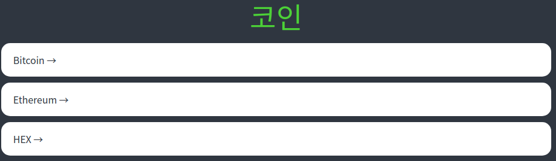

이제 저것들을 클릭했을 때 Detail Page로 이동하게 만들 것이다.

그때 사용하는 것은 anchor이 아닌 **Link**인 것을 명심하자.

**react router dom**을 통해 **Link Component**를 사용할 것이다.

```tsx
a {
  text-decoration: none;
  color: inherit;
}

...

  {coins.map((coin) => (
    <Coin key={coin.id}>
      <Link to={`/${coin.id}`}>{coin.name} &rarr;</Link>
    </Coin>
  ));
}
```

이번엔 좀 더 동적인 CSS를 만들어 보자.

**hover을 이용하여, a를 target하여 색깔을 봐꿔줄 것이다.**

```tsx
const Coin = styled.li`
  background-color: white;
  color: ${(props) => props.theme.bgColor};
  margin-bottom: 10px;
  border-radius: 15px;
  a {
    padding: 20px;
    transition: color 0.2s ease-in;
    display: block;
  }
  &:hover {
    a {
      color: ${(props) => props.theme.accentColor};
    }
  }
`;
```

> 여기서 잠깐, Coin에 있던 padding을 anchor로 옮겨줬다. 이유가 무엇일까?
>
> Coin에 padding을 주면 글짜만을 클릭했을 때 페이지 이동이 가능하고 block을 클릭하면 이동되지 않는다. 그래서 이와 같이 클릭 범위를 block에 최대한 근접하게 준 것이다.

이제 디자인은 마무리가 되었다.

### 3.2 Get Data(fetch)

이번엔 **받아오기 위해 처리 해야 될 것들**을 하고, fetch를 사용하도록 하자.

머가 있을까?

1.  현재, TypeScript를 사용하고 있기 때문에 **Interface를 구축**해야 한다.
2.  Array를 받아오고 넣어주기 위해서 **useState**를 만들어야 한다.
3.  fetch는 처음 한번만 실행시켜 주고 싶다. 즉, **특정한 시기에만 코드를 실행** 시키기 위해서 **useEffect**를 사용해야 한다.

그럼 위의 것들을 처리해 보자.

먼저 **Interface**의 경우 데이터가 어떻게 생겼는지 확인후 만들어 주면 된다.

```tsx
interface CoinInterface {
  id: string;
  name: string;
  symbol: string;
  rank: number;
  is_new: boolean;
  is_active: boolean;
  type: string;
}
```

이번엔 Array인 coins를 받아와 넣어주기 위해서 **useState**를 사용하자.

```tsx
const [coins, setCoins] = useState<CoinInterface[]>([]);
```

이제 **useEffect**를 사용하여 fetch를 사용하면 될 것이다.

이전에 fetch를 사용했을 때, 어떻게 하였는가?

**async**와 **await**를 사용하던가 **Promise**를 사용하였다.

특히, **async**와 **await**를 사용할 땐 **async**를 주기 위해서 밖에서 함수를 만들고 **useEffect**안에서 사용을 하였다.

이 귀찮은 과정을 해결하기 위해 그 자리에서 바로 function을 실행할 수 있는 방법이 있다.

바로 **()()로 감싸주는 것**이다.

```tsx
useEffect(() => {
  (async () => {
    const response = await fetch("https://api.coinpaprika.com/v1/coins");
    const json = await response.json();
    console.log(json);
  })();
}, []);
```

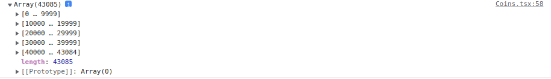

잘 불러와 졌다.

너무 많이 불러와지는 것 같으니 100개까지만 불러오자.

그래서 사용할 함수는 [slice()](https://developer.mozilla.org/ko/docs/Web/JavaScript/Reference/Global_Objects/Array/slice)이다.

**slice()** 의 예시는 이와 같다.

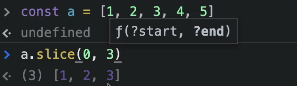

최조애적으로 Loader까지 적용하고 보면 이와 같다.

```tsx
import { useEffect, useState } from "react";
import { Link } from "react-router-dom";
import styled from "styled-components";

const Container = styled.div`
  padding: 0px 20px;
  max-width: 480px;
  margin: 0 auto;
`;

const Header = styled.header`
  height: 10vh;
  display: flex;
  justify-content: center;
  align-items: center;
`;

const CoinsList = styled.ul``;

const Coin = styled.li`
  background-color: white;
  color: ${(props) => props.theme.bgColor};
  margin-bottom: 10px;
  border-radius: 15px;
  a {
    padding: 20px;
    transition: color 0.2s ease-in;
    display: block;
  }
  &:hover {
    a {
      color: ${(props) => props.theme.accentColor};
    }
  }
`;

const Title = styled.h1`
  font-size: 48px;
  color: ${(props) => props.theme.accentColor};
`;

const Loader = styled.span`
  text-align: center;
  display: block;
`;

interface CoinInterface {
  id: string;
  name: string;
  symbol: string;
  rank: number;
  is_new: boolean;
  is_active: boolean;
  type: string;
}

function Coins() {
  const [coins, setCoins] = useState<CoinInterface[]>([]);
  const [loading, setLoading] = useState(true);
  useEffect(() => {
    (async () => {
      const response = await fetch("https://api.coinpaprika.com/v1/coins");
      const json = await response.json();
      setCoins(json.slice(0, 100));
      setLoading(false);
    })();
  }, []);
  return (
    <Container>
      <Header>
        <Title>코인</Title>
      </Header>
      {loading ? (
        <Loader>"Loading..."</Loader>
      ) : (
        <CoinsList>
          {coins.map((coin) => (
            <Coin key={coin.id}>
              <Link to={`/${coin.id}`}>{coin.name} &rarr;</Link>
            </Coin>
          ))}
        </CoinsList>
      )}
    </Container>
  );
}

export default Coins;
```

### 3.3 Route States

먼저 시작하기 전에 사진을 가지고 올 수 있는 **API URL**은 이와 같다.

    https://coinicons-api.vercel.app/

이와 같이 추가해 주었다.

```tsx
const Img = styled.img`
  width: 35px;
  height: 35px;
`;

...

        <CoinsList>
          {coins.map((coin) => (
            <Coin key={coin.id}>
              <Link to={`/${coin.id}`}>
                
                {coin.name} &rarr;
              </Link>
            </Coin>
          ))}
        </CoinsList>
```

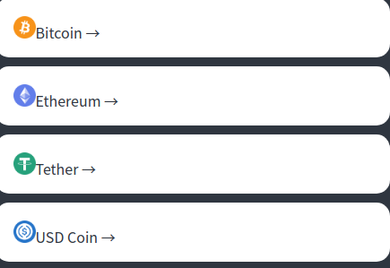

> 사진을 보면 너무 붙어 있으니 Img에 `margin-right`을 주고 display flex를 줘서 align-items:center를 줄 것인데, 그것은 새로운 div를 만들어서 줄 필요 보다는 Coin의 anchor에 주면 된다.

이제 본격적으로 **Coin(detail page)** 으로 넘어가는 작업을 해보자.

페이지를 이동할 때 정보를 주는 방법으로 어떻게 했었나?

URL에 붙여서 줘서 **useParams**로 사용해서 **id**를 받아오기도 했다.

하지만 **Coin은 Coins의 자식 컴포넌트**로 이미 **Coins에서는 각 Coin마다 id를 알고 있다.**

그래서 우리는 Link를 통해 정보를 건네 주는 방법을 사용할 것이다.

그때 사용하는 것이 **State**이다.

Link는 **pathname을 통해 URL**을 알려주고, **state를 통해 Object 전달**을 해준다.

**사용 방법**은 이와 같다.

```tsx
   <Link
     to={{
       pathname: `/${coin.id}`,
       state: { name: coin.name },
     }}
   >
```

그렇다면 이제 **Coin(detail page)**으로 넘어가서 state를 받는것부터 시작해보도록 하자.

현재 Coin 코드는 이와 같다.

```tsx
// Coin.tsx

import { useParams } from "react-router";

interface RouteParams {
  coinId: string;
}

function Coin() {
  const { coinId } = useParams<RouteParams>();
  return <h1>Coain: {coinId}</h1>;
}
export default Coin;
```

먼저 앞서 작성하였던 Coins에서 재활용할만 코드를 가져와서 넣어주었다.

```tsx
// Coin.tsx

import { useState } from "react";
import { useParams } from "react-router";
import styled from "styled-components";

interface RouteParams {
  coinId: string;
}

const Container = styled.div`
  padding: 0px 20px;
  max-width: 480px;
  margin: 0 auto;
`;

const Header = styled.header`
  height: 10vh;
  display: flex;
  justify-content: center;
  align-items: center;
`;

const Title = styled.h1`
  font-size: 48px;
  color: ${(props) => props.theme.accentColor};
`;

const Loader = styled.span`
  text-align: center;
  display: block;
`;

function Coin() {
  const [loading, setLoading] = useState(true);
  const { coinId } = useParams<RouteParams>();
  return (
    <Container>
      <Header>
        <Title>코인 {coinId}</Title>
      </Header>
      {loading ? <Loader>"Loading..."</Loader> : null}
    </Container>
  );
}
export default Coin;
```

이제 **Coins에서 넘겨준 state를 받아올 차례**이다.

우리는 **react rounter DOM**이 보내주는 **location object에 접근**하면 된다.

그때 사용하는 함수가 **useLocation()** 이다.

**useLocation hooks**는 사용자가 **현재 머물러있는 페이지에 대한 정보를 알려주는 hooks**이다. 이 hooks는 defaultProps중 하나인 **locatoin**객체를 대체 하는 **react-router-dom hooks**이다.

```tsx
const location = useLocation();
console.log(location);
```

이렇게 넣어주고 확인해보자.

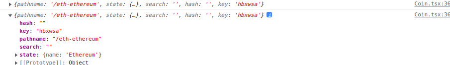

현재 담겨있는 정보를 보면, 내가 넣어준 **pathname**, **state**외에도 **search**나 **key**값이 담겨있는 것을 확인할 수 있다. **useLocation hooks**는 **Search params**를 받아올 때도 사용할 수 있다는 것이다. 기억해두자.

이제 받아오면 되는데, Interface생성도 잊지말고 해주자.

```tsx
interface RouteState {
  name: string;
}

const { state } = useLocation<RouteState>();
```

마무리로 오류 하나를 잡을 것이다.

현재 구조상 state가 생성되려면 Home화면을 거쳐서 detail page로 갔을 경우 만들어 진다.

즉, 바로 **detail page URL**을 입력해서 간다면, 아무런 화면도 뜨지 않는다.

그래서 `Loading...` 보이게끔 해두자.

```tsx
<Title>{state?.name || "Loading..."}</Title>
```

최종 코드는 이와 같다.

```tsx
// Coin.tsx

import { useState } from "react";
import { useLocation, useParams } from "react-router";
import styled from "styled-components";

interface RouteParams {
  coinId: string;
}

const Container = styled.div`
  padding: 0px 20px;
  max-width: 480px;
  margin: 0 auto;
`;

const Header = styled.header`
  height: 10vh;
  display: flex;
  justify-content: center;
  align-items: center;
`;

const Title = styled.h1`
  font-size: 48px;
  color: ${(props) => props.theme.accentColor};
`;

const Loader = styled.span`
  text-align: center;
  display: block;
`;

interface RouteState {
  name: string;
}

function Coin() {
  const [loading, setLoading] = useState(true);
  const { coinId } = useParams<RouteParams>();
  const { state } = useLocation<RouteState>();
  return (
    <Container>
      <Header>
        <Title>{state?.name || "Loading..."}</Title>
      </Header>
      {loading ? <Loader>"Loading..."</Loader> : null}
    </Container>
  );
}
export default Coin;
```

## 4. Detail Screen(Coin)

이제 본격적으로 Coin을 꾸며줄 것이다.

현재 Coin Page에 할 것은 이와 같다.

1. 코인에 대한 정보, 가격을 받아와서 display
2. Nested Router를 이용하여 Chart 표시

특히 주의 깊게 볼 것은, 1번을 하면서 **useQuery hooks**를 살펴볼 예정이다.

### 4.1 Get Data(fetch)

먼저 아래 두 API URL를 이용할 예정이다.

    https://api.coinpaprika.com/v1/coins/btc-bitcoin	=> 코인에 대한 정보
    https://api.coinpaprika.com/v1/tickers/btc-bitcoin	=> 코인에 대한 가격

이것을 이용해서 fetch를 해주자.

```tsx
useEffect(() => {
  (async () => {
    const infoData = await (
      await fetch(`https://api.coinpaprika.com/v1/coins/${coinId}`)
    ).json();
    const priceData = await (
      await fetch(`https://api.coinpaprika.com/v1/tickers/${coinId}`)
    ).json();
  })();
}, [coinId]);
```

> **coinId를 useEffect의 두번째 인자 array에 넣어준 이유**는 hooks는 최선의 성능을 위해서 hooks안에서 사용한 것은 그게 어떤 것이든 []에 dependency를 넣어 줘야 한다고 한다.

fetch로 정보를 가져왔으면, **state**에 넣어주면 된다.

```tsx
const [info, setInfo] = useState({});
const [priceInfo, setPriceInfo] = useState({});
```

필요한 정보들을 가져올 것인데, 어떻게 가져오는지 알아보자.

### 4.2 Interface(Data Types)

현재 가져와야 할 Data가 매우 많다. 그것들을 어떻게 가져오는지 방법에 대해 얘기해보자.

먼저 console.log를 해서 **infoData**와 **priceData**를 가져올 것이다.

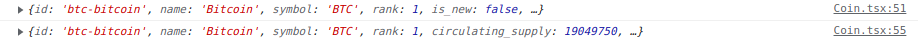

여기서 하나씩 오른쪽 마우스를 클릭해보면 `Store Object as Global Variable`이 있다.

만들어서 이용하자.

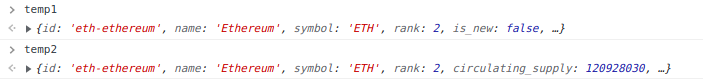

이것은 내가 지정하고 싶은 **객체를 global영역에 임시 변수로 저장**하는 Chrmoe 개발자 도구에서 지원하는 기능이다.

이후 다음과 같이 해주자.

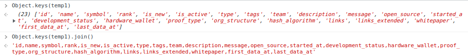

저장한 객체에서 **key값들을 전부 가져와 join()으로 String형태**로 만들어 준 것이다.

이렇게 해서 내가 일일히 입력할 필요 없이 복사, 붙여넣기를 할 수 있게 되었다.

다만 이것의 **한가지 문제**가 있다면,

`tags:object;`라고 가져온 Data가 있는데 사실 이건 Type이 Object가 아니다.

그래서 그때는 직접 찾아서 입력해야 한다.

```tsx
interface ITag {
  coin_counter: number;
  ico_counter: number;
  id: string;
  name: string;
}

interface Iinfo {
  ...
  tags: ITag[];
  ...
}
```

이러한 식으로 해줘야 할 것이다.

> price의 경우 value값을 가져와야 한다. 따라서 **keys** 대신 **values**를 사용하여 가져오면 된다.

참고로 아래와 같은 방식으로 하면 오류가 나온다.

```tsx
const [info, setInfo] = useState<InfoData>({});
```

TypeScript가 Interface를 받아 무엇인지 알고 있으면, **중괄호{}** 는 지워줘야 오류가 안난다.

참고로 Coins에서 Screen painting하는 것은 봤으니 건너뛰도록 하고 코드를 통해 확인하면 되겠다.

### 4.3 Nested Routes

위에서 [Nested Router](#11-nested-router)의 개념은 정리했다. 여기선 활용하는 법을 배울 것이다.

**Nested Router는 router안에 있는 또 다른 router이다.**

이것은 웹사이트에서 **탭**이랑 비슷한 효과를 내준다.

> 사실 강의에선 탭을 사용할 때 많은 도움을 준다고 헀지만, 구글링을 통해 찾아본 탭의 개념과 상충해서 위와 같이 적었습니다.

> **탭**은 메인영역, aside 영역에 많이 사용되는 UI요소이다.
>
> **탭 UI**는 **여러 문서, 패널을 하나의 창에 두고 전환하여 볼 수 있도록 구현한 인터페이스**를 뜻한다.
>
> 참고:
>
> - [💛[부스트코스\_웹 UI 개발] 15. 탭](https://velog.io/@wish/15.-%ED%83%AD)

먼저 routes/Price.tsx 와 routes/Chart.tsx를 만들어주자.

```tsx
// routes/Price.tsx

function Price() {
  return <h1>Price</h1>;
}

export default Price;
```

```tsx
// routes.Chart.tsx

function Chart() {
  return <h1>Chart</h1>;
}

export default Chart;
```

이제 이 두 가지를 모두 다 **Coin Screen**에 넣어줄 것이다.

```tsx
// Coin.tsx

<Switch>
  <Route path={`/${coinId}/price`}>
    <Price />
  </Route>
  <Route path={`/${coinId}/chart`}>
    <Chart />
  </Route>
</Switch>
```

첫 번째 Route는 price를 보여주는 액션을 할 것이다.
두 번째 Route는 chart에 관한 것이다.

> path의 경우 **detail page에서 이동**하는 것이므로 **특정 Coin의 price와 chart를 보기 위해** 위와 같이 **coinId**를 넣어주었다.

### 4.4 Switch

이번엔 prcie와 chart를 스위치하는 법을 배울 것이다.

기본적으로 Link가 있어야 할 것이다.

```tsx
// Coin.tsx

 <Link to={`/${coinId}/chart`}>Chart</Link>
 <Link to={`/${coinId}/price`}>Price</Link>
```

URL 변화 없이 **React.js의 State**만으로 구현할 수도 있었지만, **링크를 사용해서 URL을 바꿈**으로써 **트리거가 되어서 re-render를 할 수 있다**는 것이다.

**URL이 바뀌는 데도 원하는 부분만 바뀌는 것이다.**

> 여기서 말하는 **원하는 부분**은 **Switch안에 있는 부분**이다.

수정한 코드를 보자.

```tsx
// Coin.tsx

          <Tabs>
            <Tab>
              <Link to={`/${coinId}/chart`}>Chart</Link>
            </Tab>
            <Tab>
              <Link to={`/${coinId}/price`}>Price</Link>
            </Tab>
          </Tabs>

          <Switch>
            <Route path={`/:coinId/price`}>
              <Price />
            </Route>
            <Route path={`/:coinId/chart`}>
              <Chart />
            </Route>
          </Switch>
```

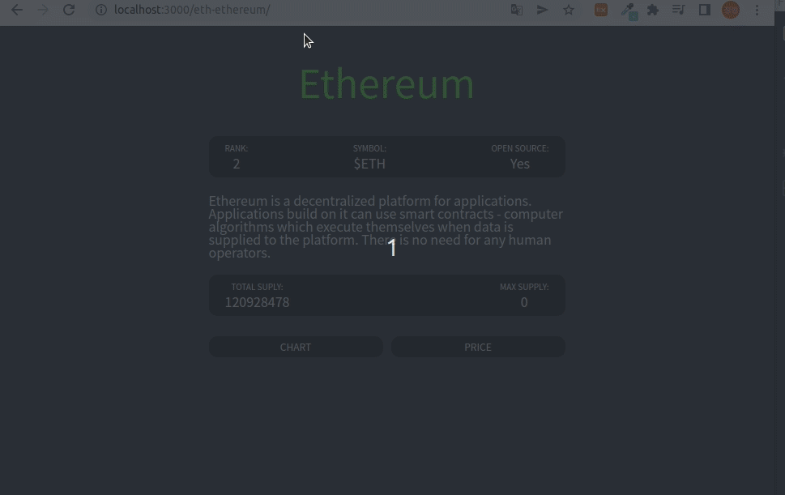

이제 여기서 사용할 것이 **useRouteMatch hooks**이다.

**useRouteMatch hook**는 현재 URL이 일치하는지 확인하는데 시도하는 hook이다. 실제로 렌더링 하지 않고 일치 데이터에 액세스 하는데 유용하다.

```tsx
const priceMatch = useRouteMatch("/:coinId/price");
```

이러한 식으로 사용해서 현재 coinId/price라는 URL에 있는지 확인해 주는 것이다.

console.log를 통해 확인해보자.

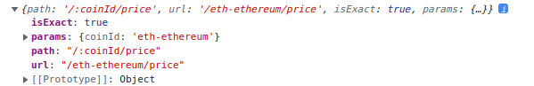

이것을 활용하기 위해서 **Tab을 수정**해주자.

Tab styled component에 prop을 추가해줘야 한다.

```tsx
const Tab = styled.span<{ isActive: boolean }>`
	CSS
	...
`;
```

그리고 이렇게 isActive라는 prop을 주었다면 CSS안에서 활용해야지 않겠나?

```tsx
const Tab = styled.span<{ isActive: boolean }>`
  ...
  color: ${(props) =>
    props.isActive ? props.theme.accentColor : props.theme.textColor};
`;
```

이런식으로 styled component안에 적어주면 된다.

이제 이것들을 어떻게 사용하면 될까?

당연히, **컴포넌트에서 props를 주는 부분에 isActive와 priceMatch를 활용**해주면 된다.

```tsx
<Tabs>
  <Tab isActive={chartMatch !== null}>
    <Link to={`/${coinId}/chart`}>Chart</Link>
  </Tab>
  <Tab isActive={priceMatch !== null}>
    <Link to={`/${coinId}/price`}>Price</Link>
  </Tab>
</Tabs>
```

이렇게 함으로써 머를 누르고 있는지 유저가 색깔을 통해 확인할 수 있게 되었다.

## 5. React Query

이제 React JS에서 지원해주는 기능 중 하나인 **react query**를 알아보자.

### 5.1 Introduction

**react query**는 리액트 애플리케이션에서 **서버 상태 가져오기, 캐싱, 동기화 및 업데이트**를 보다 쉽게 다룰 수 있도록 도와주며 **클라이언트 상태**와 **서버 상태**를 명확히 구분하기 위해서 만들어진 라이브러리이다.

**react query**에서 **기존 상태 관리 라이브러리(redux, mobX)** 는 **클라이언트 상태 작업**에 적합하지만 **비동기 또는 서버 상태 작업에는 그다지 좋지 않다**고 말하고 있다.

**클라이언트 상태(Client State)** 와 **서버 상태(Server State)** 는 완전히 다르며 **클라이언트 상태**는 컴포넌트에서 관리하는 각각의 input 값으로 예를 들 수 있고 **서버 상태**는 database에 저장되어 있는 데이터로 예를 들 수 있다.

### 5.2 react-query 상태

- **fresh**: 새롭게 추가된 쿼리 & 만료되지 않은 쿼리 → 컴포넌트가 마운트, 업데이트되어도 데이터 재요청 ❌

> 여기서 **마운트는 나타나는 것**을 의미한다. 컴포넌트가 나타나는 것은 마운트라 하고 삭제될 때는 언마운트라고 한다.

- **fetching**: 요청 중인 쿼리
- **stale**: 만료된 쿼리 → 컴포넌트가 마운트, 업데이트되면 데이터 재요청 ⭕
- **inactive**: 비활성화된 쿼리 → 특정 시간이 지나면 가비지 컬렉터에 의해 제거

이정도 까지 정리를 하고 사용 방법에 대해서는 아래에서 코드와 함께 진행할 것이다.

참고: [react-query](https://velog.io/@jkl1545/React-Query)

### 5.3 사용 방법(useQuery)

먼저 설치부터 해주자.

    npm install react query

자세한 사용법은 해당 사이트를 참고하자.
[Overview | React Query | TanStack](https://react-query.tanstack.com/overview)

기본적인 순서만 보자면 이와 같다.

1.  **queryClinet를 만든다.**
2.  **provider를 만든다.**

index.tsx에서 해보자.

```tsx
// index.tsx

const queryClient = new QueryClient();

ReactDOM.render(
  <React.StrictMode>
    <QueryClientProvider client={queryClient}>
      <ThemeProvider theme={theme}>
        <App />
      </ThemeProvider>
    </QueryClientProvider>
  </React.StrictMode>,
  document.getElementById("root")
);
```

**QueryClientProvider**는 **client props를 필요로 하기 때문**에 넣어준 것이다.

이제 사용할 준비를 맞췄다.

react query는 앞서 우리가 했던 작업들을 간략화시켜줄 것이다.

먼저 **첫 단계로 reat query를 사용하기 위해서 fetcher함수를 만들어야 한다.**

fetcher함수는 이와 같다.

```tsx
// routes/api.ts

export async function fetchCoins() {
  const response = await fetch("https://api.coinpaprika.com/v1/coins");
  const json = await response.json();
  return json;
}
```

> 기본적으로 API와 관련된 것들은 component들과 멀리 떨어져 있도록 해주자.

해당 fetcher함수는 json data의 Promise를 return해줘야 한다.

이 작업을 할 때 좋은 방법은 이건 아니다. async와 await를 하는것 대신 **promise**를 사용하는 것이 코드가 더 깔끔해질 것이다.

```tsx
// routes/api.ts

export function fetchCoins() {
  return fetch("https://api.coinpaprika.com/v1/coins").then((response) =>
    response.json()
  );
}
```

이제 Coins.tsx로 가서 이전 코드랑 비교해보면서 진행해보자.

일단 우리가 이전까지 해온 작업의 코드를 보면 이와 같다.

```tsx
// Not use react-query

const [coins, setCoins] = useState<CoinInterface[]>([]);
const [loading, setLoading] = useState(true);
useEffect(() => {
  (async () => {
    const response = await fetch("https://api.coinpaprika.com/v1/coins");
    const json = await response.json();
    setCoins(json.slice(0, 100));
    setLoading(false);
  })();
}, []);
```

**useQuery**를 사용할 것인데 2가지 argument를 필요로 한다.

1.  **QueryKey**:
    - Querykey를 기반으로 데이터 캐싱을 관리한다.
    - 문자열 또는 배열로 지정할 수 있다.
2.  **Query function**:
    - useQuery의 두번째 인자에는 promise를 반환하는 함수를 넣어주어야 한다.
    - 보통 fetch를 사용하는 함수를 이용한다.

사실 세번째 인자로 options을 넣어줄 수 있지만 여기서는 다루지 않고, 링크를 올려두겠다.

[[React Query] 리액트 쿼리 시작하기 (useQuery)](https://velog.io/@kimhyo_0218/React-Query-%EB%A6%AC%EC%95%A1%ED%8A%B8-%EC%BF%BC%EB%A6%AC-%EC%8B%9C%EC%9E%91%ED%95%98%EA%B8%B0-useQuery)

어떻게 코드를 쓰면 될까?

```tsx
// use react query
const { isLoading, data } = useQuery("allCoins", fetchCoins);
```

useQuery는 **isLoading이라고 불리는 boolean값을 return**하는데 **이전 것을 대체**할 수 있다.

무슨 말이냐?

**fetchCoins**가 끝나면 **react query**는 그 함수 데이터를 **data**에 넣어줄 것이다.

그리고 **isLoading의 boolean값을 false로 만든다는 것**이다.

어디서 많이 본 방식이다. 맞다. 이건 우리가 위해서 fetch함수를 사용하여 구현한 방식이다.

즉, **위의 저 긴 코드를 한줄로 생략할 수 있게 된 것**이다.

우리는 Typescript를 사용하고 있기 때문에 **data Interface**가 필요하다.

```tsx
const { isLoading, data } = useQuery<ICoin[]>("allCoins", fetchCoins);
```

> 여기서 I는 Interface의 약자로 개발자들이 활용하는 명명법이다.

이제 TypeScript는 data가 CoinInterface array거나 undefined라는 것을 안다.

그럴때 data를 사용하려면?

```tsx
{data?.slice(0, 100).map((coin) => (
	...
```

이와같이 **?.** 를 사용하면 된다고 했다.

> 데이터를 전부 렌더링 하기 싫어서 100개만 보여주기 위하여 저와 같이 했다.

아까 위에서 봤듯이, QueryKey를 기반으로 데이터 캐싱을 관리한다고 했다.

그래서 이전에는 특정 코인 페이지로 이동하고 되돌아가기를 누르면 `Loading...`이 보였다.

즉, 다시 fetching을 했다는 것인데, **useQuery**를 사용하면 데이터를 캐시에 저장해두기 때문에 `Loading...`이 보이지 않는 것이다.

최종 코드는 이와 같다.

```tsx
// Coins.tsx

function Coins() {
  const { isLoading, data } = useQuery<ICoin[]>("allCoins", fetchCoins);
  return (
    <Container>
      <Header>
        <Title>코인</Title>
      </Header>
      {isLoading ? (
        <Loader>"Loading..."</Loader>
      ) : (
        <CoinsList>
          {data?.slice(0, 100).map((coin) => (
            <Coin key={coin.id}>
              <Link
                to={{
                  pathname: `/${coin.id}`,
                  state: { name: coin.name },
                }}
              >
                
                {coin.name} &rarr;
              </Link>
            </Coin>
          ))}
        </CoinsList>
      )}
    </Container>
  );
}
```

### 5.4 Devtools

React Query는 **Devtools(Developer Tools, 개발자도구)** 라는 것을 가지고 개발자들의 개발 환경을 향상시켜주는 기능을 제공한다. **Devtools**는 **render할 수 있는 component**이고, 이것을 import해오면 **캐시에 있는 query를 볼 수 있다.**

즉, React Query의 **모든 내부 작업을 시각화** 하는데 도움이 되며 문제가 발생할 경우 **디버깅 시간을 절약**할 수 있다.

App.tsx가서 **import를 해주고 Router아래에 render할 것**이다.

```tsx
//  App.tsx

import { ReactQueryDevtools } from "react-query/devtools";

function App() {
  return (
    <>
      <GlobalStyle />
      <Router />
      <ReactQueryDevtools initialIsOpen={true} />
    </>
  );
}
```

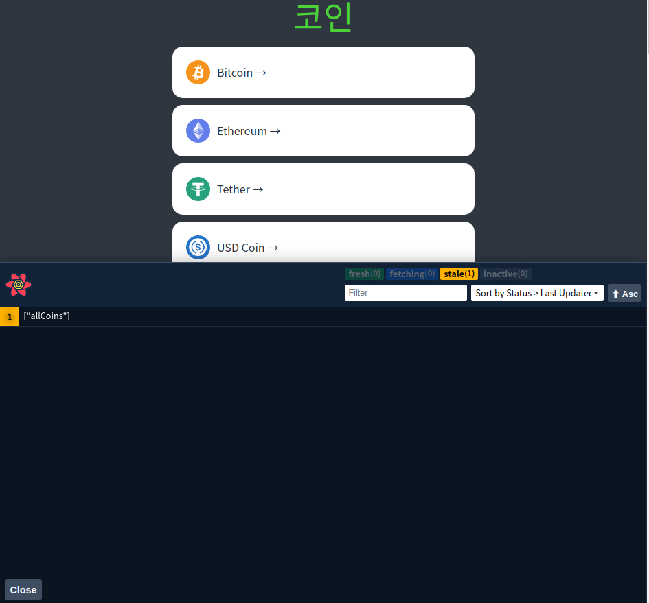

이제 캐시에 무엇이 담겨있는지 확인할 수 있다.

현재 query의 이름은 allCoins이다.

**Devtools**는 **Refetch**나 **invalidata**, **Reset**, **Remove** 등 여러가지 기능을 사용할 수 있다.

### 5.5 useQuery(중복 되는 경우)

이제 Coins를 했으니 Coin을 할 차례이다.

먼저 **fetcher함수**를 만들어 줘야 한다고 했다.

```tsx
// api.ts

const BASE_URL = `https://api.coinpaprika.com/v1`;

export function fetchCoins() {
  return fetch(`${BASE_URL}/coins`).then((response) => response.json());
}

export function fetchCoinInfo(coinId: string) {
  return fetch(`${BASE_URL}/coins/${coinId}`).then((response) =>
    response.json()
  );
}

export function fetchCoinTickers(coinId: string) {
  return fetch(`${BASE_URL}/tickers/${coinId}`).then((response) =>
    response.json()
  );
}
```

**fetchCoins**와는 다르게 인자를 받고있다. 그럴 경우 **useQuery**로 사용할 때 **함수**로 적어주면 된다.

```tsx
//  Coins.tsx
const {} = useQuery(coinId, () => fetchCoinInfo(coinId));
const {} = useQuery(coinId, () => fetchCoinTickers(coinId));
```

지금 문제는 **2가지의 query가 같은 query key**를 가지고 있다.

React query는 각각 다른 key를 사용해야 한다.

그래서 우리는 이와 같은 방식으로 할 것이다.

```tsx
const {} = useQuery(["info", coinId], () => fetchCoinInfo(coinId));
const {} = useQuery(["tickers", coinId], () => fetchCoinTickers(coinId));
```

**key를 array로 감싸서 표현한 것**이다.

최종적으로 코드를 채우면 이와 같다.

```tsx
// Coin.tsx

const { isLoading: infoLoading, data: infoData } = useQuery<InfoData>(
  ["info", coinId],
  () => fetchCoinInfo(coinId)
);
const { isLoading: tickersLoading, data: tickersData } = useQuery<PriceData>(
  ["tickers", coinId],
  () => fetchCoinTickers(coinId)
);
```

**infoLoading**과 **tickersLoading**를 코드에서 동시에 활용하는 방법이 있다.

Tab키를 눌렀을 때 떠야되는 Loading은 **둘 중 하나만 true**이면 된다.

그래서 이와 같이 사용이 가능하다.

    const loading = infoLoading || tickersLoading;

최종 코드는 이와 같다.

```tsx
// Coin.tsx

function Coin() {
  const { coinId } = useParams<RouteParams>();
  const { state } = useLocation<RouteState>();
  const priceMatch = useRouteMatch("/:coinId/price");
  const chartMatch = useRouteMatch("/:coinId/chart");
  const { isLoading: infoLoading, data: infoData } = useQuery<InfoData>(
    ["info", coinId],
    () => fetchCoinInfo(coinId)
  );
  const { isLoading: tickersLoading, data: tickersData } = useQuery<PriceData>(
    ["tickers", coinId],
    () => fetchCoinTickers(coinId)
  );
  const loading = infoLoading || tickersLoading;
  return (
    <Container>
      <Header>
        <Title>
          {state?.name ? state.name : loading ? "Loading..." : infoData?.name}
        </Title>
      </Header>
      {loading ? (
        <Loader>Loading...</Loader>
      ) : (
        <>
          <Overview>
            <OverviewItem>
              <span>Rank:</span>
              <span>{infoData?.rank}</span>
            </OverviewItem>
            <OverviewItem>
              <span>Symbol:</span>
              <span>${infoData?.symbol}</span>
            </OverviewItem>
            <OverviewItem>
              <span>Open Source:</span>
              <span>{infoData?.open_source ? "Yes" : "No"}</span>
            </OverviewItem>
          </Overview>
          <Description>{infoData?.description}</Description>
          <Overview>
            <OverviewItem>
              <span>Total Suply:</span>
              <span>{tickersData?.total_supply}</span>
            </OverviewItem>
            <OverviewItem>
              <span>Max Supply:</span>
              <span>{tickersData?.max_supply}</span>
            </OverviewItem>
          </Overview>

          <Tabs>
            <Tab isActive={chartMatch !== null}>
              <Link to={`/${coinId}/chart`}>Chart</Link>
            </Tab>
            <Tab isActive={priceMatch !== null}>
              <Link to={`/${coinId}/price`}>Price</Link>
            </Tab>
          </Tabs>

          <Switch>
            <Route path={`/:coinId/price`}>
              <Price />
            </Route>
            <Route path={`/:coinId/chart`}>
              <Chart />
            </Route>
          </Switch>
        </>
      )}
    </Container>
  );
}
```

## 6. Chart

간단하게만 보고 넘어갈 것이다.

차트를 만들어 줄 것인데 일단 기본 작업은 이와 같다.

1.  Chart를 보여주기 위해 Chart Route path가 필요하고 coinId props로 넘겨줌
2.  Chart에서 props를 사용할 수 있게 Interface 생성
3.  API URL을 사용하기 위해 fetcher함수 생성
4.  Chart.tsx에서 useQuery사용하여 코드 진행

이와 같은 순서는 이전에도 계속 해온 것들이다. 생략하고 코드는 그러면 이정도와 같다.

```tsx
//  Chart.tsx

Chart.tsx;

import { useQuery } from "react-query";
import { fetchCoinHistory } from "./api";

interface ChartProps {
  coinId: string;
}

interface IHistorical {
  time_open: string;
  time_close: string;
  open: number;
  high: number;
  low: number;
  close: number;
  volume: number;
  market_cap: number;
}

function Chart({ coinId }: ChartProps) {
  const { isLoading, data } = useQuery<IHistorical[]>(["ohlcv", coinId], () =>
    fetchCoinHistory(coinId)
  );
  return <h1>Chart</h1>;
}

export default Chart;
```

이제 **APEXCHARTS**를 사용할 것인데, **APEXCHARTS**는 **자바스크립트 Chart library**이다.

해당 페이지에 나와있다.

[ApexCharts.js - Open Source JavaScript Charts for your website](https://apexcharts.com/)

현재 이정도로 코딩을 했다.

```tsx
// Chart.tsx

function Chart({ coinId }: ChartProps) {
  const { isLoading, data } = useQuery<IHistorical[]>(["ohlcv", coinId], () =>
    fetchCoinHistory(coinId)
  );
  return (
    <div>
      {isLoading ? (
        "Loading chart..."
      ) : (
        <ApexChart
          type="line"
          series={[
            {
              name: "sales",
              data: data?.map((price) => price.close),
            },
          ]}
          options={{
            theme: {
              mode: "dark",
            },
            chart: {
              height: 500,
              width: 500,
            },
          }}
        />
      )}
    </div>
  );
}
```

이렇게 했을 때 이와 같은 오류를 직면한다.

```
TS2769: No overload matches this call.
  Overload 1 of 2, '(props: Props | Readonly<Props>): ReactApexChart', gave the following error.
    Type '{ name: string; data: number[] | undefined; }' is not assignable to type 'number'.
  Overload 2 of 2, '(props: Props, context: any): ReactApexChart', gave the following error.
    Type '{ name: string; data: number[] | undefined; }' is not assignable to type 'number'.
```

왜 발생한 것일까?

이 오류의 경우 **series data []가 받아야 하는건 number**인데 현재 **data.map()** 을 읽어오지 않는다면 undefined라서 문제가 되는 것이다.

두 가지 방법중 선택하자.

1. 널 병합 연산자(??) 사용
2. `?.` 사용

1번의 경우

    data: data?.map((price => price.close)) ?? [],

2번의 경우

    data?.map((price) => price.close) as number[]

코드는 더 있지만, 사이트의 document를 참고하는 것이 좋을 것 같아서 여기서 마무리 하겠다.

## 7. Final Touches

마무리 작업을 들어갈 것이다.

먼저 현재 코인의 가격이 보여야 되는 부분에 다른 데이터가 들어가 있다.

```tsx
            <OverviewItem>
              <span>Open Source:</span>
              <span>{infoData?.open_source ? "Yes" : "No"}</span>
```

이 부분을 코인의 가격이 들어가게 수정하자.

```tsx
<OverviewItem>
  <span>Price:</span>
  <span>{tickersData?.quotes.USD.price.toFixed(3)}</span>
</OverviewItem>
```

여기서 사용한 **toFixed()** 는 고정 소수점 표기법으로 표기하기위해 사용하는 함수로 소수점 자리를 몇개까지 표시해줄지 결정해준다.

그리고 5초 마다 수정되게 즉, 실시간으로 되게 만들고 코인의 정보를 가져오게 하고 싶다.

**useQuery**에는 **3번재 argument**로 **options**를 줄 수 있다고 말했다.

이와 같이 해주면 된다.

```tsx
const { isLoading: tickersLoading, data: tickersData } = useQuery<PriceData>(
  ["tickers", coinId],
  () => fetchCoinTickers(coinId),
  {
    refetchInterval: 5000,
  }
);
```

마지막으로, **react-helmet**이란 것을 추가해줄것인데,

**무엇을 render하든 간에 document의 head**로 간다.

설치부터 해주자.

    npm install react-helmet

    npm i --save-dev @types/react-helmet

그리고 이와 같이 사용해주면 마무리다.

```tsx
// Coin.tsx

import { Helmet } from "react-helmet";

...

      <Helmet>
        <title>
          {state?.name ? state.name : loading ? "Loading..." : infoData?.name}
        </title>
      </Helmet>

...

```

Helmet은 그저 head로 가는 direct link일 뿐이다.

오류를 하나 잡을 것인데 하는 **ApexChart**를 쓰는 도중 다음과 같은 오류가 나왔따.

```tsx
// Chart.tsx
        ...


        <ApexChart
          type="line"
          series={[
            {
              name: "Price",
              data: data?.map((price) => price.close),
            },
          ]}

          ...
```

name과 data쪽에서 다음과 같은 **오류**가 나왔다.

```
Overload 1 of 2, '(props: Props | Readonly): ReactApexChart', gave the following error.
Type '{ name: string; data: any[] | undefined; }' is not assignable to type 'number'.
Overload 2 of 2, '(props: Props, context: any): ReactApexChart', gave the following error.
Type '{ name: string; data: any[] | undefined; }' is not assignable to type 'number'.
```

무슨 오류일까?

두 가지를 해보면서 생각해봤다.

1.  name이나 data둘 중 하나늘 지워봤다.

name을 지우면 똑같은 오류가 계속 나지만, data를 지우면 오류가 바뀐다.

```
Type '{ name: string; }' is not assignable to type 'number'.
```

그래서 아마도 **data쪽에서 문제가 있을 것이라고 접근은 하였다.**

최종적으로 문제에 도달하지는 못했지만, 문제는 찾아보니 이와 같았다.

**series data[]** 가 **받아야 와야 하는 건 number** 인데 현재 **data?.map()** 으로 읽어올때랑 아닐때를 구분해서 받아야 하는데 **읽어오면 number 이지만 못읽어오면 undefind**가 되서 문제가 되는 것이다.
그래서 저 형식이 **number 로 강제해주면 해결되는 문제**입니다.

그래서 **두 가지 방식**이 존재한다.

1.  널 병합 연산자(??)를 사용하여 []를 붙여준다.
2.  as number[]를 붙여준다.

**1번의 경우**

```tsx
data: data?.map((price) => price.close) ?? [],
```

**2번의 경우**

```tsx
data: data?.map((price) => price.close) as number[],
```

요번 파트는 여기서 끝낼 것이다. 하지만 Crypto Tracker의 구현에서 필요한 부분이 남아있지만, 그것에 대해선 [다음 파트](./state-management.md)에서 해결해 볼 것이다.
