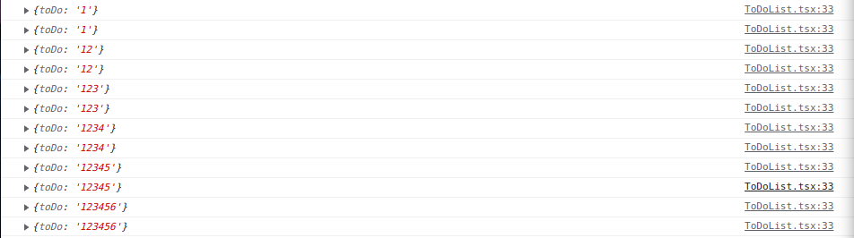

# State Management & React Form Hooks

- [State Management & React Form Hooks](#state-management--react-form-hooks)
  - [1. Introduction](#1-introduction)
  - [2. State Management](#2-state-management)
    - [2.1 State(상태)](#21-state상태)
    - [2.2 State Management Tools](#22-state-management-tools)
    - [2.3 Recoil](#23-recoil)
      - [2.3.1 Recoil usablity](#231-recoil-usablity)
      - [2.3.2 Introduction to Recoil](#232-introduction-to-recoil)
      - [2.3.3 Atoms](#233-atoms)
      - [2.3.4 전역상태 관련 Hooks](#234-전역상태-관련-hooks)
      - [2.3.5 Seletor](#235-seletor)
    - [2.4 Crypto Tracker Finish](#24-crypto-tracker-finish)
  - [3. To-Do-List](#3-to-do-list)
    - [3.1 Set Up](#31-set-up)
    - [3.2 React Hook Form](#32-react-hook-form)
    - [3.3 How to use?](#33-how-to-use)
      - [3.3.1 Register](#331-register)
      - [3.3.2 handleSubmit](#332-handlesubmit)
      - [3.3.3 formState](#333-formstate)
      - [3.3.4 실시간 유효성 검사](#334-실시간-유효성-검사)
      - [3.3.5 Sign Up Page(Code Reviewing)](#335-sign-up-pagecode-reviewing)
    - [3.4 Make To Do List](#34-make-to-do-list)
      - [3.4.1 Create atom](#341-create-atom)
      - [3.4.2 State](#342-state)
      - [3.4.3 Refactoring](#343-refactoring)
      - [3.4.4 To Do](#344-to-do)
      - [3.4.5 Selector](#345-selector)
      - [3.5 Enums](#35-enums)

## 1. Introduction

이번 파트에서는 무엇을 배울 것인가?

이전 파트에서 Crypto Tracker를 구현했다. 우선, 그것을 이어 받아 **State Management**을 활용해 마무리를 지을 예정이다.

그리고 To-Do-List를 만들면서 **react-hook-form**에 대해서 알아볼 것이다.

## 2. State Management

먼저 **State Management**를 알아보기 전에 **State(상태)**에 대해서 한번 더 짚고 넘어가자.

### 2.1 State(상태)

**State**란 React에서 **Component안에서 관리**되는 것을 의미한다.

State가 변경되면 Re-Rendering된다고 앞에서 말했었다.

이 State를 **자식 컴포넌트에게 전달**하려면 **props**를 이용해야 된다.

그렇다면 State Management는 무엇이고 왜 필요한가?

컴포넌트간의 정보 공유에 대해서 잠깐 알아보고 진행하자.

**Compoennt 간의 정보 공유**

- **자식 컴포넌트들 간**의 **다이렉트 데이터 전달**은 **불가능**하다.
- **자식 컴포넌들 간의 데이터**를 주고 받을 때는 상태를 관리하는 **부모 컴포넌트**를 통해서 주고 받는다.

여기서 만약, **자식이 많이 진다면 어떻게 될까?**

상태를 관리하는 상위 컴포넌트에서 계속 내려받아야 해서 **상태 관리가 매우 복잡**해진다. → **Props driling 이슈**


그래서 나온 것이 **State Management Tools**이다.

### 2.2 State Management Tools

상태 관리 툴은 어떤 문제를 해결해 줄까?

1.  **전역 상태 저장소 제공**
2.  **Props driling 이슈 해결**
    - 예를 들어, `<A>`라는 컴포넌트에 상태가 있고, `<I>`라는 컴포넌트가 해당 상태를 사용한다고 하면, 그 중간에 존재하는 `<C>`, `<G>`등은 굳이 name이라는 상태가 필요하지 않음에도 컴포넌트에 props를 만들어 자식 컴포넌트에 넘겨주어야 했다.
    - 즉, props는 `<I>`에서만 필요한데 `<A>` → `<C>` → `<G>` → `<I>` 이렇게 props가 불필요하게 전달된다는 뜻이다. 이 문제를 해결해준다.

**상태 관리 툴 종류**는 무엇이 있을까?

- Redux
- React Context
- Mobx
- Recoil

우리는 요번에 Recoil을 이용해서 배워볼 것이다.

### 2.3 Recoil

**Recoil**은 React를 위환 **전역 상태관리 라이브러리**로, 2020년 5월 Factbook에서 출시 하였다. 그렇기에, 다른 라이브버리(Redux, Mobx)와 달리 **React 전용**이며 **React에 최적화**되어 있다고 할 수 있다.

비동기 요청이 매우 심플하고, Redux처럼 다양한 구성(action, reducer 등)을 할 필요가 없다.

그렇다면, **Recoil**이 가지고 있는 **이전 전역 상태관리 라이브러리와의 차이점**을 봐보자.

대표적으로 사용되었던 **Redux, Mobx**들의 성능 자체에 문제가 있던 것은 아니다. 오히려, 페이스북에서 고안한 **Flux패턴**을 기반으로 설계되면서 **안정적인 전역상태 관리**가 가능하였다.[(Flux 관련 링크)](https://medium.com/hcleedev/web-react-flux-%ED%8C%A8%ED%84%B4-88d6caa13b5b)


그럼에도 불구하고, **Redux의 사용도와 만족도가 감소**하게 된 데에는 **아래와 같은 문제**들이 잔존하였다.

- **React전용 라이브러리가 아니다!** React 관점에선 **외부요인으로 Store 취급**되며, [동시성 모드](https://ko.reactjs.org/docs/concurrent-mode-intro.html)를 구현하기에 **호환성이 부족**하다.
- **복잡한 Boiler Plate 초기세팅이 요구된다!** Store, Action, Reducer등 다양한 구성요소가 필요해 **비효율적이며 러닝커브가 높다**.
- **비동기 데이터에 추가 리소스가 요구된다!** Redux-sage등 전역상태에서 **비동기 데이터를 호출하기 위한 서드파트 라이브러리가 필요**하다.

이러한 단점들을 보완한, 그리고 React에서 좀 더 최적화된 전역 상태관리 라이브버리로 내놓은 것이 **Recoil**이다.

출처:

- [[Recoil] 전역 상태관리 라이브러리 - Recoil 정복기 :: ttaeng_99 's 개발의 흔적들](https://abangpa1ace.tistory.com/212)

#### 2.3.1 Recoil usablity

이제 우리 프로젝트를 진행하면서 **Recoil의 유용성**을 이해해 보자.

먼저 **State Management(Recoil)을 사용하지 않고** **theme을 전달**해 볼 것이다.

현재 ThemeProvider를 index.tsx에 넣어 두었는데, 그것을 App.tsx로 옮겨주자.

```tsx
// App.tsx

function App() {
  return (
    <>
      <ThemeProvider theme={theme}>
        <GlobalStyle />
        <Router />
        <ReactQueryDevtools initialIsOpen={true} />
      </ThemeProvider>
    </>
  );
}

export default App;
```

왜 이렇게 했는지는 진행하다 보면 이해 된다.

그리고 현재 ThemeProvider에 만들어 둔 theme이 하나밖에 없으니 두개로 되게 만들자.

```tsx
// Theme.ts

import { DefaultTheme } from "styled-components";

export const darkTheme: DefaultTheme = {
  bgColor: "#2f3640",
  textColor: "black",
  accentColor: "#4cd137",
};

export const lightTheme: DefaultTheme = {
  bgColor: "whitesmoke",
  textColor: "black",
  accentColor: "#4cd137",
};
```

이렇게 해서 **두개 다 이용 가능하도록 만들 것**인데, **state를 만들어서 버튼을 구현해서 toggle**을 하도록 해줄 것이다.

먼저 버튼을 구현하기 전에 작업을 완료하자.

```tsx
// App.tsx

function App() {
  const [isDark, setIsDark] = useState(false);
  const toggleDark = () => setIsDark((current) => !current);
  return (
    <>
      <ThemeProvider theme={isDark ? darkTheme : lightTheme}>
        <button onClick={toggleDark}>Toggle Mode</button>
        <GlobalStyle />
        <Router />
        <ReactQueryDevtools initialIsOpen={true} />
      </ThemeProvider>
    </>
  );
}

export default App;
```

일단, 왜 index.tsx에서 App.tsx로 옮긴 것인지는 이해 되는가?

바로 **state를 사용하기 위함**이다.

버튼의 구현의 경우 Coins.tsx에서 할 것이다.

Coins.tsx에서 저 state를 다루기 위해선 어떻게 해야되나?

해당 state를 prop을 넘겨주어야 한다.

```tsx
// App.tsx

function App() {
  const [isDark, setIsDark] = useState(false);
  const toggleDark = () => setIsDark((current) => !current);
  return (
    <>
      <ThemeProvider theme={isDark ? darkTheme : lightTheme}>
        <GlobalStyle />
        <Router toggleDark={toggleDark} />
        <ReactQueryDevtools initialIsOpen={true} />
      </ThemeProvider>
    </>
  );
}

export default App;
```

그리고 **Router**에서 prop을 받아서 **Coins**로 넘겨주면 Coins에서 사용 가능 할 것이다.

```tsx
// Router.tsx

interface IRouterProps {
  toggleDark: () => void;
}

function Router({ toggleDark }: IRouterProps) {
  return (
    <BrowserRouter>
      <Switch>
        <Route path="/:coinId">
          <Coin />
        </Route>
        <Route path="/">
          <Coins toggleDark={toggleDark} />
        </Route>
      </Switch>
    </BrowserRouter>
  );
}
export default Router;
```

이제 Coins에서 사용 가능 할 것이다.

버튼 구현은 생략하도록 하겠다.

이제 왜 필요한 것인지 느껴지나? Props가 많이 내려갔다.

**App -> Router -> screen** 이렇게 **두 단계**나 아래로 보내고 있는 것이다.

그래서 이 문제를 해결하기 위해 **Recoil**을 이용해서 **Global State**를 만들어 주는 것이다.

#### 2.3.2 Introduction to Recoil

Recoil에서는 **비눗방울** 같은 것을 만드는데, Atom이라고 부른다.

**Recoil Atom**을 생성하여 그 atom들을 어플리케이션 어딘가 다른 곳에 둔다.

특정 component에 종속되지 않고, **어떤 component에서 어떤 value를 접근**하려면, **component를 직접 atom에 연결**하면 된다.

쉽게 설명하자면 이와 같았다.

이제 설치 하는 것부터 시작해서 코드와 같이 개념을 정리하면서 알아보자.

    npm install recoil

프로젝트의 적용 방법은 이와 같다.

```tsx
// index.tsx

ReactDOM.render(
  <React.StrictMode>
    <RecoilRoot>
      <QueryClientProvider client={queryClient}>
        <App />
      </QueryClientProvider>
    </RecoilRoot>
  </React.StrictMode>,
  document.getElementById("root")
);
```

Recoil을 활용하기 위해 index.tsx최상단의 `<App / >` 컴포넌트를 **`<RecoilRoot>`로 감싸주기만 하면 된다.**

그리고 `/src`내에 atoms.tsx를 만들어서 여기에 **전역상태 관련된 Atoms, Selector들을 설정**한다.

> 보통은 **/src내 recoil폴더**로 만든다.

먼저 주요 개념들을 정리 하고 넘어가자.

Recoil을 사용하면 **atoms(공유 상태)에서 seletor(순수 함수)를 거쳐 React 컴포넌트로 내려가는 data-flow graph**를 만들 수 있다.

**Atoms**는 **컴포넌트가 구독할 수 있는 상태의 단위**다. **Seletors**는 **atoms 상태값을 동기 또는 비동기 방식을 통해 변환**한다.

또한, Recoil에서 지원하는 **Hooks**들로 atom 혹은 seletor의 **get(접근) 및 set(수정)등의 다양한 동작**이 가능하다.

#### 2.3.3 Atoms

**Atoms**는 **Recoil 상태의 단위를 의미**한다. 컴포넌트간에 이 **상태는 공유되며, 구독 및 업데이트가 가능**하다. 특히, atom의 상태가 업데이트되면, 이를 구독하던 컴포넌트들이 모두 **Re-Rendering**된다.

> 여기서 말하는 **구독**은 **읽어 오는 것**, 즉 **value값을 읽는 기능으로만 해서 가져오는 것**을 의미한다.

> Redux는 Reducer(통상 상위 도메인)단위로 state를 구성하나, Recoil은 Atoms(상태) 단위로 좀 더 잘게 구성할 수 있다.

Atoms를 설정할 땐, Recoil의 **atom()매서드**를 통해 변수에 할당해주면 된다. 이 때, **key, default 2개의 프로퍼티**를 **필수**로 설정해야 한다.

- **key**: **고유한 key값** (보통 **해당 atom을 생성하는 변수 명**으로 지정)
- **default**: **atom의 초기값**을 정의한다. 정적인 값(int, string...), promise, 다른 atom의 값으로 설정 할 수 있다.

```tsx
// routes/atoms.ts

export const isDarkAtom = atom({
  key: "isDark",
  default: false,
});
```

이제 App에서 해당 atom과 연결해줘야 한다. 어떻게 하면 될까?

#### 2.3.4 전역상태 관련 Hooks

**전역상태(Atoms, Seletor)**를 **get/set**하기 위해 Recoil에서 제공하는 Hooks들을 사용한다. 기본적으로 아래 **4가지**가 크게 사용된다.

- **useRecoilState()**: **useState()와 유사**하다. **[state, setState] 튜플에 할당**하며, **인자**에 **Atoms**(혹은 **Selector**)를 넣어준다.
- **useRecoilValue()**: 전역상태의 **state 상태값만을 참조**하기 위해 사용된다. 선언된 변수에 할당하여 사용하면 된다.
- **useSetRecoilState()**: 전역상태의 **setter 함수만을 활용**하기 위해 사용된다. 선언된 함수변수에 할당하여 사용하면 된다.
- **useResetRecoilState()**: 전역상태 **default(초기값)으로 Reset 하기 위해 사용**된다. 선언된 함수변수에 할당하여 사용하면 된다.

```tsx
// 예시

import { useRecoilState, useSetRecoilState, useResetRecoilState } from "recoil";
import { countState } from "../../recoil/count";

function ReadWriteCount() {
  const [count, setCount] = useRecoilState(countState); // useRecoilState 을 통한 value, setter 반환
  const countValue = useRecoilValue(countState); // 구독하는 atom 의 값만 반환
  const setCountUseSetRecoilState = useSetRecoilState(countState); // 값을 변경하는 함수만 반환
  const resetCount = useResetRecoilState(countState); // 설정된 기본값으로 리셋

  return (
    <div>
      <h2>읽기 쓰기 카운트 컴포넌트</h2>

      <p>카운트 {count}</p>
      <p>카운트(useRecoilValue 사용) {countValue}</p>

      <button onClick={() => setCount(count + 1)}>숫자 증가</button>
      <button onClick={() => setCount(count - 1)}>숫자 감소</button>
      <button onClick={() => setCountUseSetRecoilState(count + 1)}>
        숫자 증가 (useSetRecoilState 사용)
      </button>
      <button onClick={() => setCountUseSetRecoilState(count - 1)}>
        숫자 감소 (useSetRecoilState 사용)
      </button>
      <button onClick={resetCount}>카운트 리셋</button>
    </div>
  );
}

export default ReadWriteCount;
```

#### 2.3.5 Seletor

**Seletor**는 atom 혹은 다른 Seletor 상태를 입력받아 **동적인 데이터를 반환하는 순수함수(Pure Function)** 이다.

상태값에서 비롯된 **파생된 데이터**를 만들 때 사용되며, atom처럼 **컴포넌트가 이를 구독**할 수 있다. **(readOnly값이므로 useRecoilValue)**

**Seletor**가 **참조하던 다른 상태가 변경되면 이도 같이 업데이트**되며, 이 때 Seletor를 **바라보던 컴포넌트들이 Re-Rendering**이 되는 것이다.

Seletor를 설정할 때도, Recoil의 **seletor() 매서드**를 통해 등록하면 된다. 기본적으로, **key와 get 2개의 프로퍼티**를 설정한다.

- **key**: 고유한 key 값
- **get**: **Seletor 순수함수**. **사용할 값을 반환**하며, 매개변수인 콜백객체 내 **get() 매서드**로 다른 atom 혹은 seletor를 참조한다.

```tsx
export const memoListSelector = selector<MemoList>({
  key: "memoList",
  get: async ({ get }) => {
    const id = get(focusLabelState)?.id;
    const totalList = get(totalMemoListSelector);
    return id ? getMemoListByLabel(id) : totalList;
  },
});
```

마찬가지로 토이에서 **메모목록 배열값을 반환하는 Seletor**를 만들었다.
**id**는 **포커스된 라벨의 아이디(atom)** / **totalList**는 **전체 메모리스트(seletor)** 를 가져온 뒤, **아이디가 있으면 라벨 아이디에 해당하는 메모리스트를 / 없다면 전체 메모리스트**를 **동적으로 반환**하는 **seletor**인 것이다.

이렇게 만들었을 때 장점은, focusLabel의 아디가 바뀔 때마다 이 seletor도 **동적으로 해당하는 리스트를 반환**해주는 부분이다.

추가적인 개념은 참고 사이트를 올려 놓겠다.

참고:

- [[Recoil] 전역 상태관리 라이브러리 - Recoil 정복기 :: ttaeng_99 's 개발의 흔적들](https://abangpa1ace.tistory.com/212)

### 2.4 Crypto Tracker Finish

이제 우리 프로젝트에서도 진행해 가보자.

App.tsx에서 isDarkAtom을 사용하기 위해서 받아오자.

```tsx
// App.tsx

function App() {
  const isDark = useRecoilValue(isDarkAtom);
  return (
    <>
      <ThemeProvider theme={isDark ? darkTheme : lightTheme}>
        <GlobalStyle />
        <Router />
        <ReactQueryDevtools initialIsOpen={true} />
      </ThemeProvider>
    </>
  );
}
```

이제 Coins에서 버튼을 만들어 줄 것인데, Coins에서 또한 Atoms을 받아와야 한다.

하지만, App에서 받아왔던 것과는 다르게 value를 수정해줘야 한다.

그래서 **useSetRecoilState()** 를 사용해서 구현하면된다.

```tsx
// Coins.tsx

  ...

  const setDarkAtom = useSetRecoilState(isDarkAtom);

  const toggleDarkAtom = () => setDarkAtom((prev) => !prev);

  <button onClick={toggleDarkAtom}>Toggle Mode</button>

  ...
```

일단 Crypto Tracker를 구현하는 것은 이것으로 마무리다. 전체 코드를 보고 싶으면 아래 사이트를 이용하자.

[jeongbeomSeo/react-master/Crypto-Tracker](https://github.com/jeongbeomSeo/react-master/tree/023957218ea531937bd759b8b2aa964ca305289a)

## 3. To-Do-List

이제 **To Do List**를 구현하면서 위에서 배웠던 **State Management**를 활용해 볼 것이고, 새롭게 배울 **react-form-hooks**에 대해서도 알아 볼 것이다.

### 3.1 Set Up

먼저 기본 코드를 봐보자.

```tsx
// index.tsx

import React from "react";
import ReactDOM from "react-dom";
import { RecoilRoot } from "recoil";
import { ThemeProvider } from "styled-components";
import App from "./App";
import { darkTheme } from "./theme";

ReactDOM.render(
  <React.StrictMode>
    <RecoilRoot>
      <ThemeProvider theme={darkTheme}>
        <App />
      </ThemeProvider>
    </RecoilRoot>
  </React.StrictMode>,
  document.getElementById("root")
);

// App.tsx

import { createGlobalStyle } from "styled-components";

const GlobalStyle = createGlobalStyle`
`;
function App() {
  return (
    <>
      <GlobalStyle />
    </>
  );
}

export default App;

// theme.ts

import { DefaultTheme } from "styled-components";

export const darkTheme: DefaultTheme = {
  bgColor: "#2f3640",
  textColor: "white",
  accentColor: "#9c88ff",
  cardBgColor: "transparent",
};
```

현재 이와 같이 되어 있고, 여기서 ToDoList.tsx를 만들어 줄 것이다.

```tsx
// ToDoList.tsx

import React, { useState } from "react";

function ToDoList() {
  const [todo, setTodo] = useState("");
  const onChange = (event: React.FormEvent<HTMLInputElement>) => {
    const {
      currentTarget: { value },
    } = event;
    setTodo(value);
  };
  const onSubmit = (event: React.FormEvent<HTMLFormElement>) => {
    event.preventDefault();
    console.log(todo);
  };
  return (
    <div>
      <form onSubmit={onSubmit}>
        <input onChange={onChange} value={todo} placeholder="Write a to do" />
        <button>Add</button>
      </form>
    </div>
  );
}

export default ToDoList;
```

이렇게 헀으면 App에서 ToDoList를 받아와야 한다.

```tsx
// App.tsx

...

  return (
    <>
      <GlobalStyle />
      <ToDoList />
    </>
  );

...
```

### 3.2 React Hook Form

**React Hook Form**은 React에서 **form의 validation**을 도와주는 라이브러리이다.

**react-hook-form의 장점**

- 가볍고, 다른 dependency가 없다.
- **ref를 기반**으로 하여 다른 UI 라이브러리와 호환이 잘 된다.
- 적은 코드로 더 좋은 퍼포먼스를 낼 수 있다.
- 다른 라이브러리 혹은 React에 비해 Re-render수가 적다.
- Fast Mounting(로딩속도가 빠름)
- TS를 기본으로 지원

> 여기서 말하는 **validation**은 **유효성 검사**로 **예를 들어**, 회원가입할 때 비밀번호에 여러 조건이 걸려있고, 조건이 만족하지 않았을 경우 회원가입이 안되는 것처럼 **검증해주는 것**을 의미한다.

### 3.3 How to use?

설치부터 해주자.

    npm install react-hook-form

react-hook-form을 사용하기 위해서 **useForm**이라는 hook을 import해줘야 한다.

**useForm()** 에는 굉장히 많은 기능을 가지고 있는데 하나씩 알아보도록 하자.

먼저 To Do List를 구현하기 전에 설명을 위해 회원가입 페이지를 구현해 보고, To Do List로 넘어갈 것이다.

#### 3.3.1 Register

**register은 input에서 값을 불러오기 위한 함수로 다른 옵션을 이용하면 input의 유효성 검사도 쉽게 할 수 있다.**

```tsx
function ToDoList() {
  const { register } = useForm();
  console.log(register("toDo"));
  return (
    <div>
      <form>
        <input placeholder="Write a to do" />
        <button>Add</button>
      </form>
    </div>
  );
}
```

결과를 확인해보자.


객체를 생성했다. **register 함수**에는 **문자열**을 보내줘야 한다. 그럼 **name**을 가지게 된다.

> **onBlur**의 경우 input을 클릭했을 때가 onClick이라면, 반대로 클릭되어 있던 **input의 focus가 사라졌을 때** **onBlur**이다.

**register의 활용**은 이와 같다.

```tsx
function ToDoList() {
  const { register } = useForm();
  return (
    <div>
      <form>
        <input {...register("toDo")} placeholder="Write a to do" />
        <button>Add</button>
      </form>
    </div>
  );
}
```

> **`...`** 는 ES6문법으로 **register함수**를 **spred해서 넣어주는 것**이다.
>
> 이렇게 해서 **register함수**가 반환하는 **객체**를 가져다가 **input에 props로 주는 것**이다.

작업 도중 form의 모든 값들을 확인하고 싶기 때문에 **watch**라는 기능을 사용할 것이다.

**watch**는 form의 입력값들의 변화를 관찰할 수 있게 해주는 함수다.

```tsx
const { register, watch } = useForm();
console.log(watch());
```



> 여기서 왜 **2번 렌더링이 되는 현상**이 나올까?
>
> **React.StrictMode**때문이다.
>
> npx create-react-app으로 생성하면 자동 설정이 되어있다.
>
> 따라서 index.js에서 이 Wrapper을 제거해주면 컴포넌트가 두번씩 호출되지 않는다.

만약, 내가 input에다가 required를 넣고 싶을 땐 어떻게 해주면 될까?

```tsx
// ToDoList.tsx

...

      <form onSubmit={handleSubmit(onValid)}>
        <input {...register("email", { required: true })} placeholder="Email" />
        ...
```

이와 같이 넣어줬는데, 여기서 궁금한 점이 생긴다.

**HTML**은 **input태그에 required**라는 속성을 가지고 있다. 굳이 저렇게 넣어줄 필요가 있나? 차이점은 무엇인가?

만약 내가 `<input {...register("email")} required placeholder="Email" />`이와 같이 해줬다고 하고, 다음 영상을 봐보자.


관리자 도구에서 마음대로 조작해서 데이터를 강제로 넣어줄 수 있는 것이다.

그래서 HTML에 의지하느 대신, JavaScript에서 validation을 하는 것이다.

다음과 같이 해보자.

```tsx
function ToDoList() {
  const { register, handleSubmit } = useForm();
  const onValid = (data: any) => {
    console.log(data);
  };
  return (
    <div>
      <form onSubmit={handleSubmit(onValid)}>
        <input {...register("email", { required: true })} placeholder="Email" />
        <input
          {...register("firstName", { required: true })}
          placeholder="First Name"
        />
        <input
          {...register("lastName", { required: true })}
          placeholder="Last Name"
        />
        <input
          {...register("userName", { required: true })}
          placeholder="Username"
        />
        <input
          {...register("password", { required: true })}
          placeholder="Password"
        />
        <input
          {...register("password1", { required: true })}
          placeholder="Password1"
        />
        <button>Add</button>
      </form>
    </div>
  );
}
```


현재 **focus**도 자동으로 에러가 있는 항목으로 옮겨준다.

#### 3.3.2 handleSubmit

**handleSubmit**은 React Hook Form에서 **Submit**을 관리하기 위해 만든 함수이다.

**handleSubmit**이 **validation을 담당**하게 될 것이다. 또, **preventDefault**도 대체해 줄 것이다.

지금 **onValid**를 하나 만들 것인데, 이 함수는 react-hook-form이 모든 validation을 다 마쳤을 때만 호출될 것이다.

**데이터가 유효하지 않을 수**도 있는데, 그러면 **useForm이 에러**를 보여줄 것이다.

```tsx
function ToDoList() {
  const { register, handleSubmit } = useForm();
  const onValid = (data: any) => {
    console.log(data);
  };
  return (
    <div>
      <form onSubmit={handleSubmit(onValid)}>
      ...
```

handleSubmit의 경우 두 개의 인자를 받는다.

1.  데이터가 유효할 때 호출되는 함수
2.  데이터가 유효하지 않을 때 호출되는 함수

> **첫 번째 arg는 필수**지만, **두 번째 arg는 필수가 아니다**.


form에 넣어준 데이터가 있는 객체가 보인다.

여기서 염두해두고 넘어갈 것이 있다.

**handleSubmit은 event function으로 들어가는데 인자를 받는 상황**이다.

보통은 이와 같이 사용한다.

```tsx
<form onSubmit={eventFunction}>
```

하지만, **handleSubmit**은 **function의 형태**로 들어갔다.

**handleSubmit**은 **함수를 인자로 받으며 그 함수에 data라는 인자**를 넘겨준다.

이것을 기억해 두자.

**handleSubmit**의 경우 두번째 인자도 받을 수 있다고 했는데 활용방식은 다음과 같다.

```tsx
export function App() {
  const { register, handleSubmit } = useForm();
  const onSubmit = (data) => {
    console.log(data);
  };
  const onError = (error) => {
    console.log(error);
  };
  return (
    <div className="App">
      <form onSubmit={handleSubmit(onSubmit, onError)}>
```

> 여기서 **에러는 Validatoin을 통과하지 못했다는 것**을 의미한다.

#### 3.3.3 formState

**formState**의 **전체적인 form state**에 관한 정보를 포함하고 있다.

이번에는 글자가 10글자 이상이여야 하는 조건을 걸어보자.

```tsx
<input
  {...register("userName", { required: true, minLength: 10 })}
  placeholder="Username"
/>
```

이와 같이 해주고 **formState를 추가하여** 확인해보자.

```tsx
  const { register, handleSubmit, formState } = useForm();
  const onValid = (data: any) => {
    console.log(data);
  };
  console.log(formState.errors);

  ...
```


해당 `type: 'required'`라고 적혀있는 에러는 **입력 필수인데 입력되지 않았다는 에러**를 말한다.

`password1`만 입력하지 않고 submit해본 결과 다음과 같다.


`password1`은 입력하지 않았으니 required에 의한 오류를 내보냈고, useNmae의 경우 `minLength`조건을 충족하지 않았다는 오류이다.

참고로 **에러에 해당하는 Message**를 보낼 수도 있다.

```tsx
<input
  {...register("password1", { required: "Passwrod is required" })}
  placeholder="Password1"
/>
```


이렇게 보내줄 수 있는 것이다.

minLenght의 경우 이와 같이도 가능하다.

```tsx
<input
  {...register("userName", {
    required: true,
    minLength: {
      value: 5,
      message: "Your name is too short.",
    },
  })}
  placeholder="Username"
/>
```

> minLength같은 경우 ValidationRule로 문자열이나 숫자 아니면 다른 것도 보낼 수 있다. **ctrl + 좌클릭**으로 들어가서 어떠한 형태로 되어있는지 확인후 이용하면 된다.

#### 3.3.4 실시간 유효성 검사

이제 마지막으로 React Hook Form에서 **실시간 유효성 검사**를 하는법을 알아보자.

실시간 유효성 검사를 사용하기 위해서는 **useForm**을 다음과 같이 변경해야 한다.

```tsx
useForm({ mode: "onChnage" });
```

useForm을 다음과 같이 변경하면 React Hook Form이 실시간으로 유호성 검사를 하게 된다. 먼저 input에 Validation을 설정한 다음 useForm에서 errors라는 객체를 가져오게 된다.

> **errors**는 **에러들이 담긴 객체**로 현재는 모드가 **onChange**이기 때문에 **에러가 실시간을 업데이트** 된다.

코드 예시는 이와 같다.

```tsx
export default function App() {
  const { register, handleSubmit, errors } = useForm();
  const onSubmit = (data) => {
    console.log(data);
  };
  const onError = (error) => {
    console.log(error);
  };
  return (
    <div className="App">
      <form onSubmit={handleSubmit(onSubmit, onError)}>
        <input
          type="text"
          placeholder="username"
          {...register("username", {
            minLength: {
              value: 5,
              message: "Username must be longer than 5 characters",
            },
          })}
        />
        <input type="submit" />
      </form>
      {erros && <h1>{error?.username?.message}</h1>}
    </div>
  );
}
```

#### 3.3.5 Sign Up Page(Code Reviewing)

최종적인 코드를 보면 이와 같다.

```tsx
interface IForm {
  email: string;
  firstName: string;
  lastName: string;
  username: string;
  password: string;
  password1: string;
  extraErorr?: string;
}

function ToDoList() {
  const {
    register,
    handleSubmit,
    formState: { errors },
  } = useForm<IForm>({
    defaultValues: {
      email: "@naver.com",
    },
  });
  const onValid = (data: IForm) => {
    if (data.password !== data.password1) {
      setError(
        "password1",
        { message: "Passwrod are not the same" },
        { shouldFocus: true }
      );
    }
    setError("extraErorr", { message: "Server offline." });
  };
  return (
    <div>
      <form
        style={{ display: "flex", flexDirection: "column" }}
        onSubmit={handleSubmit(onValid)}
      >
        <input
          {...register("email", {
            required: "Email is required",
            pattern: {
              value: /^[A-Za-z0-9._%+-]+@naver.com$/,
              message: "Only naver.com emails allowed",
            },
          })}
          placeholder="Email"
        />
        <span>{errors?.email?.message}</span>
        <input
          {...register("firstName", { required: "write here" })}
          placeholder="First Name"
        />
        <span>{errors?.firstName?.message}</span>
        <input
          {...register("lastName", {
            required: "write here",
            validate: {
              noBeom: (value) =>
                value.includes("beom") ? "no beoms allowed" : true,
              noLeo: (value) =>
                value.includes("Leo") ? "no beoms allowed" : true,
            },
          })}
          placeholder="Last Name"
        />
        <span>{errors?.lastName?.message}</span>
        <input
          {...register("username", { required: "write here", minLength: 10 })}
          placeholder="Username"
        />
        <span>{errors?.username?.message}</span>
        <input
          {...register("password", { required: "write here", minLength: 5 })}
          placeholder="Password"
        />
        <span>{errors?.password?.message}</span>
        <input
          {...register("password1", {
            required: "Password is required",
            minLength: {
              value: 5,
              message: "Your password is too short.",
            },
          })}
          placeholder="Password1"
        />
        <span>{errors?.password1?.message}</span>
        <button>Add</button>
        <span>{errors?.extraErorr?.message}</span>
      </form>
    </div>
  );
}
```

마지막 코드 분석을 해보자.

- **Interface**는 TypeScript를 사용하기 때문에 생성해줘야 한다.

  **Interface**에 들어가는 것들은 **form에서 보내주는 데이터**를 기반으로 작성하면 된다.

- useForm에게 Interface를 건네주었고, **default값으로 email**에 `email: "@naver.com"`를 주었다. 이것이 무엇을 의미할까?

  프론트에서 email Input을 보면 처음에 해당 string이 이미 입력되어 있는 상태, 즉 **default값이 적혀있을 것을 의미**한다.

- **onValid function**을 통해 Password 검사를 해주었고, 같지 않을 경우 password1에 **focus가 가도록 하면서 Message를 전달**하도록 해놓았다.

  그때 사용한 것이 **shouldFocus** 기능이다.

- **onValid function은 어디에** 넣어줬을까?

  사용자가 form을 전부 입력하고 **submit을 하는 과정**에서 이루어져야 하는 것이기 때문에 form submit event에 넣어준 것이고 매개변수로는 **handleSubmit(onValid)** 을 넣어주었다.

- email에는 **pattern**을 주어서 **ReqExp**를 사용하여 **이메일 형식인지** 확인하였다.

이렇게 코드 분석도 마무리가 되었다.

### 3.4 Make To Do List

이제 지금까지 배운 모든 것을 이용하여 To Do List를 만들어 볼 예정이다.

이 과정에서 **State Management**도 들어가고, **React Hook Form**도 들어갈 것이다.

먼저 기본 코드부터 살펴보자.

```tsx
//  ToDoList.tsx

interface IForm {
  toDo: string;
}

function ToDoList() {
  const { register, handleSubmit, setValue } = useForm<IForm>();
  const handleValid = (data: IForm) => {
    console.log("add to do", data.toDo);
    setValue("toDo", "");
  };
  return (
    <div>
      <form onSubmit={handleSubmit(handleValid)}>
        <input
          {...register("toDo", {
            required: "Please Write a To Do",
          })}
          placeholder="Write a to do"
        />
        <button>Add</button>
      </form>
    </div>
  );
}

export default ToDoList;
```

#### 3.4.1 Create atom

이제 Recoil을 이용하여 atom을 생성해주자.

```tsx
// ToDoList.tsx


const toDoState = atom({
  key: "toDo",
  default: [],
});

...

function ToDoList(){
	const [toDos, setToDos] = useRecoilState(toDoState)
	...
```

이제 toDos에 to do를 넣어줄 차례이다.

현재 toDos를 확인해보면, **never[]** 타입이다.

> **never 타입이란?**
>
> 먼저 never타입을 완전히 이해하기 위해서는 **타입**이 무엇이고 시스테에서 어떤 역할을 하는지 알아야 한다.
>
> **타입**은 **가능한 값의 집합**이다. 예를 들어, `string`타입은 무한히 가능한 모든 문자열의 집합을 의미한다. 그래서 변수의 타입을 `string`으로 지정하면, 해당 변수는 오직 가능한 집합내의 값만 가질 수 있다.
>
> ```tsx
> let foo: string = "foo";
> foo = 3; // ❌ 숫자는 문자열 집합에 속하지 않는다.
> ```
>
> 타입 스트립트에서 **nver**타입은 **값의 공집합**이다.
>
> 집합에 어떤 값도 없기 때문에, **never**타입은 **any** 타입의 값을 포함해 **어떤 값도 가질 수 없다.** 그래서 **never**타입은 때때로 **점유할 수 없는** 또는 **바닥 타입**이라고 불린다.
>
> 참고 : [타입스크립트의 Never 타입 완벽 가이드 | TOAST UI :: Make Your Web Delicious!](https://ui.toast.com/weekly-pick/ko_20220323)

never타입에서 벗어나기 위해 toDo가 어떻게 생긴지를 알려줄 **인터페이스**가 필요로 하다.

toDo가 가지게 될 카테고리는 이와 같다.

1.  TO_DO
2.  DOING
3.  DONE

그래서 이와 같이 만들어 주면 된다.

```tsx
//  ToDoList.tsx

...
interface IToDo {
  text: string;
  category: "To_DO" | "DOING" | "DONE";
}
...
```

> `category: string;`이와 같은 식으로 적어도 되지만 TypeScript를 써서 제한할 수 있으니 **category가 string 전체가 아니라고 규정해둔 것**이다.

이것을 atom에 넣어주면 된다.

```tsx
const toDoState = atom<IToDo[]>({
  key: "toDo",
  default: [],
});
```

이제 TypeScript는 **toDos**가 **IToDo객체로 이루어진 배열**임을 안다.

#### 3.4.2 State

이제 할 것은 유저가 form을 작성하여 제출했을 때 Recoil을 통해서 만든 state를 변화시켜주면 되겠다.

```tsx
// ToDoList.tsx

import { useForm } from "react-hook-form";
import { atom, useRecoilState } from "recoil";

interface IForm {
  toDo: string;
}

interface IToDo {
  text: string;
  id: number;
  category: "TO_DO" | "DOING" | "DONE";
}

const toDoState = atom<IToDo[]>({
  key: "toDo",
  default: [],
});

function ToDoList() {
  const [toDos, setToDos] = useRecoilState(toDoState);
  const { register, handleSubmit, setValue } = useForm<IForm>();
  const handleValid = ({ toDo }: IForm) => {
    setToDos((oldToDos) => [
      { text: toDo, id: Date.now(), category: "TO_DO" },
      ...oldToDos,
    ]);
    setValue("toDo", "");
  };
  console.log(toDos);
  return (
    <div>
      <h1>To Dos</h1>
      <hr />
      <form onSubmit={handleSubmit(handleValid)}>
        <input
          {...register("toDo", {
            required: "Please write a To Do",
          })}
          placeholder="Write a to do"
        />
        <button>Add</button>
      </form>
      <ul>
        {toDos.map((toDo) => (
          <li key={toDo.id}>{toDo.text}</li>
        ))}
      </ul>
    </div>
  );
}

export default ToDoList;
```

코드 분석은 생략하도록 하겠다.

이렇게 해서 painting까지 완료가 되었다.

#### 3.4.3 Refactoring

일단 지금 해야할 것은 두 가지다.

1. 코드가 너무 한 곳에 몰려 있기 때문에 **divided and conquer**작업이 필요하다.
2. Button을 눌러서 **해당 To Do의 Category** 변경 작업이 필요하다.

먼저 코드 분할 부터 해보자.

`components/CreateToDo.tsx`, `components/ToDo.tsx` 이렇게 두 가지로 분할할 것이다.

```tsx
// components/CreateToDo.tsx

function CreateToDo() {
  return (
    <form onSubmit={handleSubmit(handleValid)}>
      <input
        {...register("toDo", {
          required: "Please write a To Do",
        })}
        placeholder="Write a to do"
      />
      <button>Add</button>
    </form>
  );
}

export default CreateToDo;
```

이렇게 하면 현재 register과 handelSubmit이 오류가 난다.

handleSubmit과 register를 사용하려면 **useForm**이 필요하다.

```tsx
import { useForm } from "react-hook-form";

function CreateToDo() {
  const { register, handleSubmit } = useForm();
  const handleValid = ({ toDo }: IForm) => {
    setToDos((oldToDos) => [
      { text: toDo, id: Date.now(), category: "TO_DO" },
      ...oldToDos,
    ]);
    setValue("toDo", "");
  };
  return (
    <form onSubmit={handleSubmit(handleValid)}>
      <input
        {...register("toDo", {
          required: "Please write a To Do",
        })}
        placeholder="Write a to do"
      />
      <button>Add</button>
    </form>
  );
}

export default CreateToDo;
```

다 된 것 같았지만, 또 오류가 있다.

IForm 타입이 없다. 또한, setToDos, setValue함수도 없다.

CreateToDo에서는 atom의 value를 가져올 필요는 없기 때문에 **useSetRecoilState**를 사용하면 된다.

```tsx
const setToDos = useSetRecoilState();
```

이와 같이 해주고 나니 **인자로 들어갈 toDoState가 필요**로 한데, **toDoState**는 현재 **toDoList**에 있다.

그래서 이와 같이 해주자.

```tsx
// src/atoms.tsx

import { atom } from "recoil";

export interface IToDo {
  text: string;
  id: number;
  category: "TO_DO" | "DOING" | "DONE";
}

export const toDoState = atom<IToDo[]>({
  key: "toDo",
  default: [],
});
```

이렇게 함으로써 CreateToDO에서 toDoState를 사용할 수 있게 되었다.

현재까지 구현한 코드보고 넘어가도록 하자.

```tsx
//atoms.tsx

import { atom } from "recoil";

export interface IToDo {
  text: string;
  id: number;
  category: "TO_DO" | "DOING" | "DONE";
}

export const toDoState = atom<IToDo[]>({
  key: "toDo",
  default: [],
});

// ToDoList.tsx

import { useRecoilValue } from "recoil";
import { toDoState } from "../atoms";
import CreateToDo from "./CreateToDo";

interface IToDo {
  text: string;
  id: number;
  category: "TO_DO" | "DOING" | "DONE";
}

function ToDoList() {
  const toDos = useRecoilValue(toDoState);
  console.log(toDos);
  return (
    <div>
      <h1>To Dos</h1>
      <hr />
      <CreateToDo />
      <ul>
        {toDos.map((toDo) => (
          <ToDo text={toDo.text} category={toDo.category} id={toDo.id} />
        ))}
      </ul>
    </div>
  );
}

export default ToDoList;

// CreateToDo.tsx

import { useForm } from "react-hook-form";
import { useSetRecoilState } from "recoil";
import { toDoState } from "../atoms";

interface IForm {
  toDo: string;
}

function CreateToDo() {
  const setToDos = useSetRecoilState(toDoState);
  const { register, handleSubmit, setValue } = useForm<IForm>();
  const handleValid = ({ toDo }: IForm) => {
    setToDos((oldToDos) => [
      { text: toDo, id: Date.now(), category: "TO_DO" },
      ...oldToDos,
    ]);
    setValue("toDo", "");
  };
  return (
    <form onSubmit={handleSubmit(handleValid)}>
      <input
        {...register("toDo", {
          required: "Please write a To Do",
        })}
        placeholder="Write a to do"
      />
      <button>Add</button>
    </form>
  );
}

export default CreateToDo;

// ToDo.tsx

import { IToDo } from "../atoms";

function ToDo({ text }: IToDo) {
  return <li>{text}</li>;
}

export default ToDo;
```

현재 여기서 수정 가능한 부분이 있는데, 해당 코드를 봐보자.

```tsx
{
  toDos.map((toDo) => (
    <ToDo text={toDo.text} category={toDo.category} id={toDo.id} />
  ));
}
```

이 코드를 다음과 같이 수정할 수 있다.

```tsx
<ToDo {...toDo} />
```

이것이 가능한 이유는, **ToDos의 배열**의 ToDo 원소 하나 하나가 **ToDo컴포넌트에 필요한 props**와 같기 때문이다.

둘 다 **IToDo Interface**이다.

#### 3.4.4 To Do

이제 To Do를 구현할 것인데, 먼저 카테고리에 맞춰서 버튼을 세 개 구현할 것이다.

```tsx
// ToDo.tsx

function ToDo({ text }: IToDo) {
  return (
    <li>
      <span>
        {text} <button>To Do</button> <button>Doing</button>
        <button>Done</button>
      </span>
    </li>
  );
}
```

현재 ToDo에 **key값**을 주지 않았기 때문에, console창에서 오류가 나올 것이다.


ToDoList가서 고쳐주자.

```tsx
{
  toDos.map((toDo) => <ToDo key={toDo.id} {...toDo} />);
}
```

사용자들이 버튼을 이용해서 **toDo의 카테고리를 바꿀 수 있게 기능**을 추가해줘야 한다.

그리고 toDo의 **카테고리에 따라서 알맞은 버튼만 보이도록** 할 것이다.

입력되어 있는 카테고리가 TO_DO인데, TO_DO버튼을 눌를 수 있도록 구현하면 안된다.

```tsx
// ToDo.tsx

function ToDo({ text, category }: IToDo) {
  return (
    <li>
      <span>{text}</span>
      {category !== "TO_DO" && <button>To Do</button>}
      {category !== "DOING" && <button>Doing</button>}
      {category !== "DONE" && <button>Done</button>}
    </li>
  );
}
```


이제 toDo의 카테고리를 바꾸는 함수를 만들자.

이 함수를 호출할 때, 특정한 카테고리를 인자로 받아야 한다.

예를 들어서, 사용자가 Doing버튼을 클릭한다면, 인자를 통해서 Doing버튼이 클릭되었다는 것을 알고 싶은 것이다.

```tsx
//  ToDo.tsx

  ...

  const onClick = (newCategory) => {

  }

  ...

      {category !== "TO_DO" && (
        <button onClick={() => onClick("TO_DO")}>To Do</button>
      )}
      {category !== "DOING" && (
        <button onClick={() => onClick("DOING")}>Doing</button>
      )}
      {category !== "DONE" && (
        <button onClick={() => onClick("DONE")}>Done</button>
      )}
  ...

```

onClick함수를 마저 구현해야 하며, newCategory는 현재 Type이 안 정해져 있다.

**Interface IToDo**를 만들어 놨으니 다음과 같이 해주면 된다.

```tsx
(newCategory: IToDo["category"])
```

다른 방법도 존재하긴 한다.

```tsx
  const onClick = (event: React.MouseEvent<HTMLButtonElement>) => {
    const {currentTarget: {name}} = event;
  };

...

      {category !== "TO_DO" && (
        <button name="TO_DO" onClick={onClick}>
          To Do
        </button>
      )}
      {category !== "DOING" && (
        <button name="DOING" onClick={onClick}>
          Doing
        </button>
      )}
      {category !== "DONE" && (
        <button name="DONE" onClick={onClick}>
          Done
        </button>
      )}
```

이와 같은 식으로 해서 name을 받아오는 것이다.

이제 toDo를 수정해야 한다.

**id를 알고 있기 때문에** 어떤 toDo를 수정해야 하는지 알고 있다.

```tsx
function ToDo({ text, category, id }: IToDo) {
  const setToDos = useSetRecoilState(toDoState);

  ...
```

이제 수정하는 함수를 만들어 보자.

1. id를 통해 To Do를 찾는다.
2. 해당 To Do의 index를 알아낸다.
3. To Do를 수정한다.

크게 보면 이와 같은 순서로 이루어질 것이다.

**첫 번째**로 할 일은 **우리가 수정하고자 하는 To Do의 경로**를 알아야 한다.

그러기 위해서 **setToDos**를 해줄 것이다.

```tsx
// ToDo.tsx

function ToDo({ text, category, id }: IToDo) {
  const setToDos = useSetRecoilState(toDoState);
  const onClick = (event: React.MouseEvent<HTMLButtonElement>) => {
    const {
      currentTarget: { name },
    } = event;
    setToDos((oldToDos) => {
      return oldToDos;
    });
  };
  ...
```

oldToDos를 통해서 toDos를 받아왔다. 어떻게 해야할까?

현재 toDos는 배열이다. 그리고 우리는 우리가 원하는 원소의 id를 알고 있다.

그래서 다음과 같이 해주면 된다.

```tsx
const targetIndex = oldToDos.findIndex((toDo) => toDo.id === id);
```

이것으로 우리는 원하는 원소의 배열안에서의 Index도 알아내었다.

> [findIndex()](https://developer.mozilla.org/ko/docs/Web/JavaScript/Reference/Global_Objects/Array/findIndex)

**두 번째** 단계는 **새로운 To Do를 만들어서** 원래의 To Do를 Update해야 한다.

기존의 To Do를 업데이트 하는 것이 아닌 새로운 To Do를 만드는 것이다.

**기본적인 원리는 setToDos안에서 새로운 To Do를 만들어서 새로운 ToDos를 만들어** return하여 **기존의 ToDos를 업데이트** 해주는 것이다.

새 category로 새로운 to do를 만들어 주자.

```tsx
// ToDo.tsx
  ...

  const onClick = (event: React.MouseEvent<HTMLButtonElement>) => {
    const {
      currentTarget: { name },
    } = event;
    setToDos((oldToDos) => {
      const targetIndex = oldToDos.findIndex((toDo) => toDo.id === id);
      const oldToDo = oldToDos[targetIndex];
      const newToDo = { text, id, category: name };
      return oldToDos;
    });
  };

  ...
```


category만 달라진 것을 확인해 볼 수 있다.

이제 마지막으로 **새로운 ToDos를 만들면 된다**.

어떻게 하면 될까?

우리는 원소의 위치가 바뀌면 안된다.

[JavaScript의 Slice함수](https://developer.mozilla.org/ko/docs/Web/JavaScript/Reference/Global_Objects/Array/slice)를 사용할 것인데,

이와 같은 방식을 이용해서 할 것이다.


바뀌는 원소를 제외하고 앞부분과 뒷부분으로 나눈다음 사이에 넣어주면 되겠다.

```tsx
// ToDo.tsx

const onClick = (event: React.MouseEvent<HTMLButtonElement>) => {
  const {
    currentTarget: { name },
  } = event;
  setToDos((oldToDos) => {
    const targetIndex = oldToDos.findIndex((toDo) => toDo.id === id);
    const newToDo = { text, id, category: name as any };
    return [
      ...oldToDos.slice(0, targetIndex),
      newToDo,
      ...oldToDos.slice(targetIndex + 1),
    ];
  });
};
```

여기서 `category: name as any`라고 해준 이유는 currentTarget을 통해서 받는 **name은 string**이기 때문에 **any타입**을 부여해 준 것이다.

#### 3.4.5 Selector

우리는 **카테고리별로 묶어서 배열을 3개 만들어 줄려고 한다.** 그리고 그것을 따로 구분해서 painting하면 좋겠다. 하지만 그렇다고 배열 3개를 또 만들고 싶지는 않다. 그래서 사용하는 것이 **Selector**이다.

위에서 Selector에 대한 설명은 하였지만, 다시 한번 설명하면서 바로 진행하자.

**Seletor는 derived state**를 나타낸다.

**derived state**란 state를 입력받아서 그걸 변형해 반환하는 순수함수를 거쳐 반환된 값을 말한다.

우리가 Selector로 하고 싶은 것은 selector를 이용해서 이 todo들을 분류 하는 작업을 할 것이다. 카테고리별로 말이다.

**Selector은 atom의 ouput을 변환시켜주는 도구**이다.

기존 state를 업데이트 시키는 것은 아니다.

```tsx
// atoms.tsx

export const toDoSelector = selector({
  key: "toDoSelector",
  get: ({ get }) => {
    const toDos = get(toDoState);
  },
});
```

이와 같이 해주면 **toDos에 모든 todo가 할당된 것**이다.

이제 배열을 return 해줄 것인데,

배열의 첫 번째 원소는 TO_DO 카테고리에 속한 todo가 모두 담긴 배열이 될 것이다.

[filter function](https://developer.mozilla.org/ko/docs/Web/JavaScript/Reference/Global_Objects/Array/filter)을 사용할 것이다.

```tsx
// atoms.tsx

export const toDoSelector = selector({
  key: "toDoSelector",
  get: ({ get }) => {
    const toDos = get(toDoState);
    return [
      toDos.filter((toDo) => toDo.category === "TO_DO"),
      toDos.filter((toDo) => toDo.category === "DOING"),
      toDos.filter((toDo) => toDo.category === "DONE"),
    ];
  },
});
```


다시 한번 말하면, **state자체를 바꾸는 것이 아니라, output을 바꾸고 있다는 것이다.**

최종적으로 ToDoList에서 render하는 형태는 다음과 같다.

```tsx
// ToDoList.tsx

function ToDoList() {
  const [toDo, doing, done] = useRecoilValue(toDoSelector);
  return (
    <div>
      <h1>To Dos</h1>
      <hr />
      <CreateToDo />
      <h2>To Do</h2>
      <ul>
        {toDo.map((toDo) => (
          <ToDo key={toDo.id} {...toDo} />
        ))}
      </ul>
      <hr />
      <h2>DOING</h2>
      <ul>
        {doing.map((toDo) => (
          <ToDo key={toDo.id} {...toDo} />
        ))}
      </ul>
      <hr />
      <h2>DONE</h2>
      <ul>
        {done.map((toDo) => (
          <ToDo key={toDo.id} {...toDo} />
        ))}
      </ul>
      <hr />
    </div>
  );
}

export default ToDoList;
```


이와 같은 기능은 컴포넌트 자체만으로 구현할 수 있지만, **Selector를 사용함으로써 데이터를 변형하지 않고 좀 더 체계화된 방식으로 접근 할 수 있게 된 것**이다.

마지막으로 하나의 카테고리만 보이도록 수정해주자.

```tsx
// atoms.tsx

export const categoryState = atom({
  key: "category",
  default: "TO_DO",
});
```

해당 state의 역할은 사용자가 현재 선택한 카테고리를 저장할 것이다.

```tsx
// ToDoList.tsx

function ToDoList() {
  const [toDo, doing, done] = useRecoilValue(toDoSelector);
  return (
    <div>
      <h1>To Dos</h1>
      <hr />
      <select>
        <option value={"TO_Do"}>To Do</option>
        <option value={"DOING"}>Doing</option>
        <option value={"DONE"}>Done</option>
      </select>
      <CreateToDo />
    </div>
  );
}
```

이제 남은 일은 select의 변경을 감지하는 것이다.

```tsx
// ToDoList.tsx

function ToDoList() {
  const [toDo, doing, done] = useRecoilValue(toDoSelector);
  const onInput = (event: React.FormEvent<HTMLSelectElement>) => {};
  return (
    <div>
      <h1>To Dos</h1>
      <hr />
      <select onInput={onInput}>
        <option value={"TO_Do"}>To Do</option>
        <option value={"DOING"}>Doing</option>
        <option value={"DONE"}>Done</option>
      </select>
      <CreateToDo />
    </div>
  );
}
```

이제 무엇이 필요할까?

**categoryState atom**과 **value**를 **연결하는 것이**다.

**현재의 값과 값을 수정하는 함수를 가져오는 훅**이 필요하겠다.

```tsx
const [category, setCategory] = useRecoilState(categoryState);
```

```tsx
// ToDoList.tsx

function ToDoList() {
  const toDos = useRecoilValue(toDoSelector);
  const [category, setCategory] = useRecoilState(categoryState);
  const onInput = (event: React.FormEvent<HTMLSelectElement>) => {
    setCategory(event.currentTarget.value);
  };
  return (
    <div>
      <h1>To Dos</h1>
      <hr />
      <select value={category} onInput={onInput}>
        <option value={"TO_Do"}>To Do</option>
        <option value={"DOING"}>Doing</option>
        <option value={"DONE"}>Done</option>
      </select>
      <CreateToDo />
      {toDos?.map((toDo) => (
        <ToDo key={toDo.id} {...toDo} />
      ))}
    </div>
  );
}
```

이렇게 하면 마무리다.

여기서 **categoryState**를 이용해서 atoms.tsx의 코드를 줄일 수 있다.

```tsx
// atoms.tsx
...

export const toDoSelector = selector({
  key: "toDoSelector",
  get: ({ get }) => {
    const toDos = get(toDoState);
    const category = get(categoryState);
    return toDos.filter((toDo) => toDo.category === category);
  },
});
```

#### 3.5 Enums

현재 CreateToDo컴포넌트에서 새 toDo를 추가할 때 매번 **TO_DO**카테고리로 들어가게 된다.

추가하는 To Do의 카테고리가 **categoryState**에 따라서 추가되게 할 것이다.

먼저 CreateToDo를 수정하자.

```tsx
// CreateToDo.tsx

function CreateToDo() {
  const setToDos = useSetRecoilState(toDoState);
  const [category, setCategory] = useRecoilState(categoryState);
  const { register, handleSubmit, setValue } = useForm<IForm>();
  const handleValid = ({ toDo }: IForm) => {
    setToDos((oldToDos) => [
      { text: toDo, id: Date.now(), category },
      ...oldToDos,
    ]);
    setValue("toDo", "");
  };
  ...
```

현재 category를 받아왔다.

하지만 이렇게 하면 오류가 난다.

category는 그냥 string인데, toDo의 category는 **세 종류(IToDo)** 로 제한되어서 그렇다.

```tsx
// atoms.tsx

import { atom, selector } from "recoil";

type categories = "TO_DO" | "DOING" | "DONE";

export interface IToDo {
  text: string;
  id: number;
  category: categories;
}

export const categoryState = atom<categories>({
  key: "category",
  default: "TO_DO",
});

export const toDoState = atom<IToDo[]>({
  key: "toDo",
  default: [],
});

export const toDoSelector = selector({
  key: "toDoSelector",
  get: ({ get }) => {
    const toDos = get(toDoState);
    const category = get(categoryState);
    return toDos.filter((toDo) => toDo.category === category);
  },
});
```

이와 같이 해주자.

이제 ToDoList.tsx에서 사용하는 setCategory 함수는 categories타입만 받게 되었다.

```tsx
setCategory(event.currentTarget.value as any);
```

타입스크립트는 옵션에있는 value들이 categories type인 것을 모른다.

코드 전체에 `"TO_DO" | "DOING" | "DONE"`를 사용하도록 만들어 줄것인데, 그때 사용하는 것이 **Enum**이란 것이다.

**enum** 은 **enumerated type(열거형)** 을 의미합니다.

```tsx
// atoms.tsx

export enum Categories {
  "TO_DO",
  "DOING",
  "DONE",
}

...
```

이와 같은 식으로 만들었다. 어떻게 활용하나?

```tsx
default: Categories.TO_DO,
```

이와 같은 식으로 넣어주면 된다.

버튼에 넣어보자.

```tsx
<button name={Categories.TO_DO} onClick={onClick}>
  To Do
</button>
```

근데 이렇게 하면 에러가 나온다. 왜일까?

**enum은 기본적으로 처음에 숫자**로 매긴다.

    (enum member) Categories["TO_DO"] = 0

이러한 식으로 말이다.

그래서 이와 같이 해주면 된다.

```tsx
export enum Categories {
  "TO_DO" = "TO_DO",
  "DOING" = "DOING",
  "DONE" = "DONE",
}
```
