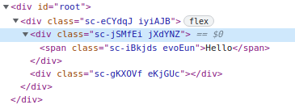
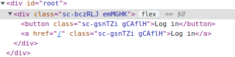

# Styled Components

- [Styled Components](#styled-components)
  - [1. Styled Components란?](#1-styled-components란)
  - [2. How to use](#2-how-to-use)
  - [3. Adapting and Extending using props](#3-adapting-and-extending-using-props)
  - [4. Mixin css props](#4-mixin-css-props)
  - [5. AS and Attrs](#5-as-and-attrs)
  - [6. Animations and Pseudo Selectors](#6-animations-and-pseudo-selectors)
  - [7. Themes](#7-themes)

## 1. Styled Components란?

**styled-components**란 Javascript 파일 내에서 CSS를 사용할 수 있게 해주는 대표적인 **CSS-in-js 라이브러리**로 React 프레임워크를 주요 대상으로 한 라이브러리이다.

> 본질적으로, **styled-components**는 styled-components 라이브러리를 사용하여 리액트 컴포넌트를 쉽게 만들 수 있으며 JavaScript 코드 내에서 일반 CSS로 구성 요소의 스타일을 지정할 수 있다.

**styled-components**는 기본적으로 css파일을 밖에 두지 않고, 컴포넌트 내부에 넣기 때문에, css가 전역으로 중첩되지 않도록 만들어 주는 장점이 있다.

여러 장점들이 있겠지만, 우선적으로 기억할 것은 **변수에 의해 스타일을 바꿀 수 있다**는 점입니다. 이 점을 기억하면서 시작을 해보도록 하겠습니다.

## 2. How to use

먼저 설치를 해주자.

    npm install styled-components

그리고 우리 App에 import를 해주자.

    import styled from "styled-components";

styled components를 만들 때 기본적인 문법은 이와 같습니다.

- **const 컴포넌트명 = styled.태그명\`스타일넣기\`** 이러한 문법으로 만들어 집니다.
- **만들고자 하는 컴포넌트의 render함수 밖**에서 만듭니다.

먼저 styled components를 사용하지 않았을 때 style을 매기는 방법은 이와 같다.

```jsx
function App() {
  return (
    <div style={{ display: "flex" }}>
      <div style={{ backgroundColor: "teal", width: 100, height: 100 }}></div>
      <div style={{ backgroundColor: "tomato", width: 100, height: 100 }}></div>
    </div>
  );
}

export default App;
```

이러한 식으로 모든 코드가 구성되어 있다고 생각해 보자.

굉장히 불편하다. 전부 div로 둘러싸여 있을 것이고, 뭘 하는지 알려면 그 안에서 style도 찾아봐야 된다.

그래서 Components를 사용하는 것이고, styled-components를 사용하려고 하는 것이다.

Father이라는 styled-compoennt를 만들고 그 안에 저 div들을 styled-component로 만들어서 넣어보자.

```jsx
const Father = styled.div`
  display: flex;
`;

const BoxOne = styled.div`
  background-color: teal;
  width: 100px;
  height: 100px;
`;

const BoxTwo = styled.div`
  background-color: tomato;
  width: 100px;
  height: 100px;
`;

function App() {
  return (
    <Father>
      <BoxOne />
      <BoxTwo />
    </Father>
  );
}
```

보기 굉장히 편해졌다.

> 참고로, vscode에서 styled-components의 자동 완성 기능을 사용하고 싶다면, vscode-styled-components Extension을 받으면 된다.

이번엔 text도 하나 만들어 보자.

```jsx
...

const Text = styled.span`
  color: white;
`;

function App() {
  return (
    <Father>
      <BoxOne>
      <Text>Hello</Text>
      </BoxOne>
      <BoxTwo />
    </Father>
  );
}
```



이것을 보면 **className이 Random하게 주어져 있고, 해당 className에 css가 적용된 것이다.**

위에서도 언급했듯이 두 가지를 기억하면 된다.

1.  **styled. 뒤에 쓰는 것은 HTML에 유효한 Tag여야 한다.**
2.  **``{백틱}안에 들어가는 것은 CSS여야 한다.**

## 3. Adapting and Extending using props

**props**란 무엇인가?

먼저 가장 기본적인 개념부터 다시 잡고 가자.

**DOM태그만을 사용해 React 엘레먼트를 나타냈던 걸** 기억하는가?

    const element = <div />;

이와 같은 식으로 했다.

**React 엘리먼트는 사용자 정의 컴포넌트로 이것을 나타낼 수 있다는 것**을 알고 있다.

    const element = <Welcome name="Sara" />;

**React가 사용자 정의 컴포넌트로 작성한 엘리먼트를 발견하면 jsx 어트리뷰트와 자식을 해당 컴포넌트에 단일 객체로 전달**합니다. 이 객체를 **props**라고 하는 것이다.

예시와 함께 이해해 보자.

```jsx
function Welcome(props) {
  return <h1>Hello, {props.name}</h1>;
}

const element = <Welcome name="Sara" />;
ReactDOM.render(element, document.getElementById("root"));
```

이 예시는 다음과 같은 일들이 일어난다.

1.  `<Welcome name="Sara" />` 엘리먼트로 **ReactDOM.render()를 호출**합니다.
2.  React는 `{name: 'Sara'}`를 **props**로 하여 **Welcome 컴포넌트를 호출**합니다.
3.  Welcome 컴포넌트는 **결과적으로 `<h1>Hello, Sara</h1>` 엘리먼트를 반환**합니다.
4.  React DOM은 `<h1>Hello, Sara</h1>` 엘리먼트와 일치하도록 DOM을 효율적으로 업데이트합니다.

참고: [Components와 Props – React](https://ko.reactjs.org/docs/components-and-props.html)

이제 **props를 컴포넌트를 사용 하는 법**을 알아보자.

위의 코드를 다시 한번 가져와 보자.

```jsx
const Father = styled.div`
  display: flex;
`;

const BoxOne = styled.div`
  background-color: teal;
  width: 100px;
  height: 100px;
`;

const BoxTwo = styled.div`
  background-color: tomato;
  width: 100px;
  height: 100px;
`;

function App() {
  return (
    <Father>
      <BoxOne />
      <BoxTwo />
    </Father>
  );
}
```

여기서 보면 BoxOne 이랑 BoxTwo는 background-color를 제외하곤 CSS가 동일하다.

즉, **코드가 중복 되고 있다는 것**이다.

그래서 우리는 props를 사용해서 하나의 Box로 사용할 것이다.

먼저 Box를 하나로 합쳐서 styled component를 만들자.

```jsx
const Box = styled.div`
  background-color: ${(props) => props.bgColor};
  width: 100px;
  height: 100px;
`;
```

이제 컴포넌트에 props를 줘서 사용할 수 있도록 만들어 줘야 겠다.

```jsx
      <Box bgColor="teal"/>
      <Box bgColor="tomato"/>
```

이와 같이 해주면 된다.

이번에는 **컴포넌트를 확장 하는 법**을 배워보자.

위에서 한 것은 **컴포넌트 안의 속성값에 변수를 주는 것으로 활용**하였다.

하지만, 만약 새로운 컴포넌트를 만든다고 할 때 기존 컴포넌트와 굉장히 유사하다면?

예를 들어 보자.

Circle Component를 추가해보자.

```jsx
const Box = styled.div`
  background-color: ${(props) => props.bgColor};
  width: 100px;
  height: 100px;
`;

const Circle = styled.div`
  background-color: ${(props) => props.bgColor};
  width: 100px;
  height: 100px;
  border-radius: 50px;
`;
			...

      <Box bgColor="teal" />
      <Circle bgColor="tomato" />

      ...
```

Circle Component는 Box랑 굉장히 비슷하다. 그래서 확장해주는 방법을 사용하는 것이다.

이와 같이 해주면 된다.

```jsx
const Circle = styled(Box)`
  border-radius: 50px;
`;
```

이 코드가 뜻하는 것은 Box의 모든 속성들을 들고 온 다음 추가적으로 더해주는 것이다.

> 물론, background color도 props로 넘겨 줄 수 있다.

## 4. Mixin css props

css props는 자주 쓰는 속성을 담는 변수로써 활용합니다.

- const 변수명 = css\`스타일\`

```jsx
const flexCenter = css`
  display: flex;
  justify-content: center;
  align-items: center;
`;

const FlexBox = div`
  ${flexCenter}
`;
```

이와 같은 방식으로 활용하면 됩니다.

## 5. AS and Attrs

만약, 컴포넌트의 **태그를 바꾸고** 싶은데 **스타일은 바꾸고 싶지 않다**면 어떻게 해야할까?

먼저 예시 코드를 살펴 보자.

```jsx
const Father = styled.div`
  display: flex;
`;

const Btn = styled.button`
  color: white;
  background-color: tomato;
  border: 0;
  border-radius: 15px;
`;

function App() {
  return (
    <Father>
      <Btn>Log in</Btn>
    </Father>
  );
}
```

여기서 만약 Btn컴포넌트를 a(href)로 사용하고 싶다면?

```jsx
function App() {
  return (
    <Father>
      <Btn>Log in</Btn>
      <Btn as="a" href="/">
        Log in
      </Btn>
    </Father>
  );
}
```

이와 같이 해주면 된다.



이번엔 **attr(attribute)** 를 주는 방법을 알아보자.

만약 input태그를 만들었다고 생각해보자.

```jsx
const Input = styled.input`
  background-color: tomato;
`;

function App() {
  return (
    <Father>
      <Input />
    </Father>
  );
}
```

HTML에서도 Input은 굉장히 많은 attr들을 가지고 있고, 그것을 주기 위해선 어떻게 해야할까?

`<Input required/>` 이와 같은 식으로 주면 될까?

만약, 내가 Input 컴포넌트를 굉장히 많이 사용해야 한다면, 굉장히 귀찮은 작업이 되겠다.

그래서 우리는 **styled components를 사용하여 attrs**를 줄 것이다.

```jsx
const Input = styled.input.attrs({ required: true })`
  background-color: tomato;
`;
```

이와 같은 식으로 해주면 된다.

## 6. Animations and Pseudo Selectors

**CSS에는 animation**을 주는 것이 있다. 그것을 **styled component에서는 어떻게 이용**하는지와 `nth-child()`와 같은 **Pseudo Selectors**는 어떻게 사용하는지 알아보자.

**styled componen안에서 animation을 주는 방법은 helper function을 import해주면 된다.**

```jsx
		import styled, { keyframes } from "styled-components";

		...

const animation = keyframes`
  from {
    transform: rotate(0deg);
    border-radius: 0px;
  }
  to {
    transform: rotate(360deg);
    border-radius: 100px;
  }
`;
```

이와 같이 해주고 컴포넌트 안에서 사용해주면 된다.

```jsx
const Box = styled.div`
  height: 200px;
  width: 200px;
  background-color: tomato;
  animation: ${animation};
`;
```

기존 CSS랑 비슷하고 **차이는 JavaScript의 String interpolation을 사용하는 것** 정도다.

이번에는 Component에서 selector를 하나 더 사용하는 법을 알아보자.

```jsx
function App() {
  return (
    <Wrapper>
      <Box>
        <span>🙂</span>
      </Box>
    </Wrapper>
  );
}
```

이렇게 코드가 짜져있다.

여기서 Box컴포넌트의 CSS를 주다가 span만 별도로 다른 CSS를 주고 싶다. 어떻게 하면 될까?

```jsx
const Box = styled.div`
  height: 200px;
  width: 200px;
  display: flex;
  justify-content: center;
  align-items: center;
  background-color: tomato;
  animation: ${animation} 1s linear infinite;
  span {
    font-size: 36px;
  }
`;
```

만약 여기서 **span에 hover을 적용**하고 싶다면 어떻게 해줘야 할까?

span:hover도 가능하지만, **^** 나 **&** 를 활용해 줄 수 있다.

```jsx
  span {
    font-size: 36px;
    &:hover {
      font-size: 50px;
    }
  }
```

여기서 추가적으로 좀 극단적인 경우가 있을 수 있으니 알아보고 넘어가자.

현재 우리가 사용하고 있는 **styled component는 tag name에 의존**하고 있다.

그런데 만약, 내가 특정 tag에만 style을 적용하고 싶다면 어떻게 해야할까?

예를 들어 보자.

```jsx
const Emoji = styled.span`
  font-size: 36px;
`;

const Box = styled.div`
  height: 200px;
  width: 200px;
  display: flex;
  justify-content: center;
  align-items: center;
  background-color: tomato;
  animation: ${animation} 1s linear infinite;
  span {
    &:hover {
      font-size: 50px;
    }
  }
`;

function App() {
  return (
    <Wrapper>
      <Box>
        <Emoji>🙂</Emoji>
      </Box>
      <Emoji>🔥</Emoji>
    </Wrapper>
  );
}
```

**만약 여기서 웃는 이모티콘에만 hover style을 적용 하고 싶다면?**

이와 같이 코드가 있는데, 우린 여기서 **Box 안의 이모티콘을 선택**해줘서 style을 줄 것이다.

```jsx
const Box = styled.div`
  height: 200px;
  width: 200px;
  display: flex;
  justify-content: center;
  align-items: center;
  background-color: tomato;
  animation: ${animation} 1s linear infinite;
  ${Emoji} {
    font-size: 50px;
  }
`;
```

이와 같은 경우 **as로 tag를 바꾼다고 해도** 문제없이 CSS가 적용될 것이다.

## 7. Themes

사실 이 파트는 **Theme Provider와 local Estate Management**를 사용할 때 진정한 효과를 보지만 미리 조금만 알아보고 넘어가자.

해당 파트에선 **Theme Provider**만 보고 넘어갈 것이다.

프로젝트를 하다보면 CSS를 잘 관리하기 위해서 **공통 스타일**을 잘 생각해야 한다.

작업할 때 생길 수 있는 문제점들을 알아보자.

- 매 컴포넌트가 증가함에 따라 스타일 코드의 일관성이 떨이질 수 있다 => **유지보수 비용의 증가**
- 스타일 속성값들이 중구난방이면 어떤 속성을 갖고있는지 코드로 확인하기 어렵다 => **협업에서의 문제**
- 스타일마다 다른 속성을 갖고 있어서 재사용이 불가능하다 => **비효율성 증가**

이러한 문제점을 **styled-components의 Theme Provider를 사용하면 Context API를 통해 해결**할 수 있다.

그렇다면 어떻게 사용하는가?

index.js에서 **ThemeProvider를 import해주고 darkTheme과 lightTheme을 만들어 보자.**

```jsx
// index.js

import { ThemeProvider } from "styled-components";

const darkTheme = {
  textColor: "whitesmoke",
  backgroundColor: "#111",
};

const lightTheme = {
  textColor: "#111",
  backgroundColor: "whitesmoke",
};

ReactDOM.render(
  <React.StrictMode>
    <ThemeProvider theme={darkTheme}>
      <App />
    </ThemeProvider>
  </React.StrictMode>,
  document.getElementById("root")
);
```

**현재 ThemeProvider는 theme안에 darkTheme을 넣어서 객체로써 자식 컴포넌트인 App 컴포넌트에 건네주고 있다.**

그럼 이것을 우리는 App.js 가서 활용할 수 있는 것이다.

```jsx
// App.js

const Title = styled.h1`
  color: ${(props) => props.theme.textColor};
`;

...
```

> **theme에는 darkTheme 혹은 lightTheme 둘 중 하나만 건네줄 수 있는 것 같은데 왜 두개를 만들었냐?**
>
> 이 질문의 답변은 위에서 말햇듯이 추후에 두 가지를 다 활용할 수 있게 되기 때문이다.
>
> 만약 darkTheme을 건네주는 코드에서 lightTheme으로 바꿔준다면 App에서 설정해둔 Title의 CSS가 바로 바뀌지 않겠는가? **단, 하나의 변화를 줄 때 전부 다 변화를 줄 수 있게 된다.**
