# TRELLO CLONE

- [TRELLO CLONE](#trello-clone)
  - [1. Introduction](#1-introduction)
  - [2. react-beautiful-dnd](#2-react-beautiful-dnd)
    - [2.1 SET UP](#21-set-up)
    - [2.2 Droppable and Draggable](#22-droppable-and-draggable)
    - [2.3 Styles and Placeholders](#23-styles-and-placeholders)
    - [2.4 onDragEnd](#24-ondragend)
    - [2.5 Increase Performance](#25-increase-performance)
    - [2.6 Make Multi Boards](#26-make-multi-boards)
    - [2.7 Same Board Movement](#27-same-board-movement)
    - [2.8 Cross Board Movement](#28-cross-board-movement)
    - [2.9 Droppable Snapshot](#29-droppable-snapshot)
  - [3. Task Objects](#3-task-objects)

## 1. Introduction

이번 파트에선 칸반 앱을 만들 것이다.

> **칸반**은 팀이 수행해야 하는 업무와 각 팀원이 맡을 수 있는 작업량 간에 균형을 맞추는 수단입니다. 칸반 프레임워크는 업무 항목을 제품 백로그에서 안정적인 작업 흐름으로 **끌어올** 수 있는 지속적인 개선 철학을 기반으로 합니다.

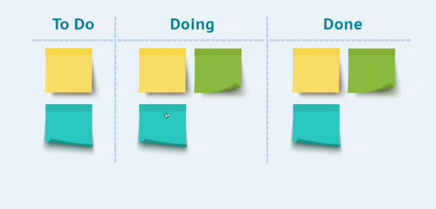

즉, 여기에서 배울 것은 **Drag and Drop**하는 방법을 배울 것이다.

**Drag and Drop**하는 방법을 배우면서 이전파트에서 배웠던 **State Management**도 복습하면서 진행할 예정이다.

**한가지 tip**을 정리하고 넘어가자.

저번 파트에서 우리는 Number를 String타입으로 바꾸기 위해 어떻게 하였는가?

`Number + ""`이러한 형태를 써서 사용했다.

그럼 반대의 경우는 어떻게 할 수 있을까?

`+String` 이와 같이 **앞에 +를 붙여주면 된다.**

## 2. react-beautiful-dnd

드래그 앤 드롭의 기능을 구현하기 위해서 React.js에서 제공하는 라이브러리는 **react-beautiful-dnd**이다.

설치 방법은 다음과 같다.

```tsx
npm i react-beautiful-dnd
npm i --save-dev @types/react-beautiful-dnd
```

> React 18에서 해당 코드로 다운 받으려고 한다면 오류가 나온다.
>
> `npm i react-beautiful-dnd --legacy-peer-deps` 해당 코드를 이용하자.

Document: [react-beautiful-dnd - npm](https://www.npmjs.com/package/react-beautiful-dnd)

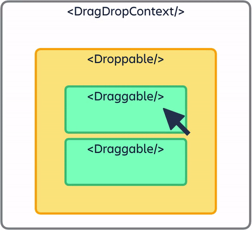

위의 **gif파일**은 **Drag and Drop**기능을 사용했을 때의 예시이다.

이미지를 보면 **DragDropContext**와 **Droppable**이라는 것과 **Draggable**이 있다.

간단하게 얘기해 보자면, 이와 같다.

- **DragDropContext**: **Drag and Drop**을 가능하게 하고 싶은 **앱의 한 영역**
- **Droppable**: **item**들을 드래그 했을 때 **놓을 수 있는 영역**
- **Draggable**: 드래그 할 수 있는 **item**

이렇게 될 거이다.

본격적으로 진행해 나가보자.

### 2.1 SET UP

먼저 import를 해주자.

그리고 **DragDropContext**를 만들 것인데, 그때 주의할 점은 감싸진 **Child Component의 전체에 적용**된다는 것이다.

즉, 우리는 **Drag and Drop**을 사용하려면 **드래그 앤 드롭을 사용 할 수 있는 React 트리의 일부를 `<DragDropContext>`에 래핑해야한다.**

전체 애플리케이션을 `<DragDropContext>`로 래핑하는 것이 좋다.

> 중첩된 `<DragDropContext>`는 지원하지 않기 떄문이다.
>
> **Darg and Drop**을 원한다면 `<Droppable />`및 `<Draggable />`의 소품을 사용하여 원하는 조건부 **Darg and Drop**을 수행 할 수 있다.

일단 예시 코드를 한번 보자.

```tsx
// App.tsx

import { DragDropContext } from "react-beautiful-dnd";

function App() {
  const onDragEnd = () => {};
  return (
    <DragDropContext onDragEnd={onDragEnd}>
      <span>Hello</span>
    </DragDropContext>
  );
}

export default App;
```

여기서 **onDragEnd**라는 함수는 유저가 드래그를 끝낸 시점에서 실행되는 함수이다.

저 코드에는 **오류**가 있다.

**DragDropContext는 children을 필요**로 한다. 또한 그 **React children**은 **ReactElement를 반환하는 함수**여야한다.

위의 이미지를 다시 살펴보면 **DragDropContext**안에는 **Droppable**과 **Draggable**이 있었다.

또 한번 세분화해서 보면, **Droppable**안에는 **Draggable**이 있다.

먼저 **DragDropContext** 컴포넌트 안에 **Droppable** 컴포넌트를 넣어주자.

```tsx
// App.tsx

import { DragDropContext, Droppable } from "react-beautiful-dnd";

function App() {
  const onDragEnd = () => {};
  return (
    <DragDropContext onDragEnd={onDragEnd}>
      <div>
        <Droppable droppableId="one">{() => <ul></ul>}</Droppable>
      </div>
    </DragDropContext>
  );
}

export default App;
```

**Droppable**은 **droppableId**라는 prop을 필요로 한다.

> `<Droppable>` 컴포넌트에 **droppableId**를 설정하는데, 이를 통해 라이브러리는 상호 작용간에 이 **특정 인스턴스**를 **추적**할 수 있다.
>
> **React children**은 **ReactElement를 반환하는 함수**여야 한다.

> **인스턴스**는 일반적으로 실행 중인 임의의 프로세스, 클래스의 현재 생성된 **오브젝트**를 가르킨다. 즉, 객체를 소프트웨어에 실체화 하면 그것을 **인스턴스**라고 부른다.

여기서 **포인트**는 **Droppable안에 들어가는 것에 *함수*가 들어간다는 것**이다.

**Draggable또한 children으로 함수가 들어가야 한다.**

```tsx
{
  () => (
    <ul>
      <Draggable draggableId="first" index={0}>
        {() => <li>one!</li>}
      </Draggable>
      <Draggable draggableId="second" index={1}>
        {() => <li>two!</li>}
      </Draggable>
    </ul>
  );
}
```

이제 **컴포넌트 생성은 완료**했다.

**포인트**를 다시 집어보자.

1.  컴포넌트 순서: **DragDropContext** → **Droppable** → **Draggable**
2.  **Droppable**과 **Draggable**는 각각 **droppableId**와 **draggableId**를 요구한다.
3.  **DragDropContext**, **Droppable**, **Draggable**는 모두 **children**은 요구한다.
4.  **Droppable**과 **Draggable**의 **children**은 **react 요소** 즉, **함수**여야 한다.

이렇게 기본 작업이 끝났다.

이제 **Draggable item**을 만들어 보자.

### 2.2 Droppable and Draggable

먼저 **Droppable**를 살펴보자.

**Droppable**에서 주는 첫번째 argument는 document를 확인해보면 **provided**라고 나와 있다.

````tsx
        <Droppable droppableId="one">
          {(provided) => (
            <ul {...provided.droppableProps}>
            ```
````

provided에서 제공하는 것들의 개념 정리를 하고가자.

> **개념 정리**
>
> - **provided.innerRef**: **Droppable**이 올바르게 작동하려면, **provided.innerRef**를 **ReactElement**에서 가능한 **가장 상위 DOM 노드**에 **바인딩**해야 한다. DOM 노드를 조회하기 위해 ReactDOM을 사용할 필요가 없도록 하기 위해 이렇게 한다.
>
> - **provided.placehloder**: 드래그하는 동안 필요에 따라 `<Droppable />`에 공간을 만드는데 사용한다. 이 공간은 사용자가 홈 목록이 아닌 목록 위로 끌 때 필요하다. 참조를 제공한 구성 요소 내부에 자리 표시자를 넣어야한다. 자체의 크기를 늘려야 한다.
>
> - **provided.droppableProps (DroppableProps)**: **Droppable 요소**에 **적용해야 하는 속성**이 포함 된 개체이다. **propvided.innerRef를 적용한 동일한 요소에 적용**해야 한다. 현재 **스타일링 및 조회에 사용하는 데이터 속성**이 포함되어 있다.

**DroppableProps** 이것이 `<ul>`이 필요로 하는 props이다.

`<ul>`에는 **ref**도 줘야 한다.

```tsx
<ul ref={provided.innerRef} {...provided.droppableProps}>
```

**provided.innerRef**는 라이브러리가 목록 요소의 **HTML 요소**에 **액세스**하기위한 참조를 생성한다. **provided.droppableProps**는 라이브러리가 **이동** 및 **위치**를 추적 할 수 있도록 하는 요소에 **props**를 적용한다.

이번엔 **Draggable**을 살펴보자.

**Draggable**에서도 또한 **provided인자**를 받는데, provided인자를 확인해보면, **draggableProps**라는 것과 **dragHandleProps**것이 있다.

- **draggableProps**: 요소를 드래그 할수 있게 만들어 준다.
- **dragHandleProps**: 특정한 부분을 집어서 드래그를 할지를 결정해준다. (예를 들면, 코너에서만 드래그하게 하고 싶은 경우)

```tsx
{
  (provided) => <li {...provided.dragHandleProps}>one!</li>;
}
```

이 코드가 의미하는 것은 `<li>`가 핸들링되는데에 **trigger**가 된다는 것을 의미한다.

```tsx
<li
  ref={provided.innerRef}
  {...provided.draggableProps}
  {...provided.dragHandleProps}
>
```

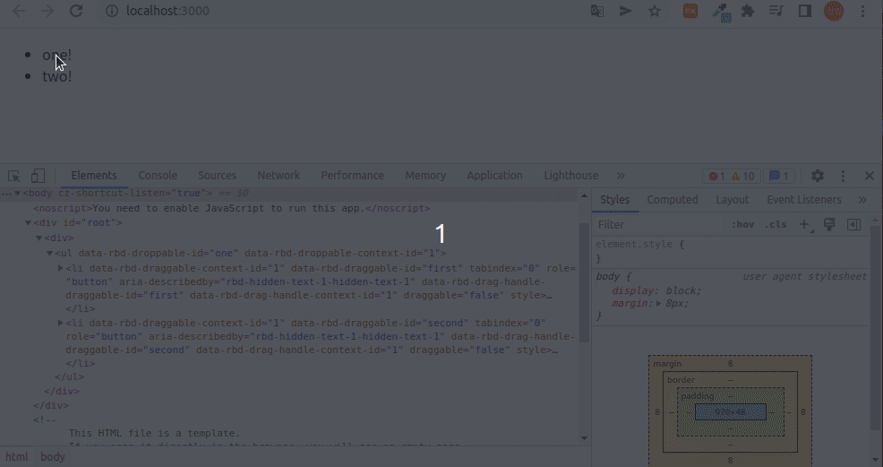

아직 옮겼을 때 처리할 **onDragEnd()** 함수 처리를 하지 않았기 때문에 저장되지는 않는다.

특정한 부분만 클릭해서 이동하게 하는 방법은 이와 같다.

```tsx
<Draggable draggableId="first" index={0}>
  {(provided) => (
    <li ref={provided.innerRef} {...provided.draggableProps}>
      <span {...provided.dragHandleProps}>🔥</span>
      one!
    </li>
  )}
</Draggable>
<Draggable draggableId="second" index={1}>
  {(provided) => (
    <li ref={provided.innerRef} {...provided.draggableProps}>
      <span {...provided.dragHandleProps}>🔥</span>
      two!
    </li>
  )}
</Draggable>
```


### 2.3 Styles and Placeholders

이제 draggable을 **array로 구성**하고 **Styles을 적용**하면서 **placeholder의 기능**을 살펴볼 것이다.

먼저 list를 만들어주자.

```tsx
const toDos = ["a", "b", "c", "d", "e", "f"];
```

그리고 이것을 **draggable**로 만들어주자.

```tsx
<Draggable draggableId={toDo} index={index}>
  {(provided) => (
    <Card ref={provided.innerRef} {...provided.draggableProps}>
      {toDo}
    </Card>
  )}
</Draggable>
```

Styles까지 적용한 전체 코드를 살펴보자.

```tsx
// App.tsx

import { DragDropContext, Droppable, Draggable } from "react-beautiful-dnd";
import styled from "styled-components";

const Wrapper = styled.div`
  display: flex;
  max-width: 480px;
  width: 100%;
  margin: 0 auto;
  justify-content: center;
  align-items: center;
  height: 100vh;
`;

const Boards = styled.div`
  display: grid;
  width: 100%;
  grid-template-columns: repeat(1, 1fr);
`;

const Board = styled.div`
  padding: 20px 10px;
  padding-top: 30px;
  background-color: ${(props) => props.theme.boardColor};
  border-radius: 5px;
  min-height: 200px;
`;

const Card = styled.div`
  border-radius: 5px;
  padding: 10px 10px;
  margin-bottom: 5px;
  background-color: ${(props) => props.theme.cardColor};
`;

const toDos = ["a", "b", "c", "d", "e", "f"];

function App() {
  const onDragEnd = () => {};
  return (
    <DragDropContext onDragEnd={onDragEnd}>
      <Wrapper>
        <Boards>
          <Droppable droppableId="one">
            {(provided) => (
              <Board ref={provided.innerRef} {...provided.droppableProps}>
                {toDos.map((toDo, index) => (
                  <Draggable draggableId={toDo} index={index}>
                    {(provided) => (
                      <Card
                        ref={provided.innerRef}
                        {...provided.draggableProps}
                        {...provided.dragHandleProps}
                      >
                        {toDo}
                      </Card>
                    )}
                  </Draggable>
                ))}
              </Board>
            )}
          </Droppable>
        </Boards>
      </Wrapper>
    </DragDropContext>
  );
}

export default App;
```

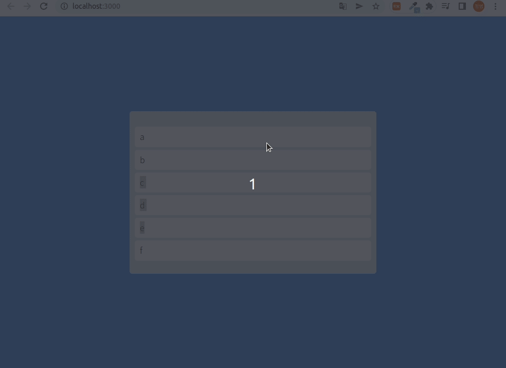

작동 방식을 보면 문제가 있어 보인다.

아이템이 리스트에서 나가면 영역이 작아지거나 커지거나 한다.

그래서 우리는 **placeholder**를 사용할 것이다.

> TypeScript를 통해서 provided가 가지고 있는 기능을 살펴볼 수 있는데, 마우스 우클릭하고 Go To Type Definition을 통해 알 수 있다.

적용 방식은 이와 같다.

```tsx
<Board ref={provided.innerRef} {...provided.droppableProps}>
  {toDos.map((toDo, index) => (
    <Draggable draggableId={toDo} index={index}>
      {(provided) => (
        <Card
          ref={provided.innerRef}
          {...provided.draggableProps}
          {...provided.dragHandleProps}
        >
          {toDo}
        </Card>
      )}
    </Draggable>
  ))}
  {provided.placeholder}
</Board>
```

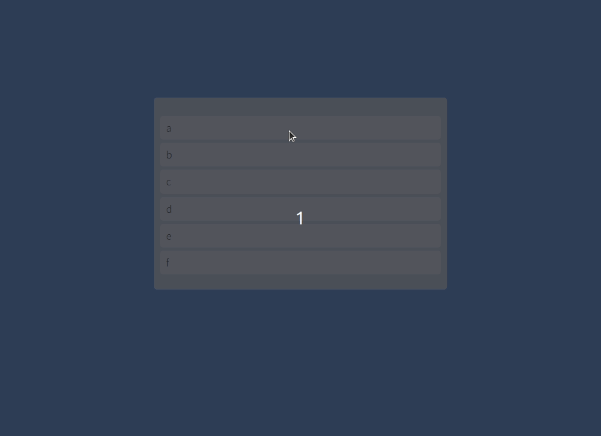

### 2.4 onDragEnd

이제 유저가 item을 옮겼을 때 저장하기 위해서 **onDragEnd() 함수**를 이용해보자.

먼저, **toDo State**를 위한 **atom**을 만들어주자.

```tsx
// atoms.tsx

import { atom, selector } from "recoil";

export const toDoState = atom({
  key: "toDo",
  default: ["a", "b", "c", "d", "e", "f"],
});
```

atom을 가져오는 방법은 이전 파트에서 배웠다.

값도 필요하고 수정 작업도 필요하기 때문에 **useRecoilState**를 사용할 것이다.

```tsx
// App.tsx
const [toDos, setToDos] = useRecoilState(toDoState);

...
```

onDragEnd는 **무슨 정보**를 가지고 올까? 확인해보자.

```tsx
const onDragEnd = (args: any) => {
  console.log(args);
};
```

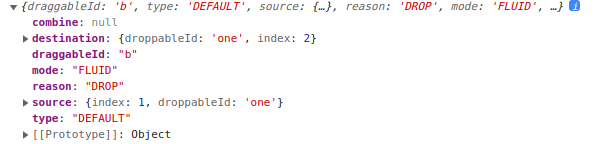

**무슨 item을 드래그 했는지**, **해당 item을 어디에 놨는지**등 여러가지 정보를 알 수 있다.

또한 **array안에서 index, droppableId**에 대한 정보도 가지고 있다.

이 정보를 이용해서 다음과 같은 작업을 진행할 것이다.

1.  **source.index**를 이용하여 array로 부터 item을 지워줄 것이다.
2.  **destination.index**를 이용하여 array로 부터 지워준 item을 넣어줄 것이다.

array에서 item을 지우고 넣어주는 역할을 하는 함수는 JavaScript의 [splice() 함수](https://developer.mozilla.org/ko/docs/Web/JavaScript/Reference/Global_Objects/Array/splice)이다.

**splice() 함수**의 중요한 점은 해당 객체 즉, array를 수정하고 변형시킨다는 점이다.

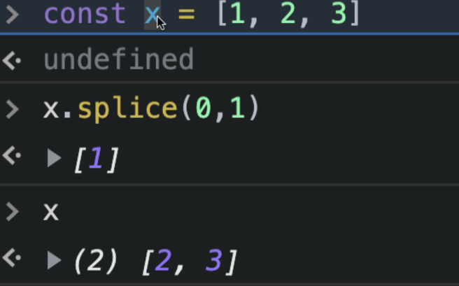

이러한 것을 **mutation**이라고 한다.

> **mutation**
>
> 새로운 변수를 생성하거나 기존 변수를 재할당하지 않고 JavaScript의 객체 또는 배열을 변경할 때 예상치 못한 mutation(변이)가 일어난다.
>
> 참고: [프론트엔드 클린코드 - 객체 변이(mutation) 지양 | 지나가던 개발(zigae)](https://www.zigae.com/avoid-mutation/)

**React나 State**에서 원하는 것이 아니다.

State를 변형시키지 않고 **항상 새로운 State를 return**해주어야 한다.

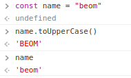

이러한 것이 non-mutation이다.

BEOM은 모두 대문자로 변했지만, name자체는 변하지 않았다.

따라서 onDragEnd코드는 다음과 같이 된다.

```tsx
const onDragEnd = ({ draggableId, destination, source }: DropResult) => {
  if (!destination) return;
  setToDos((oldToDos) => {
    const copyToDos = [...oldToDos];
    // 1) Delete item on source.index
    copyToDos.splice(source.index, 1);
    // 2) Put back the item on the destination.index
    copyToDos.splice(destination?.index, 0, draggableId);
    return copyToDos;
  });
};
```

여기서 **draggable의 key**가 **draggableId**와 **같아야 해서** 오류가 발생할 수도 있다.

```tsx
<Draggable key={toDo} draggableId={toDo} index={index}>
```

> react.js에서 key를 숫자인 Index로 주는 것에 익숙하지만, 이 경우에는 **draggableId**와 **무조건 같아야 한다는 점**을 주의하자.

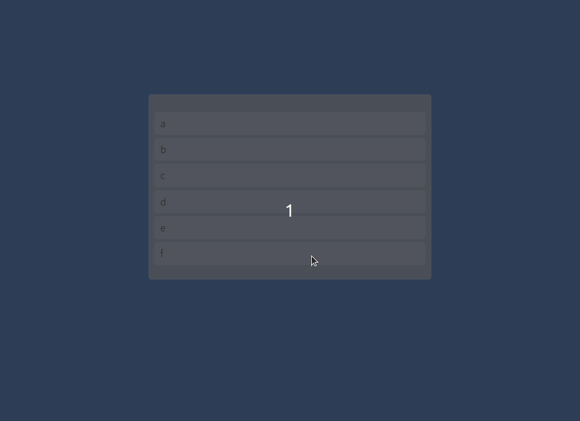

최종 코드는 이와 같다.

```tsx
// App.tsx

function App() {
  const [toDos, setToDos] = useRecoilState(toDoState);
  const onDragEnd = ({ draggableId, destination, source }: DropResult) => {
    if (!destination) return;
    setToDos((oldToDos) => {
      const copyToDos = [...oldToDos];
      // 1) Delete item on source.index
      copyToDos.splice(source.index, 1);
      // 2) Put back the item on the destination.index
      copyToDos.splice(destination?.index, 0, draggableId);
      return copyToDos;
    });
  };
  return (
    <DragDropContext onDragEnd={onDragEnd}>
      <Wrapper>
        <Boards>
          <Droppable droppableId="one">
            {(provided) => (
              <Board ref={provided.innerRef} {...provided.droppableProps}>
                {toDos.map((toDo, index) => (
                  <Draggable key={index} draggableId={toDo} index={index}>
                    {(provided) => (
                      <Card
                        ref={provided.innerRef}
                        {...provided.draggableProps}
                        {...provided.dragHandleProps}
                      >
                        {toDo}
                      </Card>
                    )}
                  </Draggable>
                ))}
                {provided.placeholder}
              </Board>
            )}
          </Droppable>
        </Boards>
      </Wrapper>
    </DragDropContext>
  );
}
```

### 2.5 Increase Performance

먼저 우리가 항상 하던 **divided and conquer**작업을 하자.

```tsx
// Components/DraggableCard.tsx

import { Draggable } from "react-beautiful-dnd";
import styled from "styled-components";

const Card = styled.div`
  border-radius: 5px;
  padding: 10px 10px;
  margin-bottom: 5px;
  background-color: ${(props) => props.theme.cardColor};
`;

interface IDraggableCardProps {
  toDo: string;
  index: number;
}

function DraggableCard({ toDo, index }: IDraggableCardProps) {
  return (
    <Draggable key={toDo} draggableId={toDo} index={index}>
      {(provided) => (
        <Card
          ref={provided.innerRef}
          {...provided.draggableProps}
          {...provided.dragHandleProps}
        >
          {toDo}
        </Card>
      )}
    </Draggable>
  );
}

export default DraggableCard;

// App.tsx

...

function App() {
  const [toDos, setToDos] = useRecoilState(toDoState);
  const onDragEnd = ({ draggableId, destination, source }: DropResult) => {
    if (!destination) return;
    setToDos((oldToDos) => {
      const toDosCopy = [...oldToDos];
      // 1) Delete item on source.index
      toDosCopy.splice(source.index, 1);
      // 2) Put back the item on the destination.index
      toDosCopy.splice(destination?.index, 0, draggableId);
      return toDosCopy;
    });
  };
  return (
    <DragDropContext onDragEnd={onDragEnd}>
      <Wrapper>
        <Boards>
          <Droppable droppableId="one">
            {(provided) => (
              <Board ref={provided.innerRef} {...provided.droppableProps}>
                {toDos.map((toDo, index) => (
                  <DraggableCard key={toDo} index={index} toDo={toDo} />
                ))}
                {provided.placeholder}
              </Board>
            )}
          </Droppable>
        </Boards>
      </Wrapper>
    </DragDropContext>
  );
}
```

여기서 문제가 무엇일까?

react.js에서 **Component의 State가 변하면 해당 component의 모든 children은 Re-Rendering**이 일어난다.

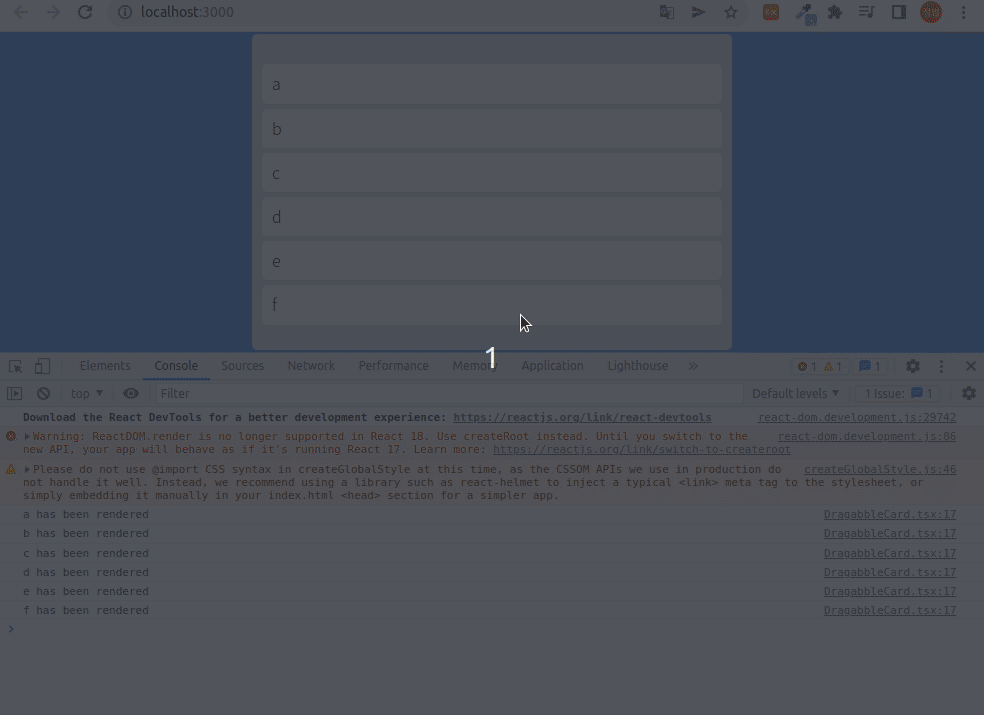

단순히 e랑 f만 바꿨지만, 나머지도 전부 Re-Rendering이 일어나 버렸다.

**Droppable, Board, DragDropContext등 부모 State**가 바뀌면 **Card**는 **Re-Rendering**이 일어날 것이다.

굉장히 큰 **Parent Comopnent**의 State를 바꾼다고 생각하면 굉장히 큰 문제다.

그래서 [react-for-beginners](https://github.com/jeongbeomSeo/react-for-beginners/blob/master/memo/main/basic.md)에서 배운 것을 사용할 차례이다.

바로 **React Memo**이다.

사용법은 간단하다.

```tsx
// DraggableCard.tsx

...

export default React.memo(DraggableCard);
```

이렇게 단순히 export하기 전에 **React.memo**로 내보내주면 된다.

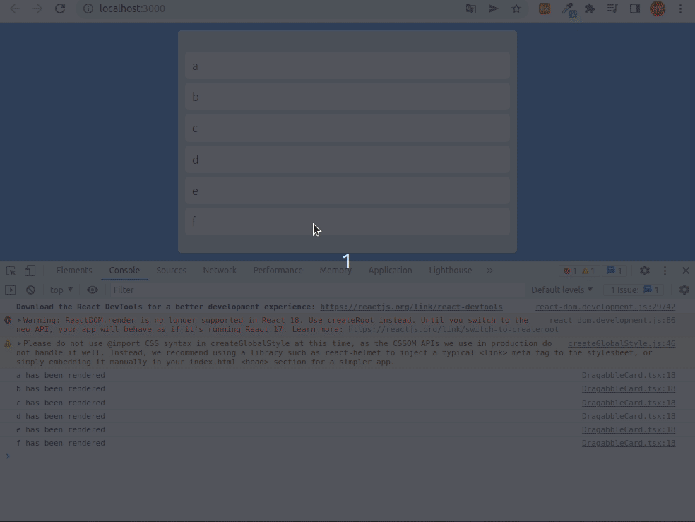

> 대부분의 경우 React Memo를 사용하지 않지만 이런 경우는 불필요한 Re-Rendering이 많기 때문에 사용한다.

### 2.6 Make Multi Boards

지금 까진 한 Droppable에서 Draggable을 여러 개만들어서 해보았다.

이번엔 **Droppable도 여러개 만들어서 구현**해보자.

먼저 State를 변경해주자.

```tsx
// atoms.tsx

import { atom, selector } from "recoil";

export const toDoState = atom({
  key: "toDo",
  default: {
    to_do: ["a", "b", "c", "d", "e", "f"],
    doing: [],
    done: [],
  },
});
```

이렇게 하고 3개의 board를 만들어 주자.

```tsx
// Components/Board.tsx

import { Droppable } from "react-beautiful-dnd";
import styled from "styled-components";
import DragabbleCard from "./DragabbleCard";

const Wrapper = styled.div`
  padding: 20px 10px;
  padding-top: 30px;
  background-color: ${(props) => props.theme.boardColor};
  border-radius: 5px;
  min-height: 200px;
`;

interface IBoardProps {
  toDos: string[];
  boardId: string;
}

function Board({ toDos, boardId }: IBoardProps) {
  return (
    <Droppable droppableId={boardId}>
      {(provided) => (
        <Wrapper ref={provided.innerRef} {...provided.droppableProps}>
          {toDos.map((toDo, index) => (
            <DragabbleCard key={toDo} index={index} toDo={toDo} />
          ))}
          {provided.placeholder}
        </Wrapper>
      )}
    </Droppable>
  );
}

export default Board;

// App.tsx

import {
  DragDropContext,
  Droppable,
  Draggable,
  DropResult,
} from "react-beautiful-dnd";
import { useRecoilState } from "recoil";
import styled from "styled-components";
import { toDoState } from "./atoms";
import DraggableCard from "./Components/DragabbleCard";

const Wrapper = styled.div`
  display: flex;
  max-width: 480px;
  width: 100%;
  margin: 0 auto;
  justify-content: center;
  align-items: center;
  height: 100vh;
`;

const Boards = styled.div`
  display: grid;
  width: 100%;
  grid-template-columns: repeat(1, 1fr);
`;

function App() {
  const [toDos, setToDos] = useRecoilState(toDoState);
  const onDragEnd = ({ draggableId, destination, source }: DropResult) => {
    if (!destination) return;
    setToDos((oldToDos) => {
      const toDosCopy = [...oldToDos];
      // 1) Delete item on source.index
      toDosCopy.splice(source.index, 1);
      // 2) Put back the item on the destination.index
      toDosCopy.splice(destination?.index, 0, draggableId);
      return toDosCopy;
    });
  };
  return (
    <DragDropContext onDragEnd={onDragEnd}>
      <Wrapper>
        <Boards></Boards>
      </Wrapper>
    </DragDropContext>
  );
}

export default App;
```

여기서 문제가 하나 발생한다.

우리는 `<Boards></Boards>`이 부분을 render해야 하는데, **toDos에서 map을 사용할 수가 없다.**

그래서 **object를 loop할 방법**을 배워보자.

**각 obejct의 property들을 받아서, 그 array들을 render하는 방법**을 사용할 것이다.

그때 사용하는 것이 **Object.keys**이다.

**Object.keys**는 **Object가 가진 key만 array로 뽑아준다.**

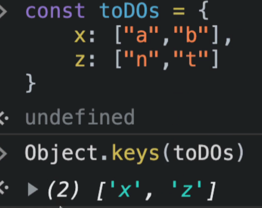

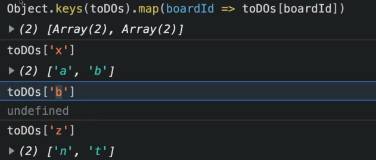

이렇게 함으로써 **boardId**가 있고, 그 **Id를 각각 가지는 자식들**도 볼 수 있게 되었다.

```tsx
<Boards>
  {Object.keys(toDos).map((boardId) => (
    <Board boardId={boardId} key={boardId} toDos={toDos[boardId]} />
  ))}
</Boards>
```

이와 같이 하고나서 에러를 수정해줄 것인데,

현재 우리는 Typescript를 사용하고 있다. **toDos는 string으로 이루어진 array**인데, **toDos boardId는 TypeScript에 의하면 string이 아니다.**

그래서, **확장성을 주기 위해 atoms에서 interface를 수정**해줄 것이다.

```tsx
// atoms.tsx

import { atom, selector } from "recoil";

interface IToDoState {
  [key: string]: string[];
}

export const toDoState = atom<IToDoState>({
  key: "toDo",
  default: {
    "To DO": ["a", "b"],
    Doing: ["c", "d", "e"],
    Done: ["f"],
  },
});
```

### 2.7 Same Board Movement

현재 위에서 atom을 보면 property name은 말 그대로 board Title이 되엇다.

이렇게 해줌으로써, Board.tsx에 title을 boardId로 설정할 수 있게 되었다.

```tsx
// Board.tsx

const Wrapper = styled.div`
  width: 300px;
  padding: 20px 10px;
  padding-top: 10px;
  background-color: ${(props) => props.theme.boardColor};
  border-radius: 5px;
  min-height: 300px;
`;

const Title = styled.h2`
  text-align: center;
  font-weight: 600;
  margin-bottom: 10px;
  font-size: 18px;
`;

interface IBoardProps {
  toDos: string[];
  boardId: string;
}

function Board({ toDos, boardId }: IBoardProps) {
  return (
    <Wrapper>
      <Title>{boardId}</Title>
      <Droppable droppableId={boardId}>
        {(provided) => (
          <div ref={provided.innerRef} {...provided.droppableProps}>
            {toDos.map((toDo, index) => (
              <DragabbleCard key={toDo} index={index} toDo={toDo} />
            ))}
            {provided.placeholder}
          </div>
        )}
      </Droppable>
    </Wrapper>
  );
}

export default Board;
```

이제 Board 내에서 item들이 움직이는 것을 해결할 것이다.

먼저, **onDragEnd의 args**를 확인해보자.

```tsx
// App.tsx

...

  const onDragEnd = (info: DropResult) => {
    console.log(info);


...
```

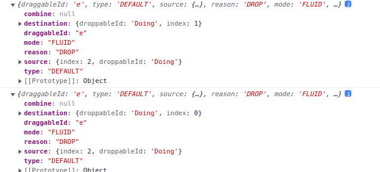

우리가 필요한 것이 무엇일까?

이전과 동일하다.

**destination**, **source**, **draggableId** 이렇게 이용하면 되겠다.

먼저 우리는 같은 Board내에서 움직이는 것을 조건으로 처리를 해줄 것이니깐 다음과 같이 해주자.

```tsx
if (destination?.droppableId === source.droppableId) {
  // same board movement.
}
```

그리고 하는 방식은 이전과 비슷하다.

1. 드래그된 item을 수정한다.
2. 수정이 일어난 보드를 복사한다.
3. 그 복사본을 기존 보드들 옆에 붙여준다.

이렇게 하는 이유는 **변화가 일어나는 보드만 가지고 수정을 하는 것**이 모든 보드를 계속해서 가지고 있는 것보다 **효율적**이기 때문이다.

```tsx
const [toDos, setToDos] = useRecoilState(toDoState);
const onDragEnd = (info: DropResult) => {
  const { destination, source, draggableId } = info;
  if (!destination) return;
  if (destination?.droppableId === source.droppableId) {
    setToDos((allBoards) => {
      const boardCopy = [...allBoards[source.droppableId]];
      boardCopy.splice(source.index, 1);
      boardCopy.splice(destination?.index, 0, draggableId);
      return {
        ...allBoards,
        [source.droppableId]: boardCopy,
      };
    });
  }
};
```

코드 분석을 해보자.

`...oldToDos`를 하면 []안에 입력할 것은 `To_Do`나 `Doing`이나 `Done`이 세개인데 이것은 `source.droppedId`에 담겨있다.

그리고 `return`할 때는 위에서 말했듯이, 수정된 board를 나머지 board에 붙여줘서 `return`해주면 된다.

> `oldToDos`는 `object`인 것을 명심하자.

> `[source.droppableId]` 는 variable형태이다.

> key값에 **`[대괄호]`** 가 있는 것은 **비구조화**를 하기 위함입니다.

> 즉 key값에 **대괄호**를 사용하는 것은 key값에 변수를 넣어주겠다는 의미이다.

### 2.8 Cross Board Movement

이제 Droppable을 여러 개 만들었으니 item들이 서로 넘어갈 수 있도록 구현하자.

순서는 다음과 같다.

1. soucre를 복사해와서, 복사본에서 원하는 요소를 지워준다.
2. destination에서 source에서 복사한 요소를 넣어준다.
3. source와 destination board를 포함한 나머지 board도 전부 return해준다.

코드는 이와 같다.

```tsx
if (destination.droppableId !== source.droppableId) {
  // cross board movement
  setToDos((allBoards) => {
    const sourceBoard = [...allBoards[source.droppableId]];
    const destinationBoard = [...allBoards[destination.droppableId]];
    sourceBoard.splice(source.index, 1);
    destinationBoard.splice(destination.index, 0, draggableId);
    return {
      ...allBoards,
      [source.droppableId]: sourceBoard,
      [destination.droppableId]: destinationBoard,
    };
  });
}
```

방식은 동일하니 코드 분석은 생략하도록 하겠다.

ondragEnd의 전체 코드는 이와 같다.

```tsx
const onDragEnd = (info: DropResult) => {
  const { destination, source, draggableId } = info;
  console.log(info);
  if (!destination) return;
  if (destination?.droppableId === source.droppableId) {
    // same board movement.
    setToDos((allBoards) => {
      const boardCopy = [...allBoards[source.droppableId]];
      boardCopy.splice(source.index, 1);
      boardCopy.splice(destination?.index, 0, draggableId);
      return {
        ...allBoards,
        [source.droppableId]: boardCopy,
      };
    });
  }
  if (destination.droppableId !== source.droppableId) {
    // cross board movement
    setToDos((allBoards) => {
      const sourceBoard = [...allBoards[source.droppableId]];
      const destinationBoard = [...allBoards[destination.droppableId]];
      sourceBoard.splice(source.index, 1);
      destinationBoard.splice(destination.index, 0, draggableId);
      return {
        ...allBoards,
        [source.droppableId]: sourceBoard,
        [destination.droppableId]: destinationBoard,
      };
    });
  }
};
```

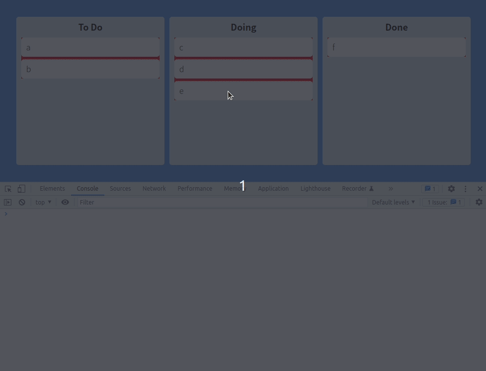

빨간색으로 구현한 것은 **receiver로 Board.tsx**에서 구현을 하였다.

```tsx
// Board.tsx

import { Droppable } from "react-beautiful-dnd";
import styled from "styled-components";
import DragabbleCard from "./DragabbleCard";

const Wrapper = styled.div`
  width: 300px;
  padding: 20px 10px;
  padding-top: 10px;
  background-color: ${(props) => props.theme.boardColor};
  border-radius: 5px;
  min-height: 300px;
`;

const Title = styled.h2`
  text-align: center;
  font-weight: 600;
  margin-bottom: 10px;
  font-size: 18px;
`;

interface IBoardProps {
  toDos: string[];
  boardId: string;
}

function Board({ toDos, boardId }: IBoardProps) {
  return (
    <Wrapper>
      <Title>{boardId}</Title>
      <Droppable droppableId={boardId}>
        {(provided) => (
          <div
            style={{ backgroundColor: "red" }}
            ref={provided.innerRef}
            {...provided.droppableProps}
          >
            {toDos.map((toDo, index) => (
              <DragabbleCard key={toDo} index={index} toDo={toDo} />
            ))}
            {provided.placeholder}
          </div>
        )}
      </Droppable>
    </Wrapper>
  );
}

export default Board;
```

### 2.9 Droppable Snapshot

board를 떠날 때 색상을 바꿔야 할 타이밍과 destination board에 도착해서 색상을 바꿔야 할 타이밍을 정해줄 것이다.

```tsx
// Board.tsx

import { Droppable } from "react-beautiful-dnd";
import styled from "styled-components";
import DragabbleCard from "./DragabbleCard";

const Wrapper = styled.div`
  width: 300px;
  padding: 20px 10px;
  padding-top: 10px;
  background-color: ${(props) => props.theme.boardColor};
  border-radius: 5px;
  min-height: 300px;
  display: flex;
  flex-direction: column;
`;

const Area = styled.div`
  background-color: blue;
  flex-grow: 1;
`;

const Title = styled.h2`
  text-align: center;
  font-weight: 600;
  margin-bottom: 10px;
  font-size: 18px;
`;

interface IBoardProps {
  toDos: string[];
  boardId: string;
}

function Board({ toDos, boardId }: IBoardProps) {
  return (
    <Wrapper>
      <Title>{boardId}</Title>
      <Droppable droppableId={boardId}>
        {(provided) => (
          <Area ref={provided.innerRef} {...provided.droppableProps}>
            {toDos.map((toDo, index) => (
              <DragabbleCard key={toDo} index={index} toDo={toDo} />
            ))}
            {provided.placeholder}
          </Area>
        )}
      </Droppable>
    </Wrapper>
  );
}

export default Board;
```

먼저, 이와 같은 식으로 Wrapper에 flex와 flex-direction을 주고 그 하위 컴포넌트에 flex-grow를 주면서 Drag와 Drop영역을 전체로 확장했다.

그리고 이제 **snapshot**을 이용해보자.

**snapshot**을 이용해서 **어느 board로부터 drag를 시작했는지 알 수 있고**, **어디 board로 이동하는지 알 수 있다.**

```tsx
// Board.tsx

function Board({ toDos, boardId }: IBoardProps) {
  return (
    <Wrapper>
      <Title>{boardId}</Title>
      <Droppable droppableId={boardId}>
        {(provided, snapshot) => (
          <Area ref={provided.innerRef} {...provided.droppableProps}>
            {toDos.map((toDo, index) => (
              <DragabbleCard key={toDo} index={index} toDo={toDo} />
            ))}
            {provided.placeholder}
          </Area>
        )}
      </Droppable>
    </Wrapper>
  );
}
```

**snapshot**을 TypeScript를 통해 확인해보면 **isDraggingOver**과 **draggingFromThisWith**이 있는 것을 확인 할 수 있다.

```tsx
// Board.tsx

const Area = styled.div<{ isDraggingOver: boolean }>`
  background-color: ${(props) => (props.isDraggingOver ? "skyblue" : "pink")};
  flex-grow: 1;
`;

...


function Board({ toDos, boardId }: IBoardProps) {
  return (
    <Wrapper>
      <Title>{boardId}</Title>
      <Droppable droppableId={boardId}>
        {(provided, snapshot) => (
          <Area
            isDraggingOver={snapshot.isDraggingOver}
            ref={provided.innerRef}
            {...provided.droppableProps}
          >
            {toDos.map((toDo, index) => (
              <DragabbleCard key={toDo} index={index} toDo={toDo} />
            ))}
            {provided.placeholder}
          </Area>
        )}
      </Droppable>
    </Wrapper>
```

이러한 식으로 처리를 할 것이다.

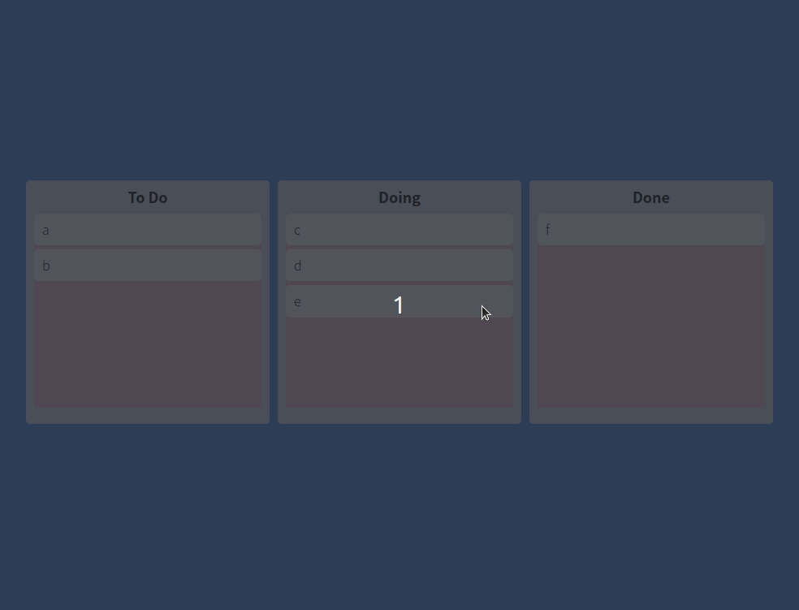

이번에는 **draggingFromThis**를 이용해볼 것인데, **Boolean에 감싸서 사용**할 것이다.

```tsx
// Board.tsx

import { Droppable } from "react-beautiful-dnd";
import styled from "styled-components";
import DragabbleCard from "./DragabbleCard";

const Wrapper = styled.div`
  width: 300px;
  padding: 20px 10px;
  padding-top: 10px;
  background-color: ${(props) => props.theme.boardColor};
  border-radius: 5px;
  min-height: 300px;
  display: flex;
  flex-direction: column;
`;

const Title = styled.h2`
  text-align: center;
  font-weight: 600;
  margin-bottom: 10px;
  font-size: 18px;
`;

interface IBoardProps {
  toDos: string[];
  boardId: string;
}

interface IAreaProps {
  isDraggingFromThis: boolean;
  isDraggingOver: boolean;
}

const Area = styled.div<IAreaProps>`
  background-color: ${(props) =>
    props.isDraggingOver
      ? "skyblue"
      : props.isDraggingFromThis
      ? "pink"
      : "gray"};
  flex-grow: 1;
  transition: background-color 0.3s ease-in-out;
`;

function Board({ toDos, boardId }: IBoardProps) {
  return (
    <Wrapper>
      <Title>{boardId}</Title>
      <Droppable droppableId={boardId}>
        {(provided, snapshot) => (
          <Area
            isDraggingOver={snapshot.isDraggingOver}
            isDraggingFromThis={Boolean(snapshot.draggingFromThisWith)}
            ref={provided.innerRef}
            {...provided.droppableProps}
          >
            {toDos.map((toDo, index) => (
              <DragabbleCard key={toDo} index={index} toDo={toDo} />
            ))}
            {provided.placeholder}
          </Area>
        )}
      </Droppable>
    </Wrapper>
  );
}

export default Board;
```

이제 드래그 하고 있는 item 색상을 변경해보자.

```tsx
// DraggableCard.tsx

import React from "react";
import { Draggable } from "react-beautiful-dnd";
import styled from "styled-components";

const Card = styled.div<{ isDragging: boolean }>`
  border-radius: 5px;
  margin-bottom: 5px;
  padding: 10px 10px;
  background-color: ${(props) =>
    props.isDragging ? "#74b9ff" : props.theme.cardColor};
  box-shadow: ${(props) =>
    props.isDragging ? "0px 2px 5px rgba(0, 0, 0, 0.05)" : ""};
`;

interface IDraggableCardProps {
  toDo: string;
  index: number;
}

function DraggableCard({ toDo, index }: IDraggableCardProps) {
  return (
    <Draggable key={toDo} draggableId={toDo} index={index}>
      {(provided, snapshot) => (
        <Card
          isDragging={snapshot.isDragging}
          ref={provided.innerRef}
          {...provided.draggableProps}
          {...provided.dragHandleProps}
        >
          {toDo}
        </Card>
      )}
    </Draggable>
  );
}

export default React.memo(DraggableCard);
```

이러한 식으로 처리를 해주면 된다.

## 3. Task Objects

이제 마지막으로 유저가 **item을 추가할 수 있도록 form**을 만들어 줄 것이다.

이전 파트에서 우리는 **react-hook-form**를 배웠다.

**useForm**을 사용하자

```tsx
// Board.tsx

const Form = styled.form`
  width: 100%;
  input {
    width: 100%;
  }
`;

interface IForm {
  toDo: string;
}

function Board({ toDos, boardId }: IBoardProps) {
  const { register, setValue, handleSubmit } = useForm<IForm>();
const onValid = ({ toDo }: IForm) => {};
  return (
    <Wrapper>
      <Title>{boardId}</Title>
      <Form>
          <input
            {...register("toDo", { required: true })}
            type="text"
            placeholder={`Add task on ${boardId} `}
          />
      </Form>
      ...
```

이렇게 까지 하고, 이제 해야할 것은 **data로부터 오는 toDo**를 실제로 만드는 것인데, 이걸 우리 **State**안에서 만들어야 한다.

대대적인 수정이 들어간다.

```tsx
// atoms.tsx

import { atom, selector } from "recoil";

export interface ITodo {
  id: number;
  text: string;
}

interface IToDoState {
  [key: string]: ITodo[];
}

export const toDoState = atom<IToDoState>({
  key: "toDo",
  default: {
    "To Do": [],
    Doing: [],
    Done: [],
  },
});
```

먼저 무엇이 바뀐 건지 이해를 해야한다.

**interface ITodo**를 만들어 주고 이것을 **item(element)에 적용시킨 것**이다.

**item들**은 **string**에서 **객체**로 바뀌었다.

전부 업데이트를 시켜주자.

먼저 현재코드를 살펴보자.

```tsx
// Board.tsx

...

interface IBoardProps {
  toDos: ITodo[];
  boardId: string;
}

...

            {toDos.map((toDo, index) => (
              <DragabbleCard key={toDo} index={index} toDo={toDo} />
            ))}

...

// DraggableCard.tsx

interface IDraggableCardProps {
  toDoId: number;
  toDoText: string;
  index: number;
}

...

function DraggableCard({ toDo, index }: IDraggableCardProps) {
  return (
    <Draggable key={toDo} draggableId={toDo} index={index}>
      {(provided, snapshot) => (
        <Card
          isDragging={snapshot.isDragging}
          ref={provided.innerRef}
          {...provided.draggableProps}
          {...provided.dragHandleProps}
        >
          {toDo}
        </Card>
      )}
    </Draggable>
  );
}

...
```

현재 Interface에서 구축해놓은 **toDo id**와 **toDo text**를 활용해야 한다.

```tsx
// Board.tsx

{
  toDos.map((toDo, index) => (
    <DragabbleCard
      key={toDo.id}
      index={index}
      toDoId={toDo.id}
      toDoText={toDo.text}
    />
  ));
}
```

> 더이상 toDo는 string이 아니고 object라서 props를 수정하고 있는 과정이다.

계속하자. props를 수정했기 때문에 **DraggableCard에서 받는 props형태도 달라져야한다.**

```tsx
// DraggableCard.tsx

function DraggableCard({ toDoId, toDoText, index }: IDraggableCardProps) {
  return (
    <Draggable draggableId={toDoId + ""} index={index}>
```

**draggableId**의 경우 **toDoId**가 string이 아니기 때문에 이와 같이 해주었다.

Type들은 전부 처리해주었고 props도 처리를 다 했다.

하지만, 아직 아직 **onDragEnd**를 수정하지 않았다.

분명, string이 들어가있는 array에서 object가 들어가있는 array로 바뀌었기 때문에 수정이 필요할 것이다.

이전까지 우리는 **draggableId**에 **text**를 넣어주었다. `To_Do`라든가 `Doing`, `Done`을 넣어주었다.

하지만 **onDragEnd의 일부 코드**만 봐도 문제가 있는 것을 알 수 있다.

```tsx
destinationBoard.splice(destination.index, 0, draggableId);
```

**draggableId**만 넘겨주어서는 안된다. 내용이 담기지 않는다.

이전과는 다르게 이제 우리는 object를 삭제하기 전에 먼저 object를 garb해줘야 한다.

예시를 들어가며 확인해보자.

`["a", "b"]` 이전에는 이렇게 생긴 **array**였다.

하지만 지금은 이렇다.

```tsx
[
  { text: "hello", id: 1 },
  { text: "hello", id: 2 },
];
```

이전의 draggableId를 확인하면 **`b`** 이와 같이 나왔는데 지금은 **`2`** 이렇게 나온다.

단순히 움직이는 **item의 id**만 말해준다.

**무슨 Card가 움직이는지에 대한 정보**와 **id정보**를 이용해 **toDo의 내용**을 가져오자.

먼저 다음을 확인하자.

```tsx
// App.tsx
function App() {
  const [toDos, setToDos] = useRecoilState(toDoState);
  const onDragEnd = (info: DropResult) => {
    const { destination, source, draggableId } = info;
    console.log(info);
    if (!destination) return;
  };

  ...
```

일단 data가 있어야 하니 atoms에 임의로 넣어주자. 아직 onValid를 구현하지 않았다.

```tsx
// atoms.tsx

export const toDoState = atom<IToDoState>({
  key: "toDo",
  default: {
    "To Do": [
      { id: 1, text: "hello" },
      { id: 2, text: "hello" },
    ],
    Doing: [],
    Done: [],
  },
});
```

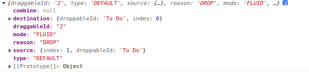

2가지 방법이 있는데,

1. id를 이용해 to do를 찾는다.
2. to do가 있는 위치를 찾는다.

어찌됬든 중요한건, **object를 받아와야 한다는 것**이다.

```tsx
// App.tsx

  ...
  const onDragEnd = (info: DropResult) => {
    const { destination, source, draggableId } = info;
    console.log(info);
    if (!destination) return;
    if (destination?.droppableId === source.droppableId) {
      // same board movement.
      setToDos((allBoards) => {
        const boardCopy = [...allBoards[source.droppableId]];
        const taskObj = boardCopy[source.index];
        boardCopy.splice(source.index, 1);
        boardCopy.splice(destination?.index, 0, taskObj);
        ...
```

이러한 식으로 해서 내가 옮기려고 하는 to do object 전체를 전달할 것이다.

최종적으로 **onDragEnd의 코드**는 이와 같다.

```tsx
const onDragEnd = (info: DropResult) => {
  const { destination, source, draggableId } = info;
  console.log(info);
  if (!destination) return;
  if (destination?.droppableId === source.droppableId) {
    // same board movement.
    setToDos((allBoards) => {
      const boardCopy = [...allBoards[source.droppableId]];
      const taskObj = boardCopy[source.index];
      boardCopy.splice(source.index, 1);
      boardCopy.splice(destination?.index, 0, taskObj);
      return {
        ...allBoards,
        [source.droppableId]: boardCopy,
      };
    });
  }
  if (destination.droppableId !== source.droppableId) {
    // cross board movement
    setToDos((allBoards) => {
      const sourceBoard = [...allBoards[source.droppableId]];
      const taskObj = sourceBoard[source.index];
      const destinationBoard = [...allBoards[destination.droppableId]];
      sourceBoard.splice(source.index, 1);
      destinationBoard.splice(destination.index, 0, taskObj);
      return {
        ...allBoards,
        [source.droppableId]: sourceBoard,
        [destination.droppableId]: destinationBoard,
      };
    });
  }
};
```

이제 마지막으로 **onValid구현**을 하고 끝내자.

```tsx
// Board.tsx

function Board({ toDos, boardId }: IBoardProps) {
  const setToDos = useSetRecoilState(toDoState);
  const { register, setValue, handleSubmit } = useForm<IForm>();
  const onValid = ({ toDo }: IForm) => {
    const newToDo = {
      id: Date.now(),
      text: toDo,
    };
    setToDos((allBoards) => {
      return {
        ...allBoards,
        [boardId]: [...allBoards[boardId], newToDo],
      };
    });
    setValue("toDo", "");
  };

  ...
```

여기서 **주의깊게 볼 것은,**

모든 이전의 board들을 그대로 놔두고, **현재 속한 board의 정보만 업데이트** 해야한다.

그래서 **toDo를 만들 때,** 이것을 현재 내가 있는 board에만 올려 줄 필요가 있다.

예를 들어보자.

내가 input에 작성한 **to Do text를 Done board에 넣어준다**고 해보자.

그러면 Done board를 제외한 나머지는 바뀌면 안되고, Done안에서만 **to Do Text를 마지막에 붙여줄 것**이다.

모든 코드는 Github를 통해 확인하자.

[jeongbeomSeo/react-master/TRELLO-CLONE](https://github.com/jeongbeomSeo/react-master/tree/ad5f367a26fa94a51662ae80d570a9989196b7cd)
