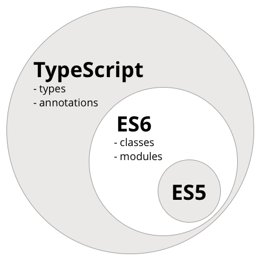
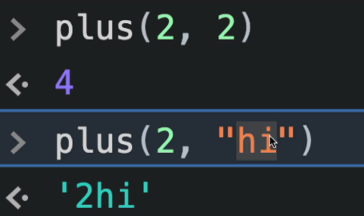
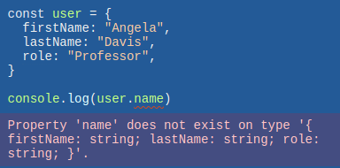
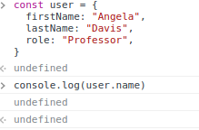

# TypeScript

- [TypeScript](#typescript)
  - [1. TypeScript란?](#1-typescript란)
  - [2. SET UP](#2-set-up)
  - [3. Typing the Props](#3-typing-the-props)
  - [4. Optional Props](#4-optional-props)
  - [5. State](#5-state)
  - [6. Forms](#6-forms)
  - [7. Themes](#7-themes)

## 1. TypeScript란?

먼저 **TypeScript**가 무엇인지를 알아보고 넘어가도록 하자.

**TypeScript(타입스크립트)** 는 자바스크립트에 타입을 부여한 언어이다.
자바스크립트의 확장된 언어라고 볼 수 있다.

특징을 살펴보자.

- TypeScript는 **MS**에 의해 개발/관리되고 있는 **오픈소스 프로그래밍 언어**이다.
- 대규모 애플리케이션을 개발하는 데 자바스크립트가 어렵고 불편하다는 불만에 대응하기 위해 개발되었다.
- TypeScript는 **ES5의 Superset**이므로 **기존의 자바스크립트(ES5) 문법을 그대로 사용**할 수 있다.
- ES6의 새로운 기능들을 사용하기 위해 Babel과 같은 별도 **트랜스파일러(Transpiler)를 사용하지 않아도 ES6의 새로운 기능을 기존의 자바스크립트 엔진(현재의 브라우저 또는 Node.js)에서 실행**할 수 있다.



**TypeScirpt의 장점**

- TypeScript를 사용하는 가장 큰 이유 중 하나는 **정적 타입을 지원**한다는 것이다.

정적 타입을 지원한다는 것이 무슨말이냐?

천천히 알아보자.

먼저 **TypeScript**는 **Strongly-typed언어**이다.

> **Strongly-typed**란, **프로그래밍 언어가 작동하기 전에 type을 확인**한다는 것이다.

만약 **JavaScript**에서 `const plus = (a, b) => a + b;`를 구현했다고 해보자.

JavaScript는 a와 b가 무슨 타입인지 신경쓰지도 않고 결과만 던져준다.



**TypeScript**의 예시를 봐보자.



이 예시를 JavaScript에서 한다면 어떻게 될까?



이렇듯 **TypeScript는 작동 전에 정적 타입 지원을 해주고 검증이 완료 된 후에 JavaScript 코드로 complie을 하여 넘겨준다.**

이렇게 해서 코드의 **가독성을 높이고** 예측할 수 있게 해주며 **디버깅을 쉽게 할 수 있게 해준다.**

참고: [TypeScript란?](https://velog.io/@taeg92/TypeScript-%EC%8B%9C%EC%9E%91%ED%95%98%EA%B8%B0)

## 2. SET UP

이제 TypeScript를 설치해 줄 것인데, 기존의 create-react-app에 설치해 줄 수 있다.

필요한 것들을 찾아서 설치해 주면 된다.

예를 들면 이런식으로 말이다.

    npm install --save typescript @types/node @types/react @types/react-dom @types/jest

하지만 이 방식은 작업 도중 많은 오류를 낼 수 있어서 TypeScript를 사용할 것이면 처음부터 TypeScript로 설치 해주는 것을 추천한다.

    npx create-react-app my-app --template typescript

또 기억해둬야 할 것은, **TypeScript의 파일 확장자(extension)은 JavaScript와는 다르다.**

JavaScript 혹은 ReactJS는 파일 확장자가 **js**이다.

하지만, TypeScript는 **ts**를 사용하고, React와 같이 사용할 경우 **tsx**를 사용한다.

또 이전 챕터에서 했던, **styped-compoenents같은 라이브러리를 기본적으로 TypeScript는 이해하지 못한다.**

따라서 **필요에 따라 `npm install --save-dev @types/라이브러리`를 입력하여 설치를 해줘야 할 것**을 기억하자.

> **@types란 아주 큰 Github repository인데, 모든 유명한 npm라이브러리를 가지고 있는 저장소이다.**
>
> 여기서 라이브러리나 패키지의 **Type definition**을 알려준다.

> **Type definition이란, styled-component의 소스코드를 보고 TypeScript에게 해 줄 설명을 만들어 내는 것이다.**

## 3. Typing the Props

그럼 이제 **TypeScript에게 React Component를 어떻게 설명**해 줄 지 알아보자.

> Component를 type한다 == Component에게 type을 준다

먼저 기본 코드를 살펴보자. Circle.tsx를 만든 후 App.tsx에 넣어준 코드를 기본으로 하겠다.

```tsx
// index.tsx

import React from "react";
import ReactDOM from "react-dom";
import App from "./App";

ReactDOM.render(
  <React.StrictMode>
    <App />
  </React.StrictMode>,
  document.getElementById("root")
);
```

```tsx
//  Circle.tsx

import styled from "styled-components";

const Container = styled.div``;

function Circle() {
  return <Container />;
}

export default Circle;
```

```tsx
// App.tsx

import styled from "styled-components";
import Circle from "./Circle";

function App() {
  return (
    <div>
      <Circle />
    </div>
  );
}

export default App;
```

이제 TypeScript에게 내 component가 가져와야 하는 props를 설명해줄 것이다.

props-type은 Type을 확인할 수 있지만, **실행 "후"에 확인이 가능**하다. 우리는 TypeScript를 사용하여 **실행 "전"에 보호**할 것이다.

그때 사용하는 것이 **interface**이다.

**interface**는 일반적으로 **타입 체크를 위해 사용되며 변수, 함수, 클래스에 사용**할 수 있다. **인터페이스**는 **여러가지 타입을 갖는 프로퍼티**로 이루어진 **새로운 타입을 정의하는 것**과 유사하다. 인터페이스에 선언된 프로퍼티 또는 메소드의 구현을 **강제하여 일관성을 유지**할 수 있도록 하는 것이다. ES6는 인터페이스를 지원하지 않지만, TypeScript는 인터페이스를 지원한다.

쉽게 생각한다면, **Object shape(객체 모양)을 TypeScript에게 설명**해주는 것으로 정의를 내릴 수 있겠다.

만약, interface를 사용하지 않는다면, 이와 같이 할 것이다.

```tsx
const x = (a: number, b: number) => a + b;
```

나쁘지 않다. 하지만, 객체를 많이 사용하는 것이 분명 존재할 것이고, 매번 이렇게 한다면 가독성이 나빠질 것이다.

그래서 interface를 사용한다.

먼저 부모 Component인 App.tsx에서 props를 넘겨주고 확인해보자.

```tsx
// App.tsx

// App.tsx

import styled from "styled-components";
import Circle from "./Circle";

function App() {
  return (
    <div>
      <Circle bgColor="teal" />
      <Circle bgColor="tomato" />
    </div>
  );
}

export default App;
```

그 후, 이와 같이 interface를 주면서 활용하면 된다.

```tsx
// Circle.tsx

import styled from "styled-components";

interface ContainerProps {
  bgColor: string;
}

const Container = styled.div<ContainerProps>`
  width: 200px;
  height: 200px;
  background-color: ${(props) => props.bgColor};
`;

// 인터페이스의 정의
interface CircleProps {
  bgColor: string;
}

// Circle Compoennt의 props는 CircleProps 인터페이스를 준수해야 한다.
function Circle({ bgColor }: CircleProps) {
  return <Container bgColor={bgColor} />;
}

export default Circle;
```

순서를 생각해보자.

1.  CircleProps를 만들어서 Circle props에 정적 타입을 부여해줬다.
2.  Container가 부모 component인 Circle로부터 prop를 받는다.
3.  Container에서 받은 props의 정적 타입을 부여하기 위해 ContainerProps를 만들어 준다.
4.  Container styled-component에 interface를 부여해주고 이용한다.

이러한 일련의 순서로 활용이 되었다.

복잡해 보일 수 있지만, 확실히 기억해야 할 것만 기억해두자.

**interface는 Object shape을 TypeScript에게 설명해주는 것이다. 즉, 사용하는 props를 확인하면 되는 것이다.**

## 4. Optional Props

위의 코드를 이어나가 보자.

만약 App.tsx에서 `<Circle />`로 해서 props를 사용하고 싶지 않을 때 즉, bgColor를 props로 안넘겨 주면 어떻게 될까?

에러가 뜬다.

    Property 'bgColor' is missing in type '{}' but required in type 'CircleProps'

즉, 나는 required를 주지 않았지만, i**nterface를 준 시점에서 bgColor는 required: true가 되어 버린 것**이다.

필수가 아닌 **optional기능을 부여**하고 싶다.

그때 사용하는 것이 **?(물음표)** 이다.

```tsx
interface CircleProps {
  bgColor?: string;
}
```

이렇게 해줌으로써 해당 props는 optional이 된 것일까? 아니다.

현재 ContainerProps interface를 보면 required인 상태로 되어 있다.

그래서 오류가 난다.

    No overload matches this call. ...

그래서 **둘 다 ?를 사용하든가**, 아니면 다음과 같이 해줄 수 있다.

```tsx
function Circle({ bgColor, borderColor }: CircleProps) {
  return <Container bgColor={bgColor ?? white} />;
}
```

> **??** 는 **널(Nullish) 병합 연산자**로 논리 연산자이다. JavaScript에서 활용이 된다.
>
> **a ?? b 의 평가 결과**로 확인해보자.
>
> - a가 null도 아니고 undefined도 아니면 a
> - 그 외의 경우는 b

## 5. State

이번엔 TypeScript와 React State를 배워보자.

**React JS에선 compoennt를 업데이트 하고 싶을 때, state를 바꿔야 했다.**

**state에 접근하기 위해서 useState hook을 사용**해야 하는 것도 앞서 배웠다.

Circle.tsx에 counter를 만들어 보자.

```tsx
// Circle.tsx

function Circle({ bgColor, borderColor }: CircleProps) {
  const [counter, setCounter] = useState(1);
  return <Container bgColor={bgColor} borderColor={borderColor ?? "white"} />;
}

const [counter, setCounter] = useState(1);
```

여기선 TypeScript를 사용하진 않았지만, 오류가 나지 않는다.

왜일까? TypeScript는 **counter의 초기값이 number인 것을 확인하고 데이터 타입을 number로 지정해준 것**이다.

TypeScript를 이용해서 Type을 지정해주고 싶을 떄는 이와 같이 해주면 된다.

```tsx
const [counter, setCounter] = useState<number>();
```

혹시 **두가지 Type을 넣어 줄 수는 있는가?**

가능하다.

```tsx
const [counter, setCounter] = useState<number | string>();
```

## 6. Forms

이번엔 비디오에서, 리액트 그리고 타입스크립트의 도움을 이용해 Form을 구현해 볼 것이다.

다시 초기 코드로 돌아가자. Circle.tsx는 지워주자.

```tsx
// App.tsx

import styled from "styled-components";

function App() {
  return <div></div>;
}

export default App;
```

여기서 이제 form을 만들어 줄 것이다.

```tsx
// App.tsx

import { useState } from "react";
import styled from "styled-components";

function App() {
  const [value, setValue] = useState("");
  const onChange = () => {};
  return (
    <div>
      <form>
        <input
          type="text"
          value={value}
          onChange={onChange}
          placeholder="username"
        />
        <button>Log in</button>
      </form>
    </div>
  );
}

export default App;
```

여기서 평소대로라면 우리는 onChnage를 이용해서 value를 바꾸기 위해서 `const onChange = (event) => {};` 이와 같이 **event**를 사용하려고 할 것이다.

문제는 event는 any타입이다.

> **타입스크립트 any, unknown**
>
> TypeScript에는 다른 프로그래밍 언어에는 존재하지 않는 타입들이 존재한다.
>
> 그 중에서도 **any, unknown**이 두 가지 타입은 재대로 이해하지 않으면, 상당히 헷갈릴 것이다. 이 부분은 [[TypeScript]타입스크립트 any, unknown 차이](https://developer-talk.tistory.com/198)를 참고하자.

any타입은 가능한 한 배재하고자 노력해야 한다.

그래서 이와 같이 해줘야 한다.

    const onChange = (event: React.FormEvent) => {};

이제 FormEvent내에서 우린 한 Element를 보낼 수 있다.

이 상황에서 **어떤 종류의 Element가 onChange 이벤트를 발생시킬지 특정**할 수도 있다.

    const onChange = (event: React.FormEvent<HTMLInputElement>) => {};

그 후, 안에서 사용하는 것은 이전과 동일하다.

```tsx
const onChange = (event: React.FormEvent<HTMLInputElement>) => {
  const {
    currentTarget: { value },
  } = event;
  setValue(value);
};
```

최종 코드는 이와 같다.

```tsx
// App.js

import React, { useState } from "react";
import styled from "styled-components";

function App() {
  const [value, setValue] = useState("");
  const onChange = (event: React.FormEvent<HTMLInputElement>) => {
    const {
      currentTarget: { value },
    } = event;
    setValue(value);
  };
  const onSubmit = (event: React.FormEvent<HTMLFormElement>) => {
    event.preventDefault();
  };
  return (
    <div>
      <form onSubmit={onSubmit}>
        <input
          type="text"
          value={value}
          onChange={onChange}
          placeholder="username"
        />
        <button>Log in</button>
      </form>
    </div>
  );
}

export default App;
```

## 7. Themes

이제 TypeScript와 styled components 테마를 연결해 볼 시간이다.

맨 처음에도 말했듯이 **TypeScript는 기본적으로 이해 못하는 라이브러리가 많기에 설치부터 해줘야 한다** 했다.

    npm install @types/styled-components

이제 **declaration(선언) 파일**을 만들자.

```tsx
// styled.d.ts

// import original module declarations
import "styled-components";

// and extend them!
declare module "styled-components" {
  export interface DefaultTheme {
    textColor: string;
    bgColor: string;
  }
}
```

**styled-components를 import**하고, 내가 **가지고 있는 styled components의 테마 정의를 확장한 것이**다.

> 타입스크립트 선언 파일 `d.ts`는 **타입스크립트 코드의 타입 추론을 돕는 파일이다.** 예를 들어, 전역 변수로 선언한 변수를 특정 파일에서 `import` 구문 없이 해당 변수를 인식하지 못한다. 그럴 때 아래와 같이 해당 변수를 선언해서 에러가 나지 않게 해줄 수 있다.
>
> ```tsx
> declare const global = "sth";
> ```
>
> 참고 :
>
> - [styled-components: API Reference](https://styled-components.com/docs/api#typescript)
> - [d.ts 파일 | 타입스크립트 핸드북](https://joshua1988.github.io/ts/usage/declaration.html)

이제 theme을 만들 차례다.

theme.ts를 만들어 주자.

**테마(theme)는 정의해둔 테마의 속성들과 똑같아야 한다.**

```ts
// src/theme.ts

import { DefaultTheme } from "styled-components";

export const lightTheme: DefaultTheme = {
  bgColor: "white",
  textColor: "black",
};

export const darkTheme: DefaultTheme = {
  bgColor: "black",
  textColor: "White",
};
```

만약 **interface DefaultTheme에 가서 새로운 attr을 추가해준다면?**

theme.ts에서 **DefaultTheme을 사용하고 있는 테마들**은 **해당 attr을 추가해줘야 한다고 에러를 표시할 것**이다.

사용하는 것은 이와 같이 해주면 된다.

1. import 해주기
2. ThemeProvider 건네주기

이전과 다를 것 없다.

```tsx
// index.tsx

import React from "react";
import ReactDOM from "react-dom";
import { ThemeProvider } from "styled-components";
import App from "./App";
import { lightTheme } from "./theme";

ReactDOM.render(
  <React.StrictMode>
    <ThemeProvider theme={lightTheme}>
      <App />
    </ThemeProvider>
  </React.StrictMode>,
  document.getElementById("root")
);
```

또 다른 방법으로는 이와 같이 props만 뽑아와서 활용하는 것도 저번 챕터에서 봤던 내용이다.

```tsx
// App.tsx

const Container = styled.div`
  background-color: ${(props) => props.theme.bgColor};
`;

const H1 = styled.h1``;
```
